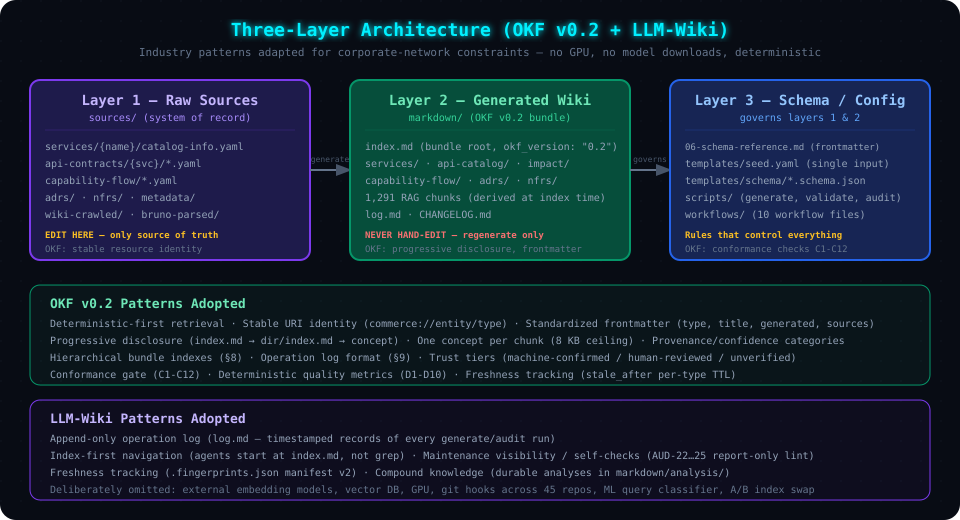
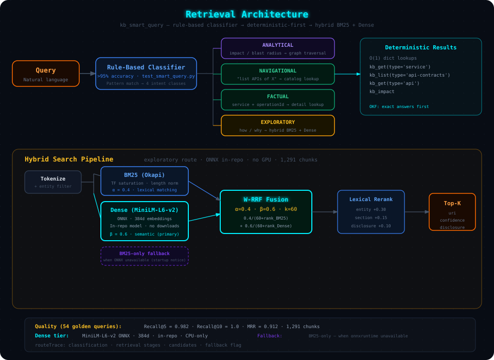
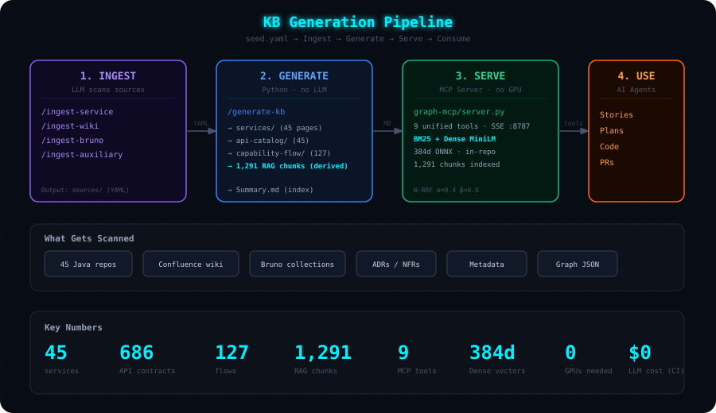
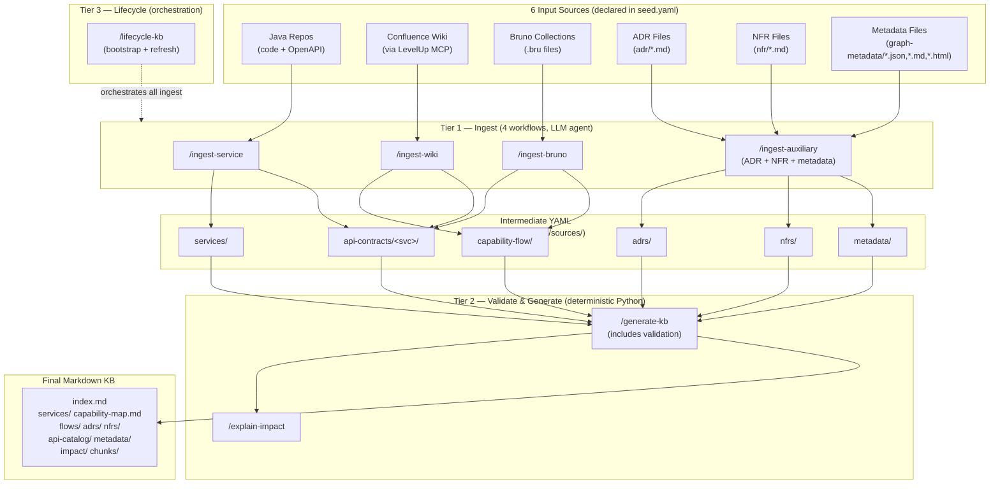
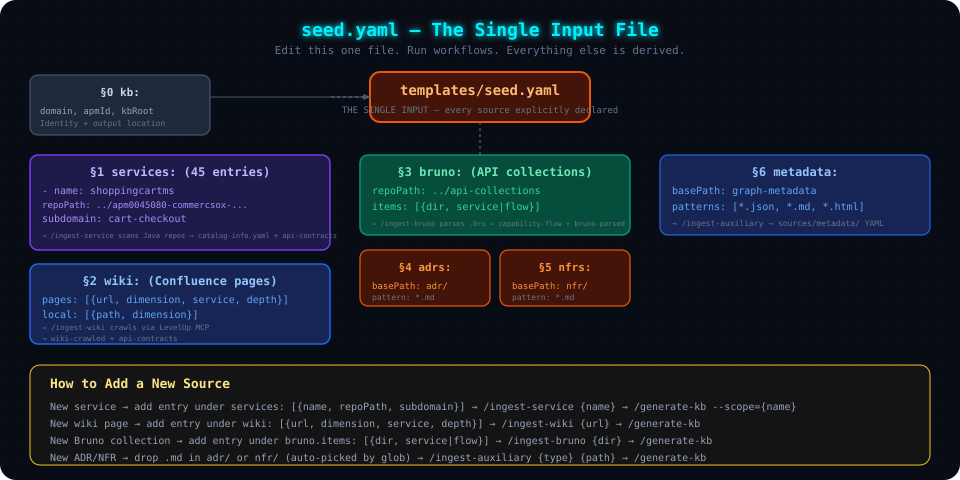

# 01 — Architecture & Data Model

> **Audience**: Anyone who wants to understand *why* the framework is built the way it is,
> what patterns it adopts, and how the data model works.

---

## The Big Picture

The Commerce KB is a **workflow-driven framework** that builds a cross-linked Markdown
knowledge base from scattered source code, wiki pages, and API collections. It follows two
industry patterns:

1. **Google's Open Knowledge Framework (OKF) v0.2** — deterministic, metadata-rich
   knowledge serving with stable identities and progressive disclosure
2. **LLM-Wiki** — a self-maintaining, append-only, agent-operated wiki pattern

The framework runs entirely on corporate-network-compatible Python libraries (`PyYAML`,
`numpy`, `rank-bm25`, `FastMCP`, `onnxruntime`, `tokenizers`). The dense embedding model
(`all-MiniLM-L6-v2` ONNX) is **committed in-repo** and runs on CPU; retrieval falls back
to LSA (numpy SVD) when ONNX dependencies are unavailable.



---

## Three-Layer Architecture

| Layer | Location | Mutability | Origin |
|-------|----------|------------|--------|
| **Layer 1 — Raw Sources** | `sources/` (YAML) | System of record — edit here only | LLM-Wiki "ingest" layer |
| **Layer 2 — Generated Wiki** | `markdown/` (OKF v0.2 bundle) | Never edit by hand — regenerate | OKF knowledge bundle (§3) |
| **Layer 3 — Schema / Config** | `KB-SCHEMA.md`, `templates/`, `scripts/`, workflows | Governs how the other two layers behave | OKF schema contract (§4–§7) |

**Key property**: The bundle is **deterministic** — regenerating from unchanged sources
produces byte-identical output. CI verifies this via the sync gate.

---

## OKF v0.2 Patterns Adopted

The generated `markdown/` tree is a conformant **OKF v0.2 knowledge bundle**, enforced by
`scripts/okf_conformance_check.py` (checks C1–C12, run in CI).

### Pattern 1: Deterministic-First Retrieval

> **OKF principle**: Answer exact questions from an authoritative store, not similarity search.

`graph_smart_query` routes factual and navigational queries to **deterministic graph
lookups** (`graph_get_service`, `graph_list_api_contracts`, `graph_get_api_detail`). Hybrid
search (BM25 + dense MiniLM embeddings, LSA fallback) is the **fallback**, not the default.
This ensures reproducible, exact answers for structured queries ("list APIs of
shoppingcartms") while still supporting open-ended exploration ("how does payment
processing work?").



### Pattern 2: Stable Resource Identity

> **OKF principle**: Every knowledge unit has a durable URI.

Every RAG chunk carries `uri: commerce://<entity>/<type>[/<section>]` in its metadata
header, derived deterministically by `generate_multidim_kb.py`. This enables:
- Precise chunk references across consumers
- Deduplication across regeneration cycles
- Provenance tracking from chunk back to source YAML

**Example URIs**:
```
commerce://shoppingcartms/service/inbound-apis
commerce://shoppingcartms/api-catalog/addItemsToCart
commerce://wireless-postpaid-upgrade/capability-flow/steps
```

> **Federation note**: the multi-domain design migrates this scheme to
> `kb://<domain>/<entity>/<type>[/<section>]` so cross-domain links resolve uniformly —
> see [Chapter 05 → Federated URI Scheme](./05-scaling-and-federation.md#federated-uri-scheme).

### Pattern 3: Standardized Metadata (Frontmatter)

> **OKF §4–§7**: Every resource carries type, title, description, provenance.

Every generated Markdown page starts with YAML frontmatter:

```yaml
---
type: service                          # canonical taxonomy
title: "ShoppingCartMs"
description: "Cart lifecycle service"
tags: [cart-checkout]
status: stable                         # draft | stable | deprecated
generated:
  by: commerce-kb-generator/8.1.0
  at: 2026-07-20T14:30:00Z
stale_after: 2026-10-18                # generated.at + 90d TTL
sources:
  - id: catalog-info
    resource: sources/services/shoppingcartms/catalog-info.yaml
confidence: authoritative              # authoritative | curated | inferred
uri: commerce://shoppingcartms/service
disclosure: "Cart lifecycle — 22 APIs, 16 downstream, Cassandra, 3 Kafka topics"
---
```

AI agents parse page type, entity name, and relationship counts from the frontmatter
**without reading the full page** — this is OKF progressive disclosure at the metadata level.

### Pattern 4: Progressive Disclosure

> **OKF §8**: Start with a one-line hint before the full payload.

Navigation flows from general to specific:

```
index.md (bundle root, okf_version: "0.2")
  → services/index.md (directory listing with title + description per entry)
    → services/shoppingcartms.md (full service deep-dive)
```

Via MCP: `graph_navigate('')` → `graph_navigate('services')` → `graph_read_concept('services/shoppingcartms')`.

Every chunk carries a `disclosure` one-liner so agents can decide relevance without reading
the body — like a search snippet.

### Pattern 5: Provenance & Confidence Categories

> **OKF principle**: Consumers need to know how trustworthy a knowledge unit is.

| Confidence | Meaning | Trust Tier (MCP) |
|------------|---------|-----------------|
| `authoritative` | Generated deterministically from code-scanned catalog YAML | `machine-confirmed` |
| `curated` | Flows, ADRs, metadata authored or merged by humans | `human-reviewed` |
| `inferred` | KB-inferred values not confirmed by primary source | `unverified` |

Pages older than **90 days** are flagged `stale` by the MCP server's `graph_read_concept`.

### Pattern 6: One Concept Per Chunk

> **OKF principle**: Each knowledge unit should be self-contained and right-sized.

Chunk export enforces an **8 KB ceiling**: API-catalog pages split per operation, other
oversized pages split at heading boundaries. `AUD-22` guards against regressions.

### Pattern 7: Conformance Checks (C1–C12)

`scripts/okf_conformance_check.py` validates the generated bundle structurally:

| Check | What It Validates |
|-------|-------------------|
| C1 | `index.md` exists with `okf_version: "0.2"` |
| C2 | Every concept page has YAML frontmatter |
| C3 | Required fields present: `type`, `title`, `generated.by`, `generated.at` |
| C4 | `generated.at` is ISO-8601 format |
| C5 | `status` is one of: `draft`, `stable`, `deprecated` |
| C6 | Cross-links point to existing files |
| C7 | Per-directory `index.md` files exist |
| C8 | Index coverage (every concept appears in its directory index) |
| C9 | `log.md` follows OKF §9 format (date-grouped, newest-first) |
| C10 | Root `okf_version` matches expected version |
| C11 | `sources` entries reference existing files |
| C12 | Bundle structure matches expected layout |

### Pattern 8: Deterministic Quality Metrics (D1–D10)

`scripts/audit_kb.py` emits machine-readable metrics to `audit-metrics.json`:

| Metric | What It Measures |
|--------|-----------------|
| D1 | Page count by type |
| D2 | Freshness distribution (% pages within TTL) |
| D3 | Cross-link density (avg links per page) |
| D4 | Orphan rate (pages with zero incoming links) |
| D5 | Provenance completeness (% pages with valid `sources`) |
| D6 | Trust distribution (`authoritative` vs `curated` vs `inferred`) |
| D7 | Type distribution across concept taxonomy |
| D8 | Index coverage (% concepts in directory indexes) |
| D9 | API description quality (% non-empty summaries) |
| D10 | Empty-body rate (% pages with minimal content) |

---

## LLM-Wiki Patterns Adopted

### Append-Only Operation Log

`markdown/log.md` — every `/generate-kb` and `/audit-kb` run appends a timestamped record:

```markdown
## 2026-07-20

- **generate** — scope: full, services: 45, flows: 127, chunks: 1291, duration: 28s
- **audit** — score: 78/100, errors: 0, warnings: 12, checks: 25
```

This gives agents and humans an operational history without external dashboards.

### Index-First Navigation

Agents start at `markdown/index.md` instead of grepping the file system. The index provides
a progressive-disclosure map of the entire KB — dimension by dimension.

### Maintenance Visibility / Self-Checks

Report-only semantic lint surfaces issues without auto-fixing:

| Check | What It Surfaces |
|-------|-----------------|
| AUD-22 | Oversized chunks (>8 KB, violates one-concept-per-chunk ceiling) |
| AUD-23 | Chunks missing OKF `disclosure`/`confidence` metadata |
| AUD-24 | Fingerprint manifest version/coverage (v2 per-service) |
| AUD-25 | Outbound-call targets not present in the KB (cross-domain refs) |

### Freshness Tracking

`sources/.fingerprints.json` (manifest v2): flat source-file hashes plus a per-service
section (`last_ingested`, `chunk_count`, source hash). Used by `/lifecycle-kb --refresh` to
skip unchanged sources.

### Compound Knowledge

Durable cross-cutting analyses can be hand-authored in `markdown/analysis/` with the same
frontmatter contract (`confidence: curated`). These are exempt from the regeneration sync
gate. Use `kb context "topic"` to gather source chunks, then file the synthesized answer
back as an `analysis/` page — so explorations compound instead of disappearing into chat.

---

## Deliberately Omitted Complexity

These patterns were **evaluated and rejected** because the simpler alternatives perform
adequately at the current scale (45 services, 1,291 chunks):

| Rejected Pattern | Why |
|------------------|-----|
| Downloaded embedding models / vector DB | Corporate-network constraints block HuggingFace/PyTorch downloads. The dense tier instead uses the **in-repo `all-MiniLM-L6-v2` ONNX model** (CPU, `onnxruntime`); BM25 + dense hybrid achieves **Recall@5 = 0.98, Recall@10 = 1.0, MRR = 0.91** on the 54-query golden suite. Embeddings are cached in `.kb_index/` — no vector DB needed for a ~1,300 chunk corpus. *A central vector DB is now an explicit Phase 2 item with measurable adoption triggers — see [Chapter 07](./07-phase-2-target-architecture.md)* |
| A/B index hot-swap | Non-problem: the index is rebuilt at server startup from git-controlled chunks (startup < 2s) |
| ML-based query classifier | Rule-based classifier reaches **>95% accuracy** on labeled cases (`test_smart_query.py`) with zero dependencies and full determinism |
| Git hooks across 45 service repos | Replaced by scheduled refresh + fingerprint skip via `/lifecycle-kb --refresh` |
| Blanket re-chunking | Only oversized outliers are split; human-readable pages are preserved unchanged |
| GPU inference | The 6-layer MiniLM ONNX model embeds the full 1,291-chunk corpus in ~20s on CPU (cached thereafter; queries embed in ~20ms). LSA via numpy Truncated SVD remains the zero-dependency fallback |

---

## Data Flow — End to End



> For the quick ASCII pipeline overview, see [README → How It Works](./README.md#how-it-works).

### Detailed Data Flow — Sources Through Tiers



The LLM agent is the scanner during ingest — it reads Java source code, deep-crawls
Confluence via LevelUp MCP, parses Bruno `.bru` files, and extracts structured YAML.
The final markdown generation by `generate_multidim_kb.py` is **fully deterministic** —
no LLM involved, pure Python template rendering. See
[02 → Two Tool Ecosystems](./02-getting-started.md#two-tool-ecosystems)
for the full distinction between workflows (LLM) and the `kb` CLI (deterministic).

---

## seed.yaml — The Single Input

Full path: `{KB_ROOT}/templates/seed.yaml`



```yaml
kb:
  domain: commerce
  apmId: apm0045079
  kbRoot: multi-dimensional-kb

services:                               # 45 entries
  - name: shoppingcartms
    repoPath: ../apm0045080-commercsox-shoppingcartms
    subdomain: cart-checkout

wiki:
  confluence:
    pages:
      - url: https://wiki.web.att.com/display/DRC/ShoppingCartMs+Design
        dimension: design               # api | capability-flow | design
        service: shoppingcartms
        depth: 3

bruno:
  repoPath: ../apm0045081-commerce-services-api-collections
  items:
    - dir: shoppingcartms
      service: shoppingcartms

adrs:
  basePath: adr
  pattern: "*.md"

nfrs:
  basePath: nfr
  pattern: "*.md"

metadata:
  basePath: graph-metadata
  patterns: ["*.json", "*.md", "*.html"]
```

### Adding a New Source

| Want to Add... | What to Do |
|----------------|------------|
| New service | Add `- name: / repoPath: / subdomain:` under `services:` |
| New wiki page | Add `- url: / dimension: / service: / depth:` under `wiki.confluence.pages:` |
| New Bruno collection | Add `- dir: / service:` under `bruno.items:` |
| New ADR/NFR | Drop `.md` file in `adr/` or `nfr/` — auto-picked up |
| New metadata | Drop file in `graph-metadata/` — auto-picked up |

---

## 6 JSON Schemas

Located in `{KB_ROOT}/templates/schema/`:

| Schema | Validates | Key Fields |
|--------|-----------|-----------|
| `service-descriptor` | `catalog-info.yaml` | `inboundApis[]`, `outboundApis[]`, `datastores[]`, `topicsProduced[]` |
| `capability-flow` | `capability-flow/*.yaml` | `kind: CapabilityFlow`, `spec.steps[]`, `spec.participatingServices[]` |
| `api-contract` | `api-contracts/<svc>/*.yaml` | `operationId`, `method`, `path`, `scenarios[]` |
| `adr` | `adrs/*.yaml` | `id`, `title`, `status`, `context`, `decision` |
| `nfr` | `nfrs/*.yaml` | `service`, `latencyP99`, `throughput`, `availability` |
| `metadata` | `metadata/*.yaml` | `name`, `dimension`, `content` |

---

## Frontmatter Contract

### Required Fields (OKF)

| Field | Type | Description |
|-------|------|-------------|
| `type` | string | Concept type (see taxonomy below) |
| `title` | string | Human-readable title |
| `description` | string | One-line description |
| `tags` | string[] | Subdomain / dimension tags |
| `status` | enum | `draft` \| `stable` \| `deprecated` |
| `generated.by` | string | `commerce-kb-generator/<version>` |
| `generated.at` | string | ISO-8601 timestamp |
| `stale_after` | string | `generated.at` + per-type TTL |
| `sources` | array | `{id, resource}` provenance entries |

### Commerce Extensions

| Field | Description |
|-------|-------------|
| `confidence` | `authoritative` \| `curated` \| `inferred` |
| `uri` | Stable chunk URI: `commerce://<entity>/<type>[/<section>]` |
| `disclosure` | One-line progressive-disclosure hint |

### Concept Type Taxonomy

| Type | Pages |
|------|-------|
| `service` | `services/<name>.md` |
| `api-catalog` / `api-operation` | `api-catalog/<svc>.md` + operation chunks |
| `capability-flow` | `capability-flow/<name>.md` |
| `impact-analysis` | `impact/<name>.md` |
| `architecture-decision` | `adrs/<id>.md` |
| `nfr` | `nfrs/<name>.md` |
| `capability-map` | `capability-map.md` |
| `index` | `index.md`, `<dir>/index.md` |

### Freshness TTLs

| Page Type | TTL |
|-----------|-----|
| Service / Impact | 90 days |
| API Catalog | 60 days |
| Capability Flow / NFR | 180 days |
| ADR | 365 days |

---

## CapabilityFlow Kind

`CapabilityFlow` unifies business capability context with step-by-step flow details in a
single YAML kind. Grouped by `metadata.capability` into `capability-map.md`.

```yaml
kind: CapabilityFlow
metadata:
  name: wireless-postpaid-upgrade
  capability: wireless                   # grouping key
spec:
  businessDomain: wireless
  realizedBy:
    - service: cpopofferms
      role: Offer discovery via PAPI
  participatingServices:
    - {service: shoppingcartms, role: "Cart lifecycle"}
  steps:
    - seq: 1
      name: device-list
      api: {method: POST, path: /msapi/.../product-offers, service: cpopofferms}
```

---

## catalog-info.yaml Forward Map

Each `inboundApis[]` entry carries per-endpoint integration context:

```yaml
inboundApis:
  - operationId: addItemsToCart
    method: POST
    path: /shopping-cart/v1/carts/{cartId}/items
    outboundCalls:
      - ref: cpoppricingms-priceinfo-v2-cart
        targetService: cpoppricingms
        purpose: Reprice cart after adding items
    kafkaEventsPublished:
      - topicRef: shopping-cart-events
        eventType: ADD_ITEMS
    datastoreOperations:
      - store: cart
        operation: read-write
```

Cross-ref rules: `outboundCalls[].ref` → `outboundApis[]`, `topicRef` → `topicsProduced[]`,
`store` → `datastores[]`.

---

## Operational Governance — Log, Lint, Audit, Evaluation

Five layers keep the KB trustworthy over time:

1. **Operation log** (`markdown/log.md`) — LLM-Wiki append-only record of every
   generate/audit run: timestamp, scope, entity counts, chunk count, score, duration.
   *OKF §9 format*.

2. **Semantic lint** (report-only, inside `/audit-kb`) — AUD-22…25: oversized chunks,
   missing metadata, fingerprint coverage, dangling cross-domain references.
   *LLM-Wiki self-check pattern*.

3. **Deterministic audit** (`scripts/audit_kb.py`) — 25 checks across coverage,
   staleness, consistency, quality, reconciliation → `audit-report.md` with overall score
   and per-service scorecard. D1–D10 metrics to `audit-metrics.json`.
   *OKF deterministic quality metrics*.

4. **Golden-dataset evaluation** (`/kb-evaluation-judge`) — regenerates stories from the
   golden feature set using the KB and scores them against baseline scorecards, proving
   KB changes do not degrade downstream story quality.

5. **OKF conformance gate** (`scripts/okf_conformance_check.py`) — C1–C12 structural
   checks; runs in CI and fails the build on any violation.

---

## Version Planes

Four independent version planes exist; they are bumped for different reasons and must not
be conflated:

| Plane | Where declared | Current | Bump when |
|---|---|---|---|
| **OKF frontmatter contract** | `KB-SCHEMA.md` header (`OKF version`) | 0.2 | The generated-Markdown frontmatter contract changes (new/renamed keys, semantics) |
| **Framework** | `KB-SCHEMA.md` header (`Framework version`) | 9.0.0 | Governance/framework rules change (templates, hard-stops, source-of-truth rules) |
| **KB content / generator actor** | `templates/seed.yaml` → `kb.version` (rendered as `generated.by: commerce-kb-generator/<version>`) | 7.1.0 | Significant source-content changes; stamped into every generated page |
| **`kb` CLI** | `pyproject.toml` → `version` | 1.0.0 | The `kbcli` command-line tool itself changes |

The JSON Schemas under `templates/schema/*.schema.json` are versioned implicitly through
the Framework plane — a breaking schema change requires a Framework version bump.

---

**Next**: [02 — Setup & Daily Operations](./02-getting-started.md) | **Home**: [README](./README.md)
