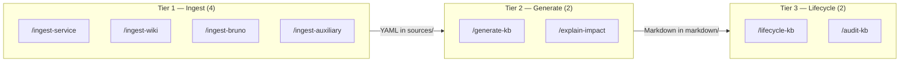
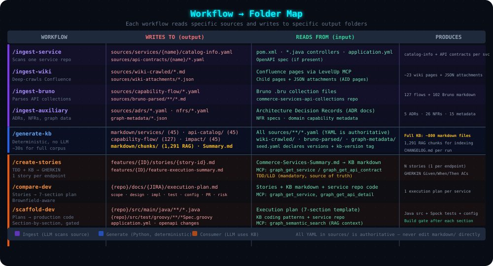

# 02 — Setup & Daily Operations

> **Audience**: New team members setting up the KB, and developers using it day-to-day.

---

## Prerequisites & Install

| Requirement | Version |
|-------------|---------|
| **Python** | 3.10+ |

### One-Command Setup

Run from the **repo root** (`apm0045079-commerce-AIFC-knowledge-base/`):

```bash
python3 -m venv .venv
source .venv/bin/activate
python3 -m pip install --upgrade pip setuptools
pip install -e "multi-dimensional-kb/[all]"    # kb CLI + RAG + MCP server
kb index                                        # warm RAG cache (~20s, cached thereafter)
```

> **Must be editable (`-e`).** A plain `pip install` (without `-e`) breaks path resolution —
> `kb search` silently returns empty results. If `kb index --json` shows `chunkCount: 0`,
> reinstall with `-e`.

### Install Profiles

```bash
pip install -e "multi-dimensional-kb/"              # Minimal — CLI only (LSA fallback)
pip install -e "multi-dimensional-kb/[embeddings]"  # + Dense RAG (MiniLM ONNX, no downloads)
pip install -e "multi-dimensional-kb/[mcp]"         # + MCP server only
pip install -e "multi-dimensional-kb/[all]"         # Everything (recommended)
```

---

## First-Time Bootstrap

### Step 1 — Review seed.yaml

```bash
cat multi-dimensional-kb/templates/seed.yaml
```

This declares **every source** that feeds the KB. Nothing is auto-discovered.

### Step 2 — Run Bootstrap

```bash
/lifecycle-kb --bootstrap     # WORKFLOW (in IDE chat) — all ingest + validate + generate
```

> Bootstrap is **workflow-only** — requires an LLM agent to scan source code and crawl wiki.
> After bootstrap, use `kb generate` (CLI) for subsequent regeneration.

### Step 3 — Verify

```bash
kb validate                    # source YAML schema + cross-ref checks
kb audit                       # health audit → audit-report.md
kb conformance                 # OKF v0.2 C1-C12 checks
kb stats                       # quick summary from audit-metrics.json
```

### Step 4 — Start MCP Server (Optional)

```bash
kb serve                       # SSE on http://localhost:8787
MCP_PORT=9000 kb serve         # custom port
python3 multi-dimensional-kb/graph-mcp/server.py --stdio   # stdio transport
```

---

## Two Tool Ecosystems

The KB has **two distinct kinds of tools**:

| | Workflows (`/ingest-*`, `/generate-kb`, etc.) | CLI (`kb` commands) |
|-|-----------------------------------------------|---------------------|
| **Runs with** | LLM agent (Windsurf/Cascade/Devin) | Deterministic Python |
| **Invoked via** | `/command` in IDE chat | `kb command` in terminal |
| **Purpose** | Scan code, crawl wiki → produce YAML | Validate, generate, audit, search |
| **LLM cost** | Yes | $0 |
| **CI** | Not used | Used (all 6 jobs) |

**Important**: `/ingest-*` has no CLI equivalent (requires LLM to read code).
`kb search` / `kb context` have no workflow equivalent (CLI-native).

---

## `kb` CLI Reference

```bash
# Generation & Validation
kb generate [--dry-run]                 # regenerate markdown/ from sources/
kb validate [--quality-report]          # source YAML schema + cross-ref validation
kb audit [--scope=S] [--min-score=N]    # full KB health audit
kb conformance [--json]                 # OKF v0.2 C1-C12 conformance
kb contracts                            # per-operation API contract YAMLs
kb aid-coverage [--fail-under=N]        # AID sample coverage report
kb viz [--out=PATH]                     # interactive dependency graph
kb stats                                # quick summary from audit-metrics.json

# Search & Context (no MCP server needed)
kb search "query" --top 5 [--type service] [--mode hybrid|bm25|dense|lsa] [--json]
kb context "topic" --tokens 4000        # ready-to-paste markdown with citations
kb index                                # rebuild .kb_index/ caches

# MCP Server
kb serve                                # start graph-mcp/server.py
```

---

## Workflows





### Tier 1 — Ingest (Raw Sources → Structured YAML)

| Workflow | What the LLM Scans | Output |
|----------|---------------------|--------|
| `/ingest-service` | Java repo (pom.xml, *.java, config, OpenAPI) | `sources/services/<name>/` + `sources/api-contracts/<name>/` |
| `/ingest-wiki` | Confluence pages (via LevelUp MCP) | `sources/wiki-crawled/` + `sources/api-contracts/<svc>/` |
| `/ingest-bruno` | Bruno `.bru` file collections | `sources/capability-flow/` + `sources/bruno-parsed/` |
| `/ingest-auxiliary` | ADR/NFR/metadata files | `sources/adrs/`, `sources/nfrs/`, `sources/metadata/` |

### Tier 2 — Validate & Generate

| Workflow | What It Does | CLI Equivalent |
|----------|-------------|----------------|
| `/generate-kb` | Validates YAML → generates Markdown KB + chunks | `kb generate` |
| `/explain-impact` | Traces deps → writes `impact/<name>.md` | *(none)* |

### Tier 3 — Lifecycle & Audit

| Workflow | What It Does | CLI Equivalent |
|----------|-------------|----------------|
| `/lifecycle-kb --bootstrap` | One-time: ingests ALL → validates → generates | *(none)* |
| `/lifecycle-kb --refresh` | Re-ingests changed sources → regenerates | *(none)* |
| `/audit-kb` | Health audit + LLM semantic analysis | `kb audit` (no LLM) |

---

## Recipes

### Ingest One Service

```bash
# 1. Ensure entry in seed.yaml under services:
# 2. WORKFLOW — LLM scans Java code
/ingest-service shoppingcartms
# 3. Regenerate
/generate-kb --scope=shoppingcartms     # or: kb generate
```

### Ingest One Wiki Page

```bash
/ingest-wiki https://wiki.web.att.com/display/DRC/Cart+APIs \
  --dimension=api --service=shoppingcartms --depth=5
/generate-kb --scope=shoppingcartms
```

### Ingest ADR / NFR / Metadata

```bash
/ingest-auxiliary adr adr/ADR-005.md
kb generate
```

### Check KB Health

```bash
kb audit                               # full audit (min-score=60)
kb audit --scope=shoppingcartms        # single service
kb conformance                         # OKF structural check
```

### Search (No MCP Server Needed)

```bash
kb search "shopping cart submit" --top 5           # hybrid (default)
kb search "addItemsToCart" --mode bm25 --top 3     # exact keyword
kb search "order pricing" --mode dense --top 5     # semantic/paraphrase
kb context "payment processing" --tokens 4000      # ready-to-paste markdown
```

---

## Refresh Modes

| Mode | Command | What Happens |
|------|---------|-------------|
| **Partial** | `/ingest-service X` → `/generate-kb --scope=X` | Re-scan one service |
| **Subdomain** | `/generate-kb --scope=subdomain:cart-checkout` | Regenerate a group |
| **Full refresh** | `/lifecycle-kb --refresh` | Re-ingest changed (fingerprint skip) |
| **Force refresh** | `/lifecycle-kb --refresh --force` | Re-ingest ALL sources |
| **Regenerate only** | `kb generate` | Re-run generator, no re-scanning |

---

## Data Extraction Depth (Per Service)

Each `/ingest-service` extracts:

| Dimension | Source | YAML Field |
|-----------|--------|-----------|
| Inbound APIs | `@RestController`, `@Path` | `inboundApis[]` |
| Request/response fields | `@NotNull`, `@Size` | `requestFields[]` |
| Outbound calls | `WebClient`, `RestTemplate`, `@FeignClient` | `outboundApis[]` |
| Forward call chain | Controller → Service → Adapter | `outboundCalls[]` |
| Kafka topics | `@KafkaListener`, `kafkaTemplate.send()` | `topicsProduced[]`, `topicsConsumed[]` |
| Datastores | `@Table`, `@Document`, `@Cacheable` | `datastores[]` |
| Architecture layers | `@Autowired` hierarchy | `architectureLayers` |
| Feature flags | `isFeatureEnabled()` | `featureFlag` |
| Error codes | `@ControllerAdvice` | `errorCodes[]` |
| Tech stack | `pom.xml` | `frameworks[]` |

---

## Directory Layout

```
<kb-repo>/
├── multi-dimensional-kb/               ← {KB_ROOT}
│   ├── templates/seed.yaml             ← THE SINGLE INPUT
│   ├── sources/                        ← Layer 1: Intermediate YAML
│   │   ├── services/<name>/catalog-info.yaml
│   │   ├── api-contracts/<svc>/*.yaml
│   │   ├── capability-flow/ · adrs/ · nfrs/ · metadata/
│   │   └── .fingerprints.json
│   ├── markdown/                       ← Layer 2: Final OKF Bundle
│   │   ├── index.md · services/ · api-catalog/ · capability-flow/
│   │   ├── impact/ · adrs/ · nfrs/ · metadata/ · wiki-content/
│   │   ├── chunks/*.md                 ← 1,291 RAG chunks
│   │   └── log.md · CHANGELOG.md
│   ├── graph-mcp/server.py             ← MCP server (25 tools)
│   ├── kbcli/cli.py                    ← Unified kb CLI
│   ├── scripts/                        ← Python generation + validation
│   ├── all-MiniLM-L6-v2/              ← ONNX model (committed in-repo)
│   └── documentation/                  ← THIS FOLDER
├── Commerce-Services-Summary.md        ← PRIMARY entry point (repo root)
└── .devin/workflows/multi-dimensional-kb/  ← 10 workflow definitions
```

---

## Entry Points

| Entry Point | For Whom |
|-------------|----------|
| `Commerce-Services-Summary.md` (repo root) | Humans + agents — primary KB index |
| `markdown/index.md` | Agents (MCP) — OKF bundle root |
| `documentation/README.md` | Developers — this documentation |

---

## Maintenance Rules

1. **Never hand-edit `markdown/`** — change `sources/` YAML, then regenerate
2. **Regenerate + audit after any source change** — score must stay ≥ 60 with 0 errors
3. **Keep provenance honest** — `sources` must reference real files
4. **Respect exclusions** — `@Internal`, admin, health endpoints stay out of API catalogs
5. **Compound knowledge** — durable analyses go in `markdown/analysis/`

---

## FAQ

**Q: How do I add a new service?**
Add to `templates/seed.yaml` → `/ingest-service <name>` → `/generate-kb --scope=<name>`.

**Q: How do I check KB health?**
`kb audit` — includes per-service scorecard and recommendations.

**Q: MCP server won't start?**
See `graph-mcp/README.md` for troubleshooting.

**Q: How do I search without the MCP server?**
`kb search "query" --top 5` or `kb context "topic" --tokens 4000`.

**Q: How do I regenerate without re-scanning code?**
`kb generate` (CLI) — fast, no LLM.

---

**Next**: [03 — MCP, Search & CI](./03-mcp-and-retrieval.md) | **Back**: [01 — Architecture](./01-architecture.md)
