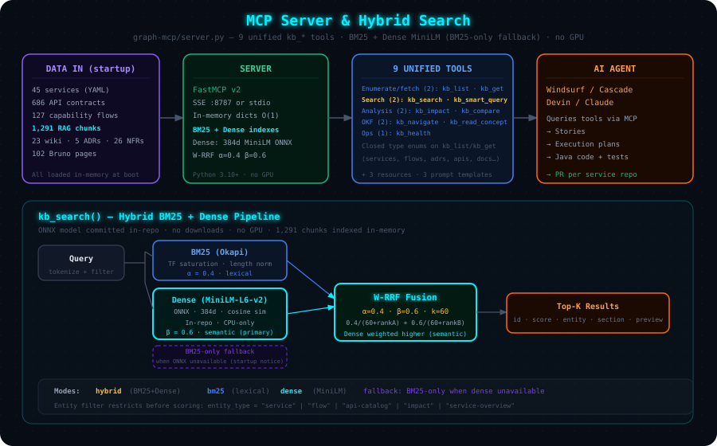
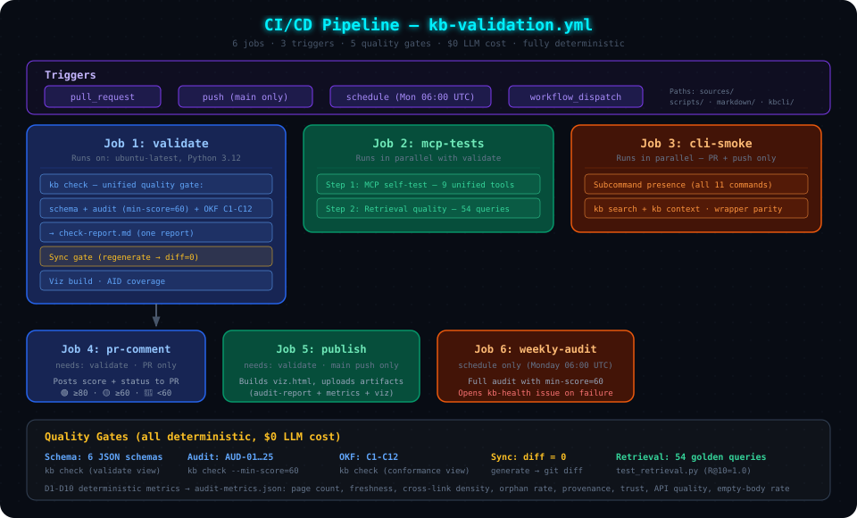

# 03 — MCP Server, Search & CI Pipeline

> **Audience**: Developers integrating with the MCP server, or maintaining the CI pipeline.

---

## MCP Server Overview

`graph-mcp/server.py` serves the KB through **25 MCP tools**. Retrieval is layered,
deterministic, and fully local. The shared `kblib` package powers both the MCP server
and the `kb` CLI.



```bash
kb serve                           # SSE on http://localhost:8787
MCP_PORT=9000 kb serve             # custom port
python3 multi-dimensional-kb/graph-mcp/server.py --stdio   # stdio transport
```

At startup: loads all YAML into memory → builds BM25 index → builds dense MiniLM ONNX
embeddings (falls back to LSA if unavailable) → caches in `.kb_index/`. Startup: <2s warm,
~20s cold.

---

## 25 MCP Tools

### Services (5)

| Tool | Use Case |
|------|----------|
| `graph_list_services` | List all 45 services with summary info |
| `graph_get_service` | Full service detail (APIs, deps, Kafka, datastores) |
| `graph_find_service_dependencies` | Upstream + downstream for one service |
| `graph_get_architecture_layers` | Controller → Service → Adapter hierarchy |
| `graph_compare_services` | Side-by-side comparison |

### APIs (3)

| Tool | Use Case |
|------|----------|
| `graph_list_api_contracts` | All contracts for a service |
| `graph_get_api_detail` | Unified: field schemas, error codes, downstream chain, scenarios |
| `graph_find_apis_by_path` | Find APIs by path pattern across all services |

### Flows (2)

| Tool | Use Case |
|------|----------|
| `graph_list_flows` | List all 127 capability flows |
| `graph_get_flow` | Full flow with step tables + Mermaid diagrams |

### ADR / Metadata (4)

| Tool | Use Case |
|------|----------|
| `graph_list_adrs` / `graph_get_adr` | Architecture decision records |
| `graph_list_metadata` / `graph_get_metadata` | Unified YAML + graph-metadata access |

### NFR / Documents (5)

| Tool | Use Case |
|------|----------|
| `graph_get_nfr` | NFR profile (latency, throughput, SLAs) |
| `graph_get_document` | Unified: `store='wiki'\|'bruno'\|'service-wiki'` |
| `graph_get_wiki_content` / `graph_get_service_wiki` / `graph_get_bruno_collection` | *Deprecated aliases* |

### Search & Navigation (6)

| Tool | Use Case |
|------|----------|
| `graph_semantic_search` | Hybrid BM25 + dense ranked search |
| `graph_smart_query` | Intelligent router — classifies → routes to best tool |
| `graph_get_impact` | Blast-radius analysis |
| `graph_health` | Server health + index stats |
| `graph_navigate` | Walk hierarchical indexes (OKF progressive disclosure) |
| `graph_read_concept` | Read one concept with parsed frontmatter + trust tier |

---

## Smart Query Routing

`graph_smart_query` classifies queries and routes to the optimal retrieval:


| Route | Pattern | Method |
|-------|---------|--------|
| **Analytical** | "impact of X", "blast radius" | Graph traversal + impact chunks |
| **Navigational** | "list APIs of X" | Deterministic catalog lookup (O(1)) |
| **Factual** | Contains service name / operationId | Deterministic detail lookup (O(1)) |
| **Exploratory** | "how", "why", open-ended | Hybrid BM25 + dense search |

Classifier accuracy: **>95%** on labeled test cases.

---

## Hybrid Search Pipeline

```
Query → tokenize → ┬─ BM25:  term relevance (α=0.4)              → Ranked List A
                    └─ Dense: MiniLM ONNX 384d cosine (β=0.6)
                              (LSA 128d fallback)                  → Ranked List B
                                                              ↓
                    Weighted RRF: α/(60+rankA) + β/(60+rankB) → Merged
                                                              ↓
                    Lexical Rerank: entity/section/disclosure  → Final Top-K
```

- **BM25** — `rank_bm25.BM25Okapi`, best for exact terms (service names, operationIds)
- **Dense** — all-MiniLM-L6-v2 ONNX (committed in-repo, no downloads, CPU-only).
  Captures paraphrases with no keyword overlap.
- **LSA fallback** — TF-IDF → numpy SVD → 128d, when ONNX deps unavailable

### Search Modes

| Mode | Retrievers | Best For |
|------|-----------|----------|
| `hybrid` *(default)* | BM25 + dense/LSA → W-RRF | General queries |
| `bm25` | BM25 only | Exact keywords |
| `dense` | MiniLM only | Conceptual/paraphrase |
| `lsa` | LSA only | No ONNX deps |

### RAG Chunking

Chunks are exported to `markdown/chunks/` (currently 1,291). Each carries HTML comment
metadata (`entity-type`, `entity`, `section`, `tokens`). **8 KB ceiling** per chunk —
oversized pages split at heading boundaries.

---

## CI Pipeline



Defined in `.github/workflows/kb-validation.yml`. Fully deterministic — **$0 LLM cost**.

### Triggers

| Trigger | When | Jobs |
|---------|------|------|
| **pull_request** | PR touching `sources/`, `scripts/`, `graph-mcp/`, `markdown/`, etc. | validate, mcp-tests, cli-smoke, pr-comment |
| **push (main)** | Push to `main` | validate, mcp-tests, cli-smoke, publish |
| **schedule** | Monday 06:00 UTC | weekly-audit |

### Job 1: `validate` — KB Quality Gate

1. **Schema validation** — all YAML against 6 JSON schemas
2. **Health audit** — 25 checks (AUD-01…25), score ≥ 60, 0 errors
3. **OKF conformance** — C1–C12 structural checks
4. **Sync gate** — regenerates ALL markdown, diffs vs committed. **Fails on any diff** — no stale pages reach `main`
5. **Viz build** — ensures interactive graph generates
6. **AID coverage** — API contract sample report (informational)

### Job 2: `mcp-tests` — Retrieval Quality (parallel)

- **25-tool self-test** (`test_tools.py`)
- **54 golden queries** (`test_retrieval.py`) — fails on regression

| Metric | Target | Current |
|--------|--------|---------|
| Recall@5 | ≥ 0.90 | **0.982** |
| Recall@10 | ≥ 0.95 | **1.0** |
| MRR | ≥ 0.80 | **0.912** |

- **Classifier accuracy** (`test_smart_query.py`) — >85% required

### Job 3: `cli-smoke` — CLI Smoke Test (parallel)

Verifies all 16 `kb` subcommands, runs `kb search` and `kb context` smoke tests.

### Job 4: `pr-comment` — PR Score (after validate)

Posts audit score on the PR: 🟢 ≥ 80, 🟡 ≥ 60, 🔴 < 60.

### Job 5: `publish` — Artifacts (main push)

Uploads `audit-report.md`, `audit-metrics.json`, `viz.html` (30-day retention).

### Job 6: `weekly-audit` — Scheduled Health Check

Full audit every Monday — creates a GitHub issue on failure.

---

## Quality Gate Summary

| Gate | Tool | Pass Criteria |
|------|------|--------------|
| Schema | `validate_catalog.py` | 0 violations |
| Audit | `audit_kb.py` | Score ≥ 60, 0 errors |
| OKF | `okf_conformance_check.py` | C1–C12 all pass |
| Sync | `generate + git diff` | No diff |
| Retrieval | `test_retrieval.py` | No regression |
| CLI | smoke tests | All subcommands work |

---

## MCP Resources & Prompts

**Resources**: `kb://services`, `kb://stats`, `kb://subdomains`

**Prompt Templates**: `kb_explore`, `kb_investigate_service`, `kb_compare`

---

**Next**: [04 — Consumer Workflows](./04-consumer-workflows.md) | **Back**: [02 — Setup & Daily Operations](./02-getting-started.md)
