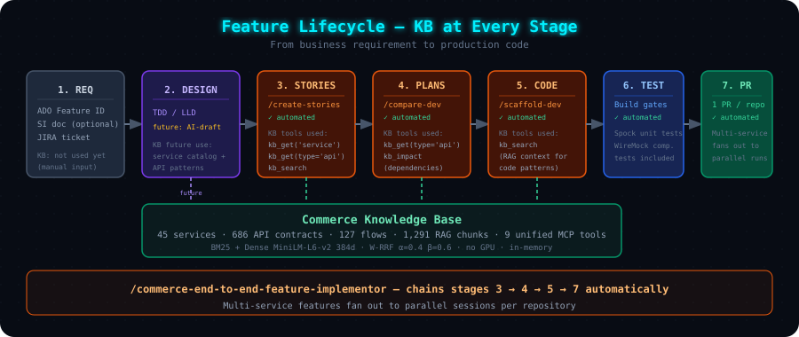
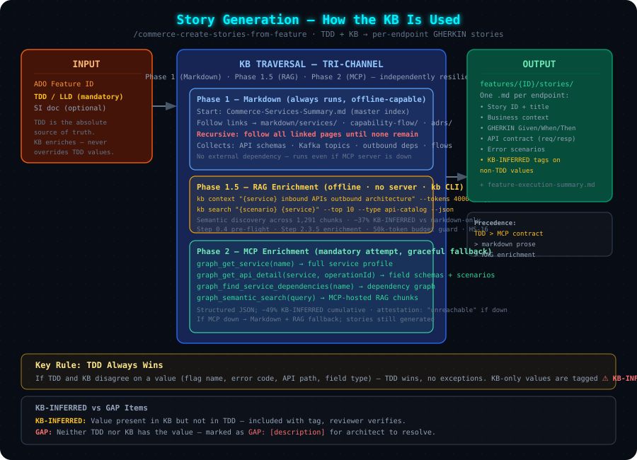

# 04 — Consumer Workflows

> **Audience**: Developers and AI agents using the KB to generate stories, plans, and code.

---

## Feature Pipeline



The KB participates at **every automated stage**:

| Stage | Workflow | KB Role |
|-------|----------|---------|
| 1. Requirement | Manual (ADO Feature) | — |
| 2. Design | Manual (TDD/LLD) | *Future*: draft TDD generation |
| 3. **Stories** | `/commerce-create-stories-from-feature` | Service profiles, API schemas, flows, error codes |
| 4. **Plans** | `/compare-commerce-dev-companion` | API details, dependencies, architecture layers |
| 5. **Code** | `/scaffold-commerce-dev-companion` | RAG context for code patterns |
| 6. Test | Build gates (Spock + WireMock) | Tests validate against KB contracts |
| 7. **PR** | `/commerce-end-to-end-feature-implementor` | Chains 3→4→5→7 automatically |

---

## Tri-Channel KB Access

Consumer workflows access the KB through **three complementary channels**:

| Phase | Channel | Mechanism | Availability |
|-------|---------|-----------|-------------|
| **1** | Markdown Crawling | Recursive `read_file` from `Commerce-Services-Summary.md` | Always (offline) |
| **1.5** | RAG Enrichment | `kb context` / `kb search` over 1,291 chunks | Always (offline, no server) |
| **2** | MCP Tools | `graph_get_service`, `graph_get_api_detail`, etc. | Requires running server |

**Precedence**: TDD > exact KB/MCP contract > markdown prose > RAG enrichment.
RAG results are tagged `⚠️ KB-INFERRED` — never override TDD or MCP data.

**Degradation**: All 3 → richest. Markdown + RAG → offline semantic search. Markdown only → functional floor.

---

## Story Generation — `/commerce-create-stories-from-feature`



```bash
/commerce-create-stories-from-feature 2181283
```

### Phase 1 — Markdown (always, offline)

Start at `Commerce-Services-Summary.md` → follow links recursively through `markdown/services/`,
`capability-flow/`, `adrs/`. Collects API schemas, Kafka topics, outbound deps, error codes.

### Phase 1.5 — RAG Enrichment (when `kb` CLI installed)

| Query | Command |
|-------|---------|
| Service context | `kb context "{service} inbound APIs outbound integrations" --tokens 4000 --type service` |
| Scenario discovery | `kb search "{scenario} {service}" --top 10 --type api-catalog --json` |
| Cross-service patterns | `kb context "{downstream} integration pattern {caller}" --tokens 2000` |

### Phase 2 — MCP (mandatory attempt, graceful fallback)

| Tool | Provides |
|------|---------|
| `graph_get_service` | Full service profile |
| `graph_get_api_detail` | Contract with scenarios, schemas |
| `graph_find_service_dependencies` | Upstream + downstream deps |
| `graph_semantic_search` | RAG context for open-ended questions |

### Key Rules

**TDD Always Wins**: KB enriches but never overrides TDD.

| Tag | Meaning |
|-----|---------|
| *(no tag)* | Value from TDD (source of truth) |
| `⚠️ KB-INFERRED` | Present in KB, not in TDD — for reviewer verification |
| `GAP: [description]` | Neither TDD nor KB has it — for architect resolution |

### Output

```
features/{FEATURE_ID}/stories/
  ├── STORY-001-initializeCart.md       ← one story per endpoint
  ├── STORY-002-addItemsToCart.md
  └── ...
features/{FEATURE_ID}/feature-execution-summary.md
```

---

## Execution Plans — `/compare-commerce-dev-companion`

Takes stories + KB + service repo → **7-section execution plan**:

```bash
/compare-commerce-dev-companion --story-file features/2181283/stories/STORY-001.md
```

| Section | Content |
|---------|---------|
| §1 Scope | What changes, impacted files |
| §2 Design | API contract, data model, sequence diagrams |
| §3 Implementation | Step-by-step coding instructions |
| §4 Configuration | application.yml, feature flags |
| §5 Testing | Spock + WireMock tests, test data |
| §6 PR | Commit message, PR description |
| §7 Risk | Risks, rollback plan, monitoring |

Brownfield changes include **IXP feature flag** protocol and **brownfield hard-stops**.

---

## Code Scaffold — `/scaffold-commerce-dev-companion`

Takes execution plan → **production-grade Java code + Spock tests**:

```bash
/scaffold-commerce-dev-companion --plan docs/JIRA-123/execution-plan.md
```

Processes the plan **section by section** with compile/build gates between each.
Uses `graph_semantic_search` to find similar patterns in other services.

---

## End-to-End — `/commerce-end-to-end-feature-implementor`

Chains all stages for a complete ADO feature:

```bash
/commerce-end-to-end-feature-implementor 2181283
```

```
ADO Feature → Stories (Phase 1) → Plans (Phase 2, batch)
           → Code (Phase 3, batch) → PRs (Phase 4, 1 per repo)
```

Multi-service features fan out to **parallel child sessions** per repository.

---

## Golden-Dataset Evaluation — `/kb-evaluation-judge`

Proves KB changes don't degrade downstream quality:

1. Takes golden-dataset folders with known-good stories + scorecards
2. Regenerates stories from TDD + current KB
3. Scores against baseline via `/stories-evaluation-judge`
4. Produces aggregate improve/degrade report

```
golden-dataset/
├── 1342585/     ← BSSE Order Amend
├── 1488986/     ← BSSE WLS CIM
├── 2108438/     ← Feature 2108438
└── 2174069/     ← Feature 2174069
```

---

## KB at Each Stage — Summary

| Stage | KB Data Used | Key MCP Tools |
|-------|-------------|---------------|
| **Stories** | Service profiles, API schemas, flows, error codes + RAG chunks | `graph_get_service`, `graph_get_api_detail` |
| **Plans** | Architecture layers, dependencies, implementations | `graph_find_service_dependencies`, `graph_semantic_search` |
| **Code** | Coding patterns, field schemas, test patterns | `graph_get_architecture_layers`, `graph_semantic_search` |
| **Evaluation** | Same as Stories (regeneration) | Same as Stories |

---

**Next**: [05 — Scaling & Federation](./05-scaling-and-federation.md) | **Back**: [03 — MCP, Search & CI](./03-mcp-and-retrieval.md) | **Home**: [README](./README.md)
