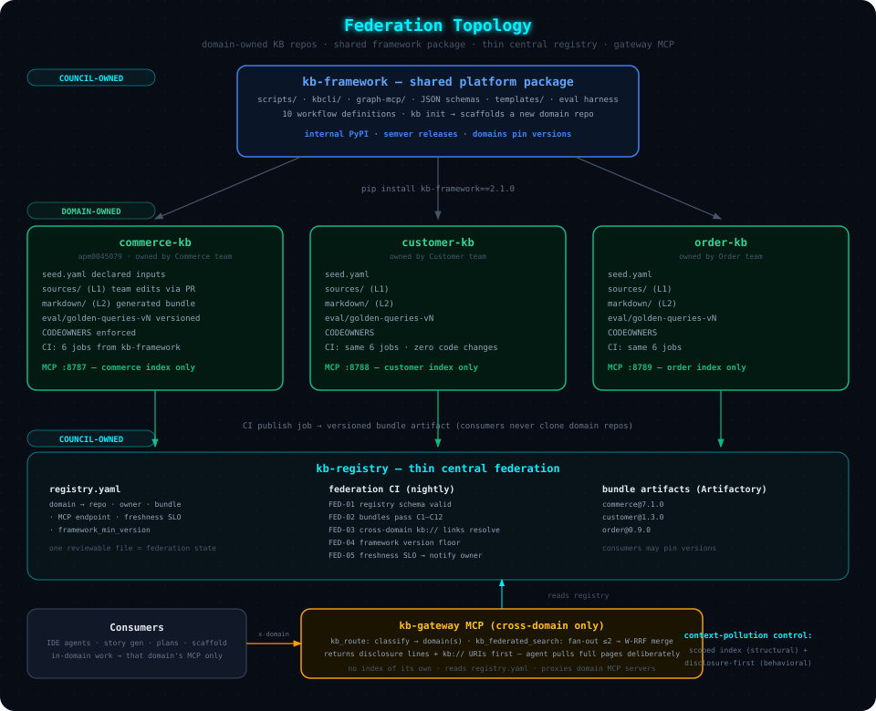
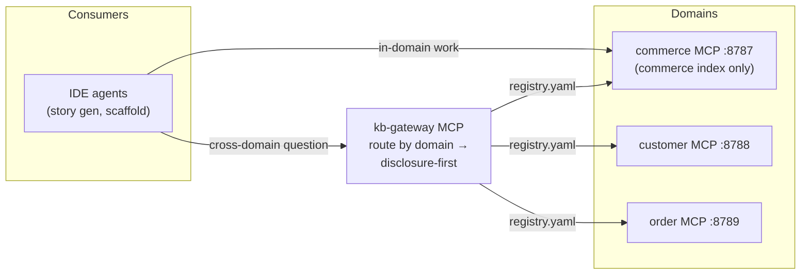

# 05 — Scaling & Federation Across Domains

> **Audience**: Architects extending the KB framework beyond Commerce (Customer, Order,
> Billing, …), and leadership evaluating whether this approach is industry-standard.

---

## Design Validation — Is This Extendable?

**Verdict: yes.** The Commerce KB is not a bespoke invention — every load-bearing design
choice maps to a named, citable industry standard that is current as of 2026:

| Design Choice (Chapters 01–04) | Industry Standard It Implements | Status |
|---|---|---|
| Markdown + YAML frontmatter bundle, stable URIs, progressive disclosure | **[Open Knowledge Format v0.2](https://github.com/GoogleCloudPlatform/knowledge-catalog)** — Google Cloud's vendor-neutral spec (June 2026) | Conformant (C1–C12 gate) |
| Three layers: raw sources → generated wiki → schema | **[Karpathy's LLM-Wiki pattern](https://cloud.google.com/blog/products/data-analytics/how-the-open-knowledge-format-can-improve-data-sharing)** (`raw/`, `wiki/`, schema file) — the pattern OKF formalized | Adopted |
| 25 structured tools over the KB via MCP | **[Model Context Protocol](https://blog.modelcontextprotocol.io/posts/2026-07-28-release-candidate/)** — donated to the Linux Foundation's Agentic AI Foundation (Dec 2025); adopted by OpenAI, Google, Microsoft, AWS, IBM | Adopted |
| `catalog-info.yaml` service descriptors, team-maintained | **[Backstage Software Catalog](https://backstage.io/docs/features/software-catalog/)** (CNCF) descriptor convention — metadata-next-to-code, centrally aggregated | Adopted |
| Serving markdown (not HTML/wiki markup) to agents | **[llms.txt](https://www.mintlify.com/blog/what-is-llms-txt)** movement (Cloudflare, Stripe, Anthropic, Mintlify) — up to ~10× token reduction vs HTML | Aligned |
| Golden-query retrieval gates (Recall@K, MRR) in CI | Standard RAG evaluation practice ([Ragas](https://blog.premai.io/rag-evaluation-metrics-frameworks-testing-2026/)/DeepEval ecosystem; golden datasets of 50–100 queries) | Adopted — needs upgrades, see [Chapter 06](./06-freshness-and-evaluation.md) |
| Deterministic generation + sync gate, $0-LLM CI | Docs-as-code + OKF "deterministic-first" principle | Adopted |

What the current design does **not** yet answer is the multi-domain question: one domain
team cannot own Customer's knowledge, Commerce's CI cannot gate Order's sources, and one
giant index would pollute every consumer's context with 10 domains of chunks. This chapter
defines that scaling layer. The corrections to the *existing* single-domain design are in
[Chapter 06](./06-freshness-and-evaluation.md#corrections-to-the-original-design).

---

## The Federation Model

The scaling pattern is **federation, not centralization** — the same model used by the two
closest industry analogues:

1. **Backstage**: each team keeps `catalog-info.yaml` next to its code and maintains it
   through its normal Git workflow; a central catalog *aggregates* — it never *owns*.
2. **Data Mesh** ([Dehghani](https://www.getdbt.com/blog/key-components-of-data-mesh-federated-computational-governance)):
   domains own their data as *products*; a federated governance layer defines global
   standards that are **enforced computationally in each domain's own pipeline**, not by a
   central review board.

Applied here:



```
                        ┌────────────────────────────────┐
                        │   kb-framework  (shared repo)   │
                        │  scripts/ kbcli/ graph-mcp/     │
                        │  schemas/ templates/ eval/      │
                        │  → internal PyPI, semver        │
                        └───────┬───────┬───────┬────────┘
                          pins v2.1.0   │       │
              ┌─────────────────┐ ┌─────┴─────────┐ ┌──────────────────┐
              │ commerce-kb repo│ │customer-kb repo│ │  order-kb repo   │
              │ seed.yaml       │ │ seed.yaml      │ │  seed.yaml       │
              │ sources/  (L1)  │ │ sources/       │ │  sources/        │
              │ markdown/ (L2)  │ │ markdown/      │ │  markdown/       │
              │ eval/golden-*   │ │ eval/golden-*  │ │  eval/golden-*   │
              │ CODEOWNERS      │ │ CODEOWNERS     │ │  CODEOWNERS      │
              │ MCP :8787       │ │ MCP :8788      │ │  MCP :8789       │
              └────────┬────────┘ └───────┬────────┘ └────────┬─────────┘
                       │ publish bundle   │ publish           │ publish
                       ▼                  ▼                   ▼
              ┌──────────────────────────────────────────────────────────┐
              │        kb-registry  (thin central federation repo)        │
              │  registry.yaml  ·  cross-domain link check  ·  gateway    │
              │  bundle artifacts: commerce@7.1.0 customer@1.3.0 …        │
              └──────────────────────────────────────────────────────────┘
```

### The Four Repositories of the Federation

| Repo | Contains | Owned By | Cadence |
|------|----------|----------|---------|
| **`kb-framework`** | `scripts/`, `kbcli/`, `graph-mcp/`, JSON schemas, `templates/`, eval harness, workflow definitions | Architecture council (platform team) | Semver releases to internal PyPI/Artifactory |
| **`<domain>-kb`** (one per domain) | `seed.yaml`, `sources/`, generated `markdown/` bundle, domain golden eval set, ADRs/NFRs | **The domain team** (CODEOWNERS) | Continuous — same 6-job CI, installed from the framework package |
| **`kb-registry`** | `registry.yaml`, federation CI, gateway MCP config | Architecture council | Changes only when a domain onboards or bumps |
| Service repos (existing) | Code + (Phase 2) their own `catalog-info.yaml` | Service teams | Unchanged |

This resolves the **version-plane question** from
[Chapter 01](./01-architecture.md#version-planes): the *Framework* plane becomes the
`kb-framework` package version that each domain pins — upgrades are explicit,
per-domain, and testable (`pip install kb-framework==2.1.0`).

### Domain KB Repo Layout (identical shape everywhere)

Every domain repo is a clone of the Commerce structure — same seed.yaml grammar, same
sources/markdown split, same CI. Only the *content* differs:

```
<domain>-kb/
├── seed.yaml                  ← domain's declared inputs (services, wiki, collections)
├── sources/                   ← Layer 1 — domain team edits (via ingest workflows)
├── markdown/                  ← Layer 2 — generated OKF bundle, never hand-edited
├── eval/
│   ├── golden-queries-vN.yaml ← versioned retrieval eval set (Chapter 06)
│   └── golden-dataset/        ← story-regeneration baselines
├── CODEOWNERS                 ← domain team owns sources/ + seed.yaml
└── .github/workflows/         ← the same 6 jobs, from kb-framework
```

**Onboarding a new domain is therefore a template instantiation, not a project**:
`kb init --domain customer --apm apm00xxxxx` scaffolds the repo, and the domain team fills
`seed.yaml` and runs `/lifecycle-kb --bootstrap`. Commerce is the reference implementation.

---

## Where Things Live — The Placement Matrix

The central question — *"where to maintain sources, where to maintain markdown bundles"* —
answered in one table:

| Asset | Lives In | Why There |
|-------|----------|-----------|
| **Sources (Layer 1 YAML)** | The domain's `<domain>-kb` repo, under `sources/` | System of record must sit inside the ownership boundary — domain team reviews every change via PR (Backstage model) |
| **Service descriptors** *(Phase 2 option)* | Each service repo (`catalog-info.yaml` next to code), harvested at ingest | Metadata-next-to-code survives team reorgs; the KB repo becomes an aggregator of truth, not a copy of it |
| **Markdown bundle (Layer 2)** | Committed in the domain repo **and** published as a versioned artifact by CI (`publish` job → tarball to Artifactory) | Committed = reviewable diffs + sync gate; published artifact = what *consumers* pull. Cross-domain consumers never clone another domain's repo |
| **Framework (Layer 3)** | `kb-framework` repo → internal package registry | One implementation, N consumers; semver protects domains from breaking changes |
| **Registry** | `kb-registry` repo (`registry.yaml`) | Single small file = single source of truth for "what domains exist"; cheap to review |
| **Golden eval sets** | `eval/` in each domain repo, versioned files | Eval data must version with the content it evaluates ([Chapter 06](./06-freshness-and-evaluation.md)) |
| **Cross-domain analyses** | `markdown/analysis/` in whichever domain initiated it, cross-linked via `kb://` URIs | Compound-knowledge pattern (Chapter 01) unchanged |
| **Monitoring data** | Central Postgres (Chapter 06) — one instance, `domain` column | Telemetry is the one thing that *should* be centralized: cross-domain usage comparison is its purpose |

**The context-pollution rule that makes this work**: a consumer working inside one domain
mounts *only that domain's* bundle and MCP server. Cross-domain knowledge enters through
the **gateway** (below) — deliberately, per query, disclosure-first — never by dumping ten
domains into the context window.

---

## Federated URI Scheme

`commerce://shoppingcartms/service` does not federate — the scheme name *is* the domain, so
links can't be resolved uniformly and every domain invents its own. Migrate to:

```
kb://<domain>/<entity>/<type>[/<section>]

kb://commerce/shoppingcartms/service/inbound-apis
kb://customer/profilems/api-catalog/getCustomerProfile
kb://order/orderfulfilms/capability-flow/order-submit
```

| Rule | Detail |
|------|--------|
| Generator | `generate_multidim_kb.py` emits `kb://` URIs; `uri_aliases: [commerce://…]` in frontmatter during a 2-release deprecation window |
| Resolution | Same-domain: local bundle. Cross-domain: `registry.yaml` maps `<domain>` → bundle artifact + MCP endpoint |
| Cross-domain refs | Today's dangling `AUD-25` warnings (outbound calls to services outside the KB) become **resolvable links** once the target domain onboards — AUD-25 is promoted to a federation-level check that runs in `kb-registry` CI |

---

## The Registry — `registry.yaml`

The entire central state of the federation is one reviewable file:

```yaml
okf_version: "0.2"
framework_min_version: "2.0.0"

domains:
  - name: commerce
    apmId: apm0045079
    repo: apm0045079-commerce-AIFC-knowledge-base
    owner: commerce-architecture-team          # CODEOWNERS group
    bundle:
      artifact: artifactory://kb-bundles/commerce/   # published by CI `publish` job
      version: 7.1.0
    mcp:
      endpoint: http://kb-commerce.internal:8787
    freshness_slo:
      pages_within_ttl: 0.95                   # D2 metric target
      reingest_within_days: 7                  # change→refresh latency target
    status: active                             # active | onboarding | deprecated

  - name: customer
    status: onboarding
    ...
```

**Federation CI (in `kb-registry`, runs nightly + on registry PRs):**

| Check | What It Validates |
|-------|-------------------|
| FED-01 | `registry.yaml` schema + referenced repos/artifacts exist |
| FED-02 | Every domain's published bundle passes OKF conformance (C1–C12) at its declared version |
| FED-03 | Cross-domain `kb://` links resolve across the current bundle set (AUD-25 promoted) |
| FED-04 | Each domain's framework version ≥ `framework_min_version` |
| FED-05 | Freshness SLO met per domain (reads D2 from each bundle's `audit-metrics.json`) — violation notifies that domain's owner, not a shared inbox |

---

## MCP Topology — Scoped Servers + One Gateway



| Tier | What Runs | Context-Pollution Control |
|------|-----------|---------------------------|
| **Per-domain MCP** (exists today) | The current 25-tool server, one per domain, indexing *only* that domain's bundle | Structural: the index simply contains nothing from other domains |
| **Federation gateway MCP** (new, thin) | `kb_route` (classify query → domain(s) via registry + capability keywords), `kb_federated_search` (fan out to ≤2 domain servers, merge by weighted RRF, return **disclosure lines + URIs only**), `kb_read(uri)` (fetch one concept cross-domain) | Behavioral: disclosure-first — an agent sees one-line hints and *chooses* what to pull, instead of receiving 10 domains of chunks |

The gateway reuses the existing smart-query router (Chapter 03) with one extra, earlier
classification step: **which domain(s)?** — then delegates. It holds no index of its own.
Deterministic tools (`graph_get_service`, …) stay domain-scoped; the gateway only ever
proxies them with an explicit `domain=` argument.

---

## Governance — Data Mesh, Applied to Knowledge

The four data-mesh principles map one-to-one onto this design; this is the governance
story to present to leadership:

| Data Mesh Principle | In This Framework |
|---|---|
| **Domain ownership** | Each domain team owns its KB repo, seed.yaml, sources, and eval set — enforced by CODEOWNERS, exercised through their normal PR workflow |
| **Knowledge as a product** | Every bundle ships with SLOs (freshness), quality guarantees (audit score ≥ 60, 0 errors), documentation (this doc set), and a versioned, consumable artifact |
| **Self-serve platform** | `kb-framework` package + `kb init` scaffold: onboarding a domain requires no platform-team involvement beyond a registry PR |
| **Federated computational governance** | Global standards (frontmatter contract, JSON schemas, C1–C12, quality gates) are defined centrally **but enforced locally in each domain's own CI** — no central review bottleneck, no drift |

**The council**: one representative per domain + the platform team owns exactly three
things — the frontmatter contract (OKF plane), the framework package roadmap, and
`registry.yaml`. Everything else is domain-local. This is deliberately the *smallest*
central surface that keeps bundles interoperable.

---

## Rollout Sequence

| Step | What | Exit Criteria |
|------|------|---------------|
| 1 | **Extract** `kb-framework` from the Commerce repo (scripts, kbcli, graph-mcp, schemas, templates, eval harness) → internal PyPI `v2.0.0` | Commerce repo installs the package and all 6 CI jobs stay green; sync gate proves byte-identical output |
| 2 | **Migrate URIs** to `kb://commerce/…` with aliases | Golden retrieval suite unchanged; consumers updated |
| 3 | **Stand up `kb-registry`** with Commerce as the only entry + FED-01…05 CI | Federation CI green |
| 4 | **Onboard Customer domain** via `kb init` — the real test of the template | Customer bundle passes C1–C12 + audit ≥ 60 with *zero framework code changes* |
| 5 | **Onboard Order domain**; deploy the gateway MCP once ≥ 2 domains are active | Cross-domain story generation resolves `kb://` links across bundles |
| 6 | Iterate: remaining domains at their own pace, pinned framework versions | — |

Anything requiring central infrastructure beyond the registry (shared vector index,
orchestrator, online judges) is **Phase 2** — designed in full in
[Chapter 07](./07-phase-2-target-architecture.md).

---

## Defending the Approach — Theory & Citations for Leadership

### The core argument in three sentences

1. **Markdown bundles** are how Google says agent knowledge should be packaged
   ([OKF](https://cloud.google.com/blog/products/data-analytics/how-the-open-knowledge-format-can-improve-data-sharing), 2026) and how Cloudflare/Stripe/Anthropic already serve
   docs to agents ([llms.txt](https://www.mintlify.com/blog/what-is-llms-txt), ~10× cheaper in tokens than HTML).
2. **MCP** is how agents consume tools/knowledge — a Linux Foundation standard spoken by
   every major model vendor, deployed in [~28% of the Fortune 500](https://www.digitalapplied.com/blog/mcp-adoption-statistics-2026-model-context-protocol).
3. **RAG with measured retrieval quality** (golden datasets, Recall@K/MRR, LLM-as-judge
   gates in CI) is the documented 2026 evaluation practice
   ([Ragas/DeepEval/TruLens](https://blog.premai.io/rag-evaluation-metrics-frameworks-testing-2026/)) — we don't claim it works, we *gate the build on proof* ([Chapter 06](./06-freshness-and-evaluation.md)).

### Anticipated questions

| Question | Answer |
|----------|--------|
| **"Why not just Confluence + search?"** | Agents burn tokens on wiki markup and can't get deterministic answers. Markdown + frontmatter gives ~10× token efficiency (llms.txt evidence), git-grade governance (PR review, diff, blame, CODEOWNERS), and a *deterministic* graph for exact questions — Confluence remains a **source** we ingest, not the serving layer. |
| **"Why not buy a vector-DB / enterprise-RAG product?"** | At 1,291 chunks the in-process index hits Recall@5 = 0.98 with zero infrastructure and $0 license. The [zoomcamp curriculum itself](./llm-zoomcamp/02-vector-search/lessons/10-next-steps.md) teaches text-search-first and warns that vector-first advice mostly comes from vector-DB vendors. When scale demands it we adopt pgvector/OpenSearch behind the *same* contract — [Chapter 07](./07-phase-2-target-architecture.md) has the design and the measurable triggers. Nothing is repurchased; nothing is thrown away. |
| **"Why MCP instead of our own API?"** | A custom API needs custom client integration in every IDE/agent. MCP is vendor-neutral (Linux Foundation), already spoken by Copilot, Claude, Gemini, and the corporate IDE agents we use — 9,600+ servers in the public registry. Betting on it is betting *with* the industry. |
| **"Why markdown files instead of a database?"** | OKF's rationale: renders on any git host, reviewable by humans, diffable, portable (tarball/filesystem), zero runtime to read. The *database view* of the same content is derived (chunks, indexes) — Layer 2 is regenerable at will; the knowledge itself is never locked in. |
| **"Who keeps 10 domains from becoming 10 silos?"** | Federated computational governance (data mesh): a global contract (frontmatter, schemas, conformance) enforced automatically in every domain's CI, a one-file registry, and cross-domain link checking. Central standards, local enforcement — no central bottleneck. |
| **"What does it cost to run?"** | CI is deterministic — **$0 LLM**. LLM spend is confined to ingest (per changed service) and evaluation (measured: ~$0.06 to generate ground truth per 80 documents, ~$0.25 to judge 395 answers — zoomcamp cost datapoints). Retrieval is CPU-only (in-repo ONNX model, no GPU, no HuggingFace at runtime). |
| **"Is the no-download constraint a compromise?"** | No — it's the recommended pattern. The vendored-ONNX approach (147 MB runtime: `onnxruntime` + `tokenizers` + `numpy`) is exactly what the zoomcamp [ONNX lesson](./llm-zoomcamp/02-vector-search/lessons/09-onnx-embedder.md) teaches for production: models baked in at build time, runtime never contacts external hubs. |

---

**Next**: [06 — Freshness, CI/CD & Evaluation](./06-freshness-and-evaluation.md) | **Back**: [04 — Consumer Workflows](./04-consumer-workflows.md) | **Home**: [README](./README.md)
