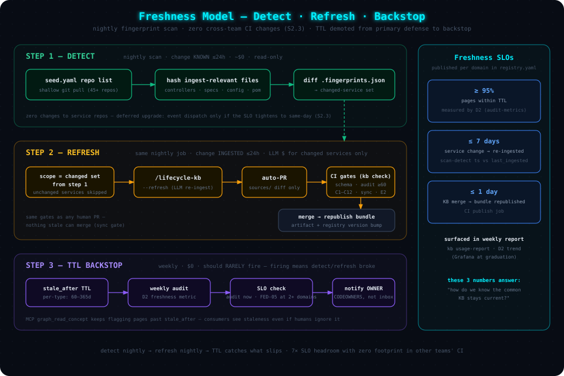
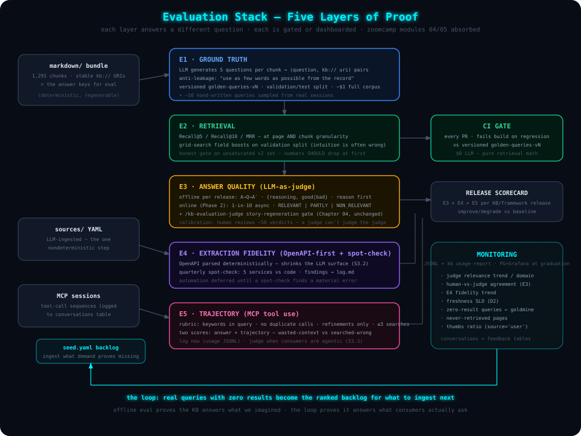
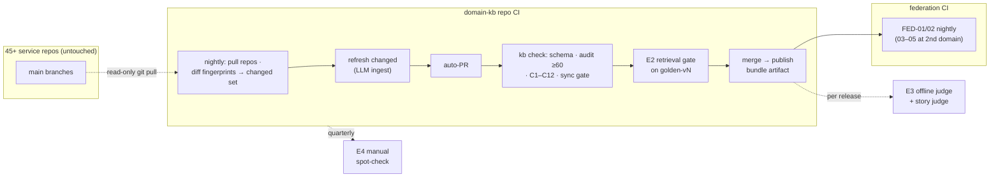

# 06 — Freshness, CI/CD & Evaluation

> **Audience**: KB maintainers who must keep the bundle current and *prove* it stays
> correct — and reviewers auditing where the original design needed correction.

---

## Corrections to the Original Design

An honest audit of Chapters 01–04 against industry evaluation practice and the
[llm-zoomcamp](https://github.com/DataTalksClub/llm-zoomcamp) material surfaced six real gaps. None invalidate the
architecture — but all six should be treated as committed upgrades, and each has a fix
specified in this chapter:

| # | Gap in Original Thinking | Why It Matters | Fix (section below) |
|---|--------------------------|----------------|---------------------|
| 1 | **Extraction fidelity is unevaluated.** All 6 quality gates validate *structure* (schemas, conformance, sync) — none check whether the LLM-ingested YAML actually matches the Java code it was scanned from. The one nondeterministic step in the pipeline is the one without an eval. | A hallucinated `outboundCalls[]` entry passes every gate and poisons every downstream story | [Extraction-Fidelity Eval](#e4--extraction-fidelity-eval-new) |
| 2 | **The 54-query golden suite is saturated.** Recall@10 = 1.0 means the suite can no longer detect regressions — and per the zoomcamp warning ([search metrics lesson](https://github.com/DataTalksClub/llm-zoomcamp/blob/main/04-evaluation/lessons/05-search-metrics.md)): *metrics above ~95% on synthetic questions usually signal leakage* (questions written too close to the indexed text), not perfection. | A retrieval regression ships silently; the headline number overstates quality | [Ground-Truth Generation](#e1--synthetic-ground-truth-generation) |
| 3 | **TTL-based staleness measures age, not change.** `stale_after: +90d` flags old pages, but a service can change the day after ingest and stay "fresh" for 89 days. Fingerprints detect change only when a refresh already runs. | The KB's main failure mode — confidently serving outdated contracts — is exactly the one TTLs can't catch | [Freshness Model](#the-freshness-model--detect-refresh-backstop) |
| 4 | **`commerce://` URIs don't federate.** | Cross-domain links unresolvable | Fixed in [Chapter 05](./05-scaling-and-federation.md#federated-uri-scheme) |
| 5 | **Zero usage telemetry.** Nobody knows which queries consumers actually run, which MCP tools get used, which pages are never retrieved, or whether answers were any good. | Can't tune what you can't see; can't defend value to leadership without usage data | [Usage Telemetry](#phase-1-usage-telemetry--jsonl-first-zero-docker) |
| 6 | **Weekly-audit failures land in a shared GitHub issue.** Passive signal, no owner. | Staleness rots precisely because nobody is paged | SLO violations route to the owning domain team via CODEOWNERS / registry `owner` ([FED-05](./05-scaling-and-federation.md#the-registry--registryyaml)) |

---

## The Freshness Model — Detect, Refresh, Backstop



Staleness is solved by a nightly **detect-and-refresh** cycle plus a TTL backstop. The
original design already has the refresh machinery and fingerprints — this model makes
detection *change-driven* and demotes TTL from primary defense to safety net.

An event-driven variant (a CI hook in every service repo notifying the KB on merge) was
evaluated and **cut** ([S2.3](./simplification/02-tier-2-slim-by-default.md#s23--drop-the-t1-event-trigger-nightly-fingerprint-scan-instead)):
it would require changes to 45 repos owned by other teams to accelerate *detection* —
which is not the bottleneck, since *ingestion* runs nightly either way. Nightly detection
gives ≤ 24 h against a ≤ 7-day SLO — 7× headroom, zero cross-team footprint. Restore
condition: the SLO tightens to same-day, or the scan repeatedly misses SLO.

```
D  DETECT     nightly, entirely inside the domain KB's own CI
              └─▶ shallow git pull of the seed.yaml-declared service repos (read-only)
                  └─▶ hash ingest-relevant files → diff vs .fingerprints.json
                      └─▶ changed-service set                              (minutes, $0)

R  REFRESH    same nightly job
              └─▶ /lifecycle-kb --refresh over the changed set
                  └─▶ LLM re-ingest of ONLY those services → auto-PR
                      └─▶ existing CI gates → merge → bundle republish     (~$/changed service)

B  BACKSTOP   stale_after TTL + weekly full audit
              └─▶ D2 freshness metric → SLO check → owner notified         (safety net)
```

| Stage | Mechanism | Latency Target | Cost |
|-------|-----------|----------------|------|
| **Detect** | Nightly scan: pull the `seed.yaml`-declared repos, hash ingest-relevant files, diff `.fingerprints.json` (which [already exists](./01-architecture.md#freshness-tracking) for exactly this). Zero changes to service repos — the whole mechanism is owned end-to-end by the KB team | Change *known* ≤ 24 h | ~$0 (git pulls + hashing) |
| **Refresh** | Existing `/lifecycle-kb --refresh` over the detected set; opens an auto-PR that must pass all existing gates (schema, audit ≥ 60, conformance, sync, retrieval) | Change *ingested* ≤ 24 h; SLO ≤ 7 days worst-case | LLM ingest for changed services only |
| **Backstop** | `stale_after` + weekly audit, unchanged — it should *rarely fire*; when it does, it means detect/refresh broke (e.g., the scan job failed silently — which is why the scan job alerts on failure) | Catch-all | $0 |

### Freshness SLOs (published per domain in `registry.yaml`)

| SLO | Target | Measured By |
|-----|--------|-------------|
| Pages within TTL | ≥ 95% | D2 metric in `audit-metrics.json` |
| Changed service re-ingested | ≤ 7 days from merge | scan-detect timestamp vs `last_ingested` in `.fingerprints.json` |
| Bundle republish after merge to KB main | ≤ 1 day | CI publish job |

These three numbers, in the weekly usage report (and later on a Grafana panel per
domain), are the answer to *"how do we know the common KB stays current?"*

---

## The Evaluation Stack — Five Layers of Proof



The original design has strong bones (golden retrieval suite, deterministic audit,
story-regeneration judge). The upgrade absorbs the zoomcamp evaluation methodology
(modules [04](https://github.com/DataTalksClub/llm-zoomcamp/tree/main/04-evaluation) and [05](https://github.com/DataTalksClub/llm-zoomcamp/tree/main/05-monitoring)) into
five explicit layers — each answering a different question, each gated or dashboarded:

| Layer | Question It Answers | Cadence |
|-------|---------------------|---------|
| E1 Ground truth | Is the eval set itself trustworthy? | Regenerated per significant content change, versioned |
| E2 Retrieval | Does search find the right chunk? | Every PR (CI gate) |
| E3 Answer quality | Are RAG/story answers faithful? | Per KB release (offline); online sampling is Phase 2 |
| E4 Extraction fidelity | Does sources/ YAML match the code? | Quarterly spot-check; automation deferred ([S3.2](./simplification/03-tier-3-defer-until-trigger.md#s32--e4-extraction-fidelity-automation)) |
| E5 Trajectory | Do agents *use* the MCP tools well? | Logging now; judged when consumers are agentic ([S3.3](./simplification/03-tier-3-defer-until-trigger.md#s33--e5-trajectory-evaluation)) |

### E1 — Synthetic Ground-Truth Generation

Adopt the zoomcamp recipe ([ground-truth lesson](https://github.com/DataTalksClub/llm-zoomcamp/blob/main/04-evaluation/lessons/02-ground-truth.md)) to grow the 54-query suite into a per-domain set of 500+:

1. For each chunk (stable `kb://` URI = the answer key), have the LLM generate **5
   questions a developer/architect would ask** that this chunk answers.
2. **Anti-leakage instruction** (verbatim from the lesson, the part that fixes gap #2):
   *"use as few words as possible from the record"* — questions must paraphrase, not quote,
   or metrics inflate.
3. Structured output (`questions: list[str]`), batched with retry/backoff.
   Measured cost: **~$0.06 per 80 documents** — the full 1,291-chunk corpus is ~$1.
4. **Version the dataset** (`eval/golden-queries-v2.yaml`) and **hold out a test split**
   (tune boosts on validation, report on test). An eval set that changes silently between
   runs makes scores incomparable.
5. Keep ~50 *hand-written* queries from real consumer sessions (once monitoring runs,
   sample real queries) — synthetic breadth + real-query realism.

### E2 — Retrieval Metrics (CI gate, upgraded)

- Keep **Recall@5 / Recall@10 / MRR**, now on the versioned v2 set — expect headline
  numbers to *drop* when leakage is removed. That is the point: a gate at 0.98 on a
  saturated set catches nothing; a gate at (say) 0.85 on an honest set catches regressions.
- Score at **both granularities**: page (`kb://…/type`) hit rate *and* chunk
  (`…/section`) hit rate — the zoomcamp
  [chunking guidance](https://github.com/DataTalksClub/llm-zoomcamp/blob/main/07-project-example/lessons/07-chunking.md) treats
  chunk size as a hyperparameter tuned by exactly this pair of numbers (validates the 8 KB
  ceiling empirically instead of by decree).
- **Grid-search field boosts** against the eval set. Zoomcamp evidence
  ([tuning lesson](https://github.com/DataTalksClub/llm-zoomcamp/blob/main/04-evaluation/lessons/06-search-tuning.md)): boosting the
  "obvious" field monotonically *hurt* — the tuned combination beat intuition by 5 points
  of hit rate. Per-field BM25 boosts should be tuned, not assumed.
- **E2 also arbitrates the retrieval default** ([S2.1](./simplification/02-tier-2-slim-by-default.md#s21--bm25-only-by-default-the-denseonnx-tier-becomes-opt-in)):
  Phase 1 ships **BM25-only**; the dense/ONNX tier (available behind the `[embeddings]`
  extra) is restored as default only if it wins on the exploratory slice of the honest
  v2 set by **ΔRecall@5 ≥ 0.03 or ΔMRR ≥ 0.05**. Whichever way it lands, the decision is
  recorded with its number — it stops being arguable.

### E3 — Answer Quality (LLM-as-Judge)

- **Offline (per KB release)**: A→Q→A′ pattern — original chunk (A), generated question
  (Q), RAG answer (A′); judge emits `{reasoning, score: good|bad}` with reasoning *before*
  the label (forcing reasoning first measurably improves labels —
  [judge lesson](https://github.com/DataTalksClub/llm-zoomcamp/blob/main/04-evaluation/lessons/13-llm-as-judge.md)). Measured cost
  ~$0.25 per ~400 answers.
- **Online (Phase 2)**: judge a **1-in-10 sample** of real queries, **asynchronously**
  (never in the answer path), verdicts `RELEVANT | PARTLY_RELEVANT | NON_RELEVANT`. This
  is deliberately the *first* Phase 2 component — it activates once real traffic exists
  and brings the Postgres/Grafana graduation with it
  ([Chapter 07](./07-phase-2-target-architecture.md#4-online-evaluation-loop)).
- **Judge calibration**: you cannot use a judge to evaluate the judge — periodically a
  human reviews ~50 judge verdicts side-by-side and the judge prompt is tuned until
  agreement is acceptable. Human feedback (thumbs) and judge verdicts share one table
  (`source` column) precisely so they can be compared on the same axis.
- The existing **story-regeneration golden-dataset judge** (`/kb-evaluation-judge`,
  Chapter 04) stays as the downstream gate — it is the E3 layer for the KB's real product
  (stories), and it's already the strongest part of the original eval design.

### E4 — Extraction-Fidelity Eval (new)

The fix for gap #1 — attack the *surface* first, automate the *audit* only if evidence
demands it ([S3.2](./simplification/03-tier-3-defer-until-trigger.md#s32--e4-extraction-fidelity-automation)):

1. **Shrink the surface — deterministic OpenAPI parsing.** Where a service has an
   OpenAPI spec, `/ingest-service` parses it *deterministically* for `inboundApis[]`
   (paths, methods, operationIds, schemas); the LLM only fills what specs can't express
   (outbound call chains, Kafka usage, feature flags). Every fact moved from
   LLM-extracted to parsed no longer needs auditing at all — it inherits the generator's
   determinism guarantee. This is the primary move, not the audit.
2. **Quarterly manual spot-check.** One engineer, five random services, one hour: diff
   the `sources/` YAML claims against mechanically checkable ground truth — operationIds
   vs OpenAPI/controller annotations, Kafka topics vs config, datastores vs deployment
   descriptors. Findings logged in `log.md`. Two quarters of findings produce the real
   error rate — the sizing data any automated harness would otherwise have to guess.
3. **Automation trigger.** Build the nightly sampling harness only if a spot-check finds
   a material error the `inferred` tagging did not contain, OpenAPI coverage stalls
   below ~50% of inbound APIs, or an incident is traced to a wrong KB fact.
4. **Confidence honesty**: facts that only the LLM asserted (no mechanical confirmation)
   are marked `confidence: inferred` in frontmatter — consumers already treat inferred
   data as `⚠️ KB-INFERRED` (Chapter 04); this closes the loop so the tag is *earned*, not
   decorative — and it bounds the blast radius of extraction errors while the quarterly
   cadence runs.

### E5 — Trajectory Eval (MCP tool use)

**Now: log only. Judge later** ([S3.3](./simplification/03-tier-3-defer-until-trigger.md#s33--e5-trajectory-evaluation)) —
today's consumers are *scripted* workflows with fixed tool sequences; judging a hardcoded
sequence measures the script's author, not agent behavior. Trajectory logging (the
`tool_name` field in the usage JSONL) is nearly free and builds the dataset judging will
need.

When consumers become genuinely agentic (gateway MCP live, or IDE agents free-querying
the KB), apply the rubric from the zoomcamp
[agent-evaluation lesson](https://github.com/DataTalksClub/llm-zoomcamp/blob/main/04-evaluation/lessons/14-agent-evaluation.md):
**search queries contain the important keywords; no duplicate calls with identical
arguments; repeat searches are refinements; ≤ 3 searches without clear reason; calls
support the final answer** — with thresholds set from the *observed* call distributions
rather than guessed. Two independent scores (answer, trajectory) diagnose failures:
answer-bad + trajectory-good means retrieval context was wasted; both-bad means the agent
searched for the wrong thing. The 9-tool surface (S1.2) keeps the rubric simple.

---

## Phase 1 Usage Telemetry — JSONL First (Zero Docker)

Per [S2.4](./simplification/02-tier-2-slim-by-default.md#s24--usage-telemetry-as-jsonl--kb-usage-report-before-postgres--grafana),
Phase 1 telemetry runs **zero standing infrastructure**. The MCP server and `kb` CLI
append one JSON line per query/tool call to local `usage/*.jsonl` files — with **exactly
the fields of the `conversations` schema below**, so graduating later is a loader script,
not a redesign:

```json
{"domain":"commerce","channel":"mcp-tool","tool_name":"kb_smart_query",
 "question":"list APIs of shoppingcartms","top_uris":["kb://commerce/shoppingcartms/api-catalog"],
 "response_ms":41.2,"timestamp":"2026-08-01T10:14:03Z"}
```

A weekly CI job runs **`kb usage-report`**, which aggregates the files and commits a
markdown report (same ethos as the append-only `log.md`): queries per tool, p95 latency,
**zero-result queries** (the ranked content-gap backlog — the highest-value signal),
never-retrieved pages, and the freshness SLO numbers. Per-process files are merged at
report time, so there is no write contention.

### Graduation — Postgres + Grafana (triggered, not default)

Stand up the containers when any of: the **online judge** starts (Phase 2 — its async
workers need the database), more than one person wants usage numbers more often than
weekly, or multiple long-running server instances make file-append coordination annoying.
Corporate-safe: two standard images, no model downloads, no external calls; historical
JSONL is backfilled by a one-time loader.

```yaml
# monitoring/docker-compose.yml  (graduation)
services:
  kb-metrics-db:
    image: postgres:17
    environment:
      POSTGRES_USER: kb
      POSTGRES_PASSWORD: ${KB_PG_PASSWORD}
      POSTGRES_DB: kb_metrics
    ports: ["5432:5432"]
    volumes: [kb_pgdata:/var/lib/postgresql/data]

  grafana:
    image: grafana/grafana
    ports: ["3000:3000"]
    volumes: [kb_grafana:/var/lib/grafana]

volumes:
  kb_pgdata: {}
  kb_grafana: {}
```

### Schema (zoomcamp two-table pattern, plus `domain` — the graduation target)

```sql
CREATE TABLE conversations (
    id            SERIAL PRIMARY KEY,
    domain        TEXT NOT NULL,            -- commerce | customer | order …
    channel       TEXT NOT NULL,            -- mcp-tool | kb-search | kb-context
    tool_name     TEXT,                     -- graph_get_service, graph_smart_query …
    question      TEXT NOT NULL,            -- what the consumer actually asked
    answer        TEXT,
    top_uris      TEXT[],                   -- kb:// URIs returned
    response_ms   FLOAT,
    tokens_total  INTEGER,
    cost          FLOAT,
    timestamp     TIMESTAMPTZ NOT NULL      -- TZ-aware or Grafana misaligns the axis
);

CREATE TABLE feedback (
    id              SERIAL PRIMARY KEY,
    conversation_id INTEGER REFERENCES conversations(id),
    source          TEXT NOT NULL,          -- 'user' (thumbs ±1) | 'judge' (verdict)
    relevance       TEXT,                   -- RELEVANT | PARTLY_RELEVANT | NON_RELEVANT
    explanation     TEXT,
    score           INTEGER,
    timestamp       TIMESTAMPTZ NOT NULL
);
```

The `source` column is the deliberate trick: user thumbs and judge verdicts land in one
table so human-vs-judge agreement (E3 calibration) is a single SQL query.

### Instrumentation & Outputs

| Where | What Changes |
|-------|--------------|
| `graph-mcp/server.py` | Thin decorator on tool dispatch: append to `usage/*.jsonl` (fire-and-forget; server works fine if the write fails). After graduation: INSERT into `conversations` |
| `kb search` / `kb context` | Same append with `channel='kb-search'` |
| Weekly report (Phase 1) | queries/tool · p95 `response_ms` · top zero-result queries (content gaps!) · never-retrieved pages (dead weight) · freshness SLOs · audit score |
| Grafana (graduation) | Same panels live, plus relevance distribution (judge) and thumbs ratio (user) once E3-online runs |

**"Top queries with zero results"** is the highest-value output either way: it is a
ranked, real-demand backlog for what to ingest next — something no amount of offline
eval provides.

---

## CI/CD — Complete Picture (Per Domain + Federation)



The original gates are unchanged in substance; the quality steps consolidate into one
`kb check` runner ([S1.5](./simplification/01-tier-1-cut-outright.md#s15--three-quality-runners--one-kb-check)),
the nightly job detects changes itself (no service-repo hooks), and everything stays
deterministic except the explicitly budgeted LLM steps (ingest, E1 regeneration,
E3 judging).

---

## What Phase 1 Absorbs from llm-zoomcamp — Adopt / Adapt / Skip

| Zoomcamp Item | Decision | Rationale |
|---|---|---|
| Vendored ONNX embedder (`onnxruntime`+`tokenizers`+`numpy`, model delivered by the framework package) | **Kept as the opt-in dense path** ([S2.1](./simplification/02-tier-2-slim-by-default.md#s21--bm25-only-by-default-the-denseonnx-tier-becomes-opt-in)) | The [ONNX lesson](https://github.com/DataTalksClub/llm-zoomcamp/blob/main/02-vector-search/lessons/09-onnx-embedder.md) teaches exactly our constraint: 147 MB runtime, no HF at runtime, 33× smaller than sentence-transformers |
| Text-search-first, embeddings only when eval justifies | **Adopted literally** — BM25-only is the Phase 1 default; dense must win E2 by ΔRecall@5 ≥ 0.03 | The [next-steps lesson](https://github.com/DataTalksClub/llm-zoomcamp/blob/main/02-vector-search/lessons/10-next-steps.md) argues this order explicitly |
| Stable document IDs before any eval | **Already adopted** (`kb://` URIs) | "If you can't uniquely identify a document, you can't tell whether search retrieved the right one" |
| ID-keyed RRF, k=60 | **Already adopted** — keep ID-keyed | Zoomcamp's generic `rrf()` keys on question text — a collision bug our URI-keyed version avoids |
| Synthetic ground truth (5 Q/chunk, anti-leakage, structured output) | **Adopt now** (E1) | Fixes the saturated golden suite; ~$1 for the whole corpus |
| Grid-search boost/weight tuning on validation split | **Adopt now** (E2) | Measured evidence that intuition-set boosts were wrong |
| LLM-as-judge offline A→Q→A′ | **Adopt now** (E3) | Completes answer-quality coverage at bounded cost |
| Online sampled async judge (1-in-10) | **Phase 2** — first Phase 2 component | Needs real traffic; brings the Postgres graduation with it |
| Trajectory rubric for tool-using agents | **Log now; judge when agentic** ([S3.3](./simplification/03-tier-3-defer-until-trigger.md#s33--e5-trajectory-evaluation)) | Scripted workflows have fixed sequences — nothing to judge yet |
| Two-table schema (conversations/feedback, TIMESTAMPTZ) | **Adopt as the JSONL field contract now**; Postgres at graduation ([S2.4](./simplification/02-tier-2-slim-by-default.md#s24--usage-telemetry-as-jsonl--kb-usage-report-before-postgres--grafana)) | Fixes gap #5 with zero standing infrastructure; graduation is a loader script |
| Synthetic dashboard data generator | **At graduation** (trivial) | Build dashboards before real traffic exists — once dashboards exist |
| pgvector as persistent central vector store | **Adapt — Phase 2** | Not needed at ~1.3K chunks/domain; full design in [Chapter 07](./07-phase-2-target-architecture.md) |
| Kestra orchestration (docker-compose) | **Adapt — Phase 2** | detect/refresh via existing CI suffices until multi-domain flow count grows |
| Elasticsearch hybrid + native RRF | **Skip** | Native RRF needs a paid ES subscription; our in-process RRF is equivalent at this scale |
| sentence-transformers at runtime; Qdrant | **Skip** | Violates the no-download constraint / redundant with chosen stores |

---

**Next**: [07 — Phase 2 Target Architecture](./07-phase-2-target-architecture.md) | **Back**: [05 — Scaling & Federation](./05-scaling-and-federation.md) | **Home**: [README](./README.md)
