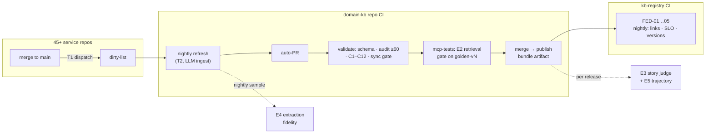

# 06 — Freshness, CI/CD & Evaluation

> **Audience**: KB maintainers who must keep the bundle current and *prove* it stays
> correct — and reviewers auditing where the original design needed correction.

---

## Corrections to the Original Design

An honest audit of Chapters 01–04 against industry evaluation practice and the
[llm-zoomcamp](./llm-zoomcamp/) material surfaced six real gaps. None invalidate the
architecture — but all six should be treated as committed upgrades, and each has a fix
specified in this chapter:

| # | Gap in Original Thinking | Why It Matters | Fix (section below) |
|---|--------------------------|----------------|---------------------|
| 1 | **Extraction fidelity is unevaluated.** All 6 quality gates validate *structure* (schemas, conformance, sync) — none check whether the LLM-ingested YAML actually matches the Java code it was scanned from. The one nondeterministic step in the pipeline is the one without an eval. | A hallucinated `outboundCalls[]` entry passes every gate and poisons every downstream story | [Extraction-Fidelity Eval](#e4--extraction-fidelity-eval-new) |
| 2 | **The 54-query golden suite is saturated.** Recall@10 = 1.0 means the suite can no longer detect regressions — and per the zoomcamp warning ([search metrics lesson](./llm-zoomcamp/04-evaluation/lessons/05-search-metrics.md)): *metrics above ~95% on synthetic questions usually signal leakage* (questions written too close to the indexed text), not perfection. | A retrieval regression ships silently; the headline number overstates quality | [Ground-Truth Generation](#e1--synthetic-ground-truth-generation) |
| 3 | **TTL-based staleness measures age, not change.** `stale_after: +90d` flags old pages, but a service can change the day after ingest and stay "fresh" for 89 days. Fingerprints detect change only when a refresh already runs. | The KB's main failure mode — confidently serving outdated contracts — is exactly the one TTLs can't catch | [Three-Trigger Freshness](#the-three-trigger-freshness-model) |
| 4 | **`commerce://` URIs don't federate.** | Cross-domain links unresolvable | Fixed in [Chapter 05](./05-scaling-and-federation.md#federated-uri-scheme) |
| 5 | **Zero usage telemetry.** Nobody knows which queries consumers actually run, which MCP tools get used, which pages are never retrieved, or whether answers were any good. | Can't tune what you can't see; can't defend value to leadership without usage data | [Monitoring Stack](#phase-1-monitoring-stack-the-only-new-docker) |
| 6 | **Weekly-audit failures land in a shared GitHub issue.** Passive signal, no owner. | Staleness rots precisely because nobody is paged | SLO violations route to the owning domain team via CODEOWNERS / registry `owner` ([FED-05](./05-scaling-and-federation.md#the-registry--registryyaml)) |

---

## The Three-Trigger Freshness Model


Staleness is solved by layering three triggers, from precise-and-cheap to blunt-and-safe.
The original design already has trigger 2 and the fingerprint machinery — this model adds
trigger 1 and demotes TTL from primary defense to backstop.

```
T1  EVENT      service repo merges to main
               └─▶ cheap pipeline hook (repository_dispatch / ADO resource trigger)
                   └─▶ appends service name to <domain>-kb dirty-list        (seconds, $0)

T2  SCHEDULE   nightly per domain
               └─▶ /lifecycle-kb --refresh over dirty-list ∪ fingerprint-changed
                   └─▶ LLM re-ingest of ONLY those services → auto-PR
                       └─▶ existing 6 CI gates → merge → bundle republish    (minutes, ~$/service)

T3  BACKSTOP   stale_after TTL + weekly full audit
               └─▶ D2 freshness metric → SLO check (FED-05) → owner notified (safety net)
```

| Trigger | Mechanism | Latency Target | Cost |
|---------|-----------|----------------|------|
| **T1 — Event** | Each service repo gains a ~5-line CI step on merge-to-main: POST to the domain KB's dirty-list endpoint/file. No git hooks in 45 repos (rejected in Chapter 01) — this is one *outbound* notification per repo's own CI, the standard event-carried-state pattern | Change *known* within minutes | ~$0 |
| **T2 — Scheduled refresh** | Existing `/lifecycle-kb --refresh` + fingerprint skip, now fed by the dirty-list; runs nightly, opens an auto-PR that must pass all existing gates (schema, audit ≥ 60, conformance, sync, retrieval) | Change *ingested* ≤ 24 h; SLO ≤ 7 days worst-case | LLM ingest for changed services only |
| **T3 — TTL backstop** | `stale_after` + weekly audit, unchanged — but now it should *rarely fire*; when it does, it means T1/T2 broke | Catch-all | $0 |

### Freshness SLOs (published per domain in `registry.yaml`)

| SLO | Target | Measured By |
|-----|--------|-------------|
| Pages within TTL | ≥ 95% | D2 metric in `audit-metrics.json` |
| Changed service re-ingested | ≤ 7 days from merge | dirty-list timestamp vs `last_ingested` in `.fingerprints.json` |
| Bundle republish after merge to KB main | ≤ 1 day | CI publish job |

These three numbers, on a Grafana panel per domain, are the answer to *"how do we know the
common KB stays current?"*

---

## The Evaluation Stack — Five Layers of Proof


The original design has strong bones (golden retrieval suite, deterministic audit,
story-regeneration judge). The upgrade absorbs the zoomcamp evaluation methodology
(modules [04](./llm-zoomcamp/04-evaluation/) and [05](./llm-zoomcamp/05-monitoring/)) into
five explicit layers — each answering a different question, each gated or dashboarded:

| Layer | Question It Answers | Cadence |
|-------|---------------------|---------|
| E1 Ground truth | Is the eval set itself trustworthy? | Regenerated per significant content change, versioned |
| E2 Retrieval | Does search find the right chunk? | Every PR (CI gate) |
| E3 Answer quality | Are RAG/story answers faithful? | Per KB release + online sample |
| E4 Extraction fidelity | Does sources/ YAML match the code? | Nightly sample |
| E5 Trajectory | Do agents *use* the MCP tools well? | Per framework release |

### E1 — Synthetic Ground-Truth Generation

Adopt the zoomcamp recipe ([ground-truth lesson](./llm-zoomcamp/04-evaluation/lessons/02-ground-truth.md)) to grow the 54-query suite into a per-domain set of 500+:

1. For each chunk (stable `kb://` URI = the answer key), have the LLM generate **5
   questions a developer/architect would ask** that this chunk answers.
2. **Anti-leakage instruction** (verbatim from the lesson, the part that fixes gap #2):
   *"use as few words as possible from the record"* — questions must paraphrase, not quote,
   or metrics inflate.
3. Structured output (`questions: list[str]`), batched with retry/backoff.
   Measured cost: **~$0.06 per 80 documents** — the full 1,291-chunk corpus is ~$1.
4. **Version the dataset** (`eval/golden-queries-v2.yaml`) and **hold out a test split**
   (tune boosts on validation, report on test). An eval set that changes silently between
   runs makes scores incomparable.
5. Keep ~50 *hand-written* queries from real consumer sessions (once monitoring runs,
   sample real queries) — synthetic breadth + real-query realism.

### E2 — Retrieval Metrics (CI gate, upgraded)

- Keep **Recall@5 / Recall@10 / MRR**, now on the versioned v2 set — expect headline
  numbers to *drop* when leakage is removed. That is the point: a gate at 0.98 on a
  saturated set catches nothing; a gate at (say) 0.85 on an honest set catches regressions.
- Score at **both granularities**: page (`kb://…/type`) hit rate *and* chunk
  (`…/section`) hit rate — the zoomcamp
  [chunking guidance](./llm-zoomcamp/07-project-example/lessons/07-chunking.md) treats
  chunk size as a hyperparameter tuned by exactly this pair of numbers (validates the 8 KB
  ceiling empirically instead of by decree).
- **Grid-search field boosts** against the eval set. Zoomcamp evidence
  ([tuning lesson](./llm-zoomcamp/04-evaluation/lessons/06-search-tuning.md)): boosting the
  "obvious" field monotonically *hurt* — the tuned combination beat intuition by 5 points
  of hit rate. Our α=0.4/β=0.6 hybrid weights and per-field boosts should be tuned, not
  assumed.

### E3 — Answer Quality (LLM-as-Judge)

- **Offline (per KB release)**: A→Q→A′ pattern — original chunk (A), generated question
  (Q), RAG answer (A′); judge emits `{reasoning, score: good|bad}` with reasoning *before*
  the label (forcing reasoning first measurably improves labels —
  [judge lesson](./llm-zoomcamp/04-evaluation/lessons/13-llm-as-judge.md)). Measured cost
  ~$0.25 per ~400 answers.
- **Online (Phase 1 lite / Phase 2 full)**: judge a **1-in-10 sample** of real queries,
  **asynchronously** (never in the answer path), verdicts
  `RELEVANT | PARTLY_RELEVANT | NON_RELEVANT` into the `feedback` table below.
- **Judge calibration**: you cannot use a judge to evaluate the judge — periodically a
  human reviews ~50 judge verdicts side-by-side and the judge prompt is tuned until
  agreement is acceptable. Human feedback (thumbs) and judge verdicts share one table
  (`source` column) precisely so they can be compared on the same axis.
- The existing **story-regeneration golden-dataset judge** (`/kb-evaluation-judge`,
  Chapter 04) stays as the downstream gate — it is the E3 layer for the KB's real product
  (stories), and it's already the strongest part of the original eval design.

### E4 — Extraction-Fidelity Eval (new)

The fix for gap #1 — the nondeterministic ingest step gets its own eval:

1. **Prefer determinism**: where a service has an OpenAPI spec, parse it *deterministically*
   for `inboundApis[]` (paths, methods, operationIds, schemas); the LLM only fills what
   specs can't (outbound call chains, Kafka usage, feature flags). Fewer LLM-written
   facts = smaller surface to verify.
2. **Nightly sample audit**: pick N random services; for each, diff `sources/` YAML claims
   against ground truth that is mechanically checkable — operationIds vs OpenAPI/controller
   annotations, Kafka topics vs config, datastores vs deployment descriptors. Score =
   % claims confirmed; trend it on the dashboard; alert the owning team below threshold.
3. **Confidence honesty**: facts that only the LLM asserted (no mechanical confirmation)
   are marked `confidence: inferred` in frontmatter — consumers already treat inferred
   data as `⚠️ KB-INFERRED` (Chapter 04); this closes the loop so the tag is *earned*, not
   decorative.

### E5 — Trajectory Eval (MCP tool use)

From the zoomcamp [agent-evaluation lesson](./llm-zoomcamp/04-evaluation/lessons/14-agent-evaluation.md):
log the tool-call sequence per consumer session and judge it against a rubric —
**search queries contain the important keywords; no duplicate calls with identical
arguments; repeat searches are refinements; ≤ 3 searches without clear reason; calls
support the final answer**. Two independent scores (answer, trajectory) diagnose failures:
answer-bad + trajectory-good means retrieval context was wasted; both-bad means the agent
searched for the wrong thing. Run per framework release on a 50-session sample.

---

## Phase 1 Monitoring Stack (the only new Docker)

Corporate-safe: two standard images, no model downloads, no external calls.

```yaml
# monitoring/docker-compose.yml
services:
  kb-metrics-db:
    image: postgres:17
    environment:
      POSTGRES_USER: kb
      POSTGRES_PASSWORD: ${KB_PG_PASSWORD}
      POSTGRES_DB: kb_metrics
    ports: ["5432:5432"]
    volumes: [kb_pgdata:/var/lib/postgresql/data]

  grafana:
    image: grafana/grafana
    ports: ["3000:3000"]
    volumes: [kb_grafana:/var/lib/grafana]

volumes:
  kb_pgdata: {}
  kb_grafana: {}
```

### Schema (zoomcamp two-table pattern, plus `domain`)

```sql
CREATE TABLE conversations (
    id            SERIAL PRIMARY KEY,
    domain        TEXT NOT NULL,            -- commerce | customer | order …
    channel       TEXT NOT NULL,            -- mcp-tool | kb-search | kb-context
    tool_name     TEXT,                     -- graph_get_service, graph_smart_query …
    question      TEXT NOT NULL,            -- what the consumer actually asked
    answer        TEXT,
    top_uris      TEXT[],                   -- kb:// URIs returned
    response_ms   FLOAT,
    tokens_total  INTEGER,
    cost          FLOAT,
    timestamp     TIMESTAMPTZ NOT NULL      -- TZ-aware or Grafana misaligns the axis
);

CREATE TABLE feedback (
    id              SERIAL PRIMARY KEY,
    conversation_id INTEGER REFERENCES conversations(id),
    source          TEXT NOT NULL,          -- 'user' (thumbs ±1) | 'judge' (verdict)
    relevance       TEXT,                   -- RELEVANT | PARTLY_RELEVANT | NON_RELEVANT
    explanation     TEXT,
    score           INTEGER,
    timestamp       TIMESTAMPTZ NOT NULL
);
```

The `source` column is the deliberate trick: user thumbs and judge verdicts land in one
table so human-vs-judge agreement (E3 calibration) is a single SQL query.

### Instrumentation & Panels

| Where | What Changes |
|-------|--------------|
| `graph-mcp/server.py` | Thin decorator on tool dispatch: INSERT into `conversations` (fire-and-forget; server works fine if the DB is down) |
| `kb search` / `kb context` | Same insert with `channel='kb-search'` |
| Grafana | Panels per domain: queries/day by tool · p95 `response_ms` · top queries with zero results (content gaps!) · never-retrieved pages (dead weight) · relevance distribution (judge) · thumbs ratio (user) · freshness SLO (D2 trend) · audit score trend |

**"Top queries with zero results"** is the highest-value panel: it is a ranked, real-demand
backlog for what to ingest next — something no amount of offline eval provides.

---

## CI/CD — Complete Picture (Per Domain + Federation)



The original 6 jobs are unchanged; three additions bolt on: the dirty-list consumer in the
nightly refresh, the E4 sample audit, and the federation checks — all deterministic except
the explicitly budgeted LLM steps (ingest, E1 regeneration, E3/E4/E5 judging).

---

## What Phase 1 Absorbs from llm-zoomcamp — Adopt / Adapt / Skip

| Zoomcamp Item | Decision | Rationale |
|---|---|---|
| Vendored ONNX embedder (`onnxruntime`+`tokenizers`+`numpy`, model in repo/image) | **Already adopted** — independently validated | The [ONNX lesson](./llm-zoomcamp/02-vector-search/lessons/09-onnx-embedder.md) teaches exactly our constraint: 147 MB runtime, no HF at runtime, 33× smaller than sentence-transformers |
| Text-search-first, embeddings only when eval justifies | **Already adopted** | BM25 is primary for exact terms; the [next-steps lesson](./llm-zoomcamp/02-vector-search/lessons/10-next-steps.md) argues this order explicitly |
| Stable document IDs before any eval | **Already adopted** (`kb://` URIs) | "If you can't uniquely identify a document, you can't tell whether search retrieved the right one" |
| ID-keyed RRF, k=60 | **Already adopted** — keep ID-keyed | Zoomcamp's generic `rrf()` keys on question text — a collision bug our URI-keyed version avoids |
| Synthetic ground truth (5 Q/chunk, anti-leakage, structured output) | **Adopt now** (E1) | Fixes the saturated golden suite; ~$1 for the whole corpus |
| Grid-search boost/weight tuning on validation split | **Adopt now** (E2) | Measured evidence that intuition-set boosts were wrong |
| LLM-as-judge offline A→Q→A′ + online sampled async judge | **Adopt now** (E3) | Completes answer-quality coverage at bounded cost |
| Trajectory rubric for tool-using agents | **Adopt now** (E5) | Purpose-built for evaluating a 25-tool MCP server |
| Postgres + Grafana monitoring, two-table schema, TIMESTAMPTZ | **Adopt now** | Fixes gap #5 with two standard corporate-mirrorable images |
| Synthetic dashboard data generator | **Adopt now** (trivial) | Build dashboards before real traffic exists |
| pgvector as persistent central vector store | **Adapt — Phase 2** | Not needed at ~1.3K chunks/domain; full design in [Chapter 07](./07-phase-2-target-architecture.md) |
| Kestra orchestration (docker-compose) | **Adapt — Phase 2** | T1/T2 via existing CI suffices until multi-domain flow count grows |
| Elasticsearch hybrid + native RRF | **Skip** | Native RRF needs a paid ES subscription; our in-process RRF is equivalent at this scale |
| sentence-transformers at runtime; Qdrant | **Skip** | Violates the no-download constraint / redundant with chosen stores |

---

**Next**: [07 — Phase 2 Target Architecture](./07-phase-2-target-architecture.md) | **Back**: [05 — Scaling & Federation](./05-scaling-and-federation.md) | **Home**: [README](./README.md)
