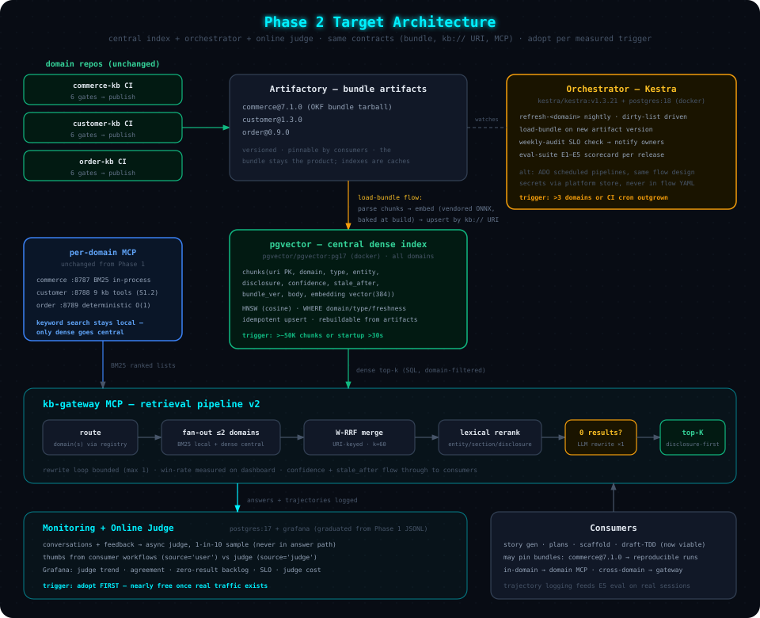

# 07 — Phase 2 Target Architecture

> **Audience**: Architects planning the evolution beyond Phase 1. Everything here is
> designed to be adopted **component by component, each behind a measurable trigger** —
> explicitly not a big-bang migration. Phase 1 keeps working untouched until a trigger fires.

---

## Phase 1 vs Phase 2 at a Glance

Phase 1 (Chapters 01–06) is per-domain, in-process, zero-infra except monitoring. Phase 2
adds shared infrastructure **only where scale creates a real problem**, and every component
keeps the same contracts (OKF bundle, `kb://` URIs, MCP tools) so consumers never change.

| Component | Phase 1 (today) | Phase 2 (target) | Upgrade Trigger | Docker Image |
|---|---|---|---|---|
| Dense index | In-process numpy per domain (`.kb_index/`) | Central **pgvector** with HNSW, all domains | Corpus > ~50K chunks, or startup > 30 s, or cross-domain queries become routine | `pgvector/pgvector:pg17` |
| Keyword search | In-process BM25 (`rank_bm25`) per domain | Same (stays local!) — or OpenSearch BM25 if the central tier grows | Only if per-domain memory becomes a problem | `opensearchproject/opensearch` (optional) |
| Merge/rerank | Weighted RRF in-process | Same algorithm, fed by local BM25 + central dense lists | Follows the dense index | — |
| Query understanding | Rule-based classifier | + LLM query rewriting on zero-result retry | Zero-result rate > ~10% on the dashboard | — |
| Ingest orchestration | CI cron + dirty-list (T1/T2) | **Kestra** flows (or ADO pipelines as constrained alternative) | > 3 domains, or flow count makes CI YAML unmanageable | `kestra/kestra:v1.3.21` + `postgres` |
| Bundle distribution | Artifactory tarballs from CI publish | Same, plus registry-driven auto-pull into central index | With the central index | — |
| Answer evaluation | Offline judge per release | + **Online judge**, async, 1-in-10 sample | As soon as real traffic exists (cheap; do early in Phase 2) | — |
| Feedback | — | Thumbs UI in consumer workflows → `feedback` table | With online judge | — |
| Monitoring | Postgres + Grafana (from Phase 1) | Same, plus cost/judge panels | Already running | `postgres:17`, `grafana/grafana` |
| Embedding model | Vendored MiniLM ONNX 384d in repo | Same model, baked into a **build-time docker layer**; optionally larger ONNX (bge-base 768d) if E2 metrics justify | Recall gap attributable to embedding quality | internal base image |

All images above are standard Docker Hub images that corporate registries commonly mirror —
no HuggingFace, no model downloads at runtime, satisfying the Phase 1 constraint even in
Phase 2.



```
   domain repos (unchanged)                 CENTRAL PLATFORM (new in Phase 2)
┌──────────────────────────┐   publish   ┌─────────────────────────────────────────┐
│ commerce-kb  CI ─────────┼────────────▶│  Artifactory: bundle artifacts           │
│ customer-kb  CI ─────────┼────────────▶│  commerce@7.1.0 · customer@1.3.0 · …     │
│ order-kb     CI ─────────┼────────────▶│                                          │
└──────────────────────────┘             └───────────────┬─────────────────────────┘
                                                         │ Kestra: load-bundle flow
                                                         ▼
                                         ┌─────────────────────────────────────────┐
                                         │  pgvector  (chunks, all domains)         │
                                         │  upsert by kb:// URI · HNSW · SQL filter │
                                         └───────────────┬─────────────────────────┘
        per-domain MCP (unchanged)                       │ dense top-k
┌──────────────────────────┐             ┌───────────────┴─────────────────────────┐
│ commerce MCP :8787       │◀── BM25 ────│  kb-gateway MCP                          │
│ customer MCP :8788       │   lists     │  route → fan-out → W-RRF merge →         │
│ order    MCP :8789       │────────────▶│  lexical rerank → (retry: LLM rewrite)   │
└──────────────────────────┘             └───────────────┬─────────────────────────┘
                                                         │ answers + trajectories
                                                         ▼
                                         ┌─────────────────────────────────────────┐
                                         │  Monitoring PG ── async judge (1-in-10)  │
                                         │  Grafana: usage · SLO · judge · cost     │
                                         └─────────────────────────────────────────┘
```

---

## 1. Central Cross-Domain Search Tier (pgvector)

**Why pgvector over a dedicated vector DB**: one standard container, plain SQL, exact
metadata filtering via `WHERE` (domain, type, confidence — no vector-DB filter DSL), HNSW
ANN when needed, and ops teams already run Postgres. OpenSearch is the documented
alternative if/when the org wants BM25 + dense in one *central* engine — but note the
zoomcamp finding that Elasticsearch's native RRF needs a paid tier, whereas our own
ID-keyed RRF is ~12 lines and engine-independent.

### Schema

```sql
CREATE EXTENSION IF NOT EXISTS vector;

CREATE TABLE chunks (
    uri         TEXT PRIMARY KEY,       -- kb://commerce/shoppingcartms/service/inbound-apis
    domain      TEXT NOT NULL,
    type        TEXT NOT NULL,          -- service | api-operation | capability-flow | …
    entity      TEXT NOT NULL,
    section     TEXT,
    disclosure  TEXT NOT NULL,          -- one-line hint (progressive disclosure)
    confidence  TEXT NOT NULL,          -- authoritative | curated | inferred
    stale_after DATE,
    bundle_ver  TEXT NOT NULL,          -- commerce@7.1.0 — provenance to the artifact
    body        TEXT NOT NULL,
    embedding   vector(384)             -- MiniLM ONNX, same model as Phase 1
);

CREATE INDEX ON chunks USING hnsw (embedding vector_cosine_ops);
CREATE INDEX ON chunks (domain, type);
```

```sql
-- query: dense top-k within a domain scope, freshness-aware
SELECT uri, disclosure, 1 - (embedding <=> %(q)s::vector) AS similarity
FROM chunks
WHERE domain = ANY(%(domains)s)
  AND (stale_after IS NULL OR stale_after >= CURRENT_DATE)
ORDER BY embedding <=> %(q)s::vector
LIMIT 10;
```

### Loader — deterministic, idempotent, bundle-driven

A `load-bundle` job (Kestra flow, below) fires when a domain publishes a new bundle
artifact: download tarball → parse chunk frontmatter → embed with the **same vendored ONNX
model** (baked into the loader image at build time) → **upsert by `uri`** → delete rows
whose URI vanished from the bundle → stamp `bundle_ver`.

This is why stable URIs were a Phase-1 requirement (Chapter 01, Pattern 2): the central
index is a *derived cache keyed by URI*, rebuildable from artifacts at any time. No
LLM anywhere in this path — it inherits the deterministic-generation guarantee.

---

## 2. Retrieval Pipeline v2

```
query ──▶ gateway: domain routing (registry + capability keywords)
              │
              ├─▶ per-domain BM25 (in-process, unchanged)      ──▶ ranked list A
              ├─▶ central pgvector dense (domain-filtered SQL) ──▶ ranked list B
              │
              ▼
        weighted RRF, ID-keyed on kb:// URI, k=60   (same algorithm as Phase 1)
              ▼
        lexical rerank (entity/section/disclosure)  (unchanged)
              ▼
        results?  ──no──▶  LLM query rewrite (1 retry) ──▶ re-run once
              │yes                                          (zoomcamp "Olama" pattern:
              ▼                                              agent recovers from typos/
        disclosure-first top-K to consumer                   vocabulary mismatch)
```

| Stage | Notes |
|-------|-------|
| RRF | Keep **URI-keyed** merging (the zoomcamp generic `rrf()` keys on text — a collision bug; ours already keys on IDs) |
| Rerank | Honest expectation from zoomcamp measurements: hybrid+RRF gained single-digit percent (HR 0.917→0.925). Adopt further rerankers **only if E2 metrics show a gap** |
| Query rewrite | Bounded: max 1 rewrite, logged to `conversations` so its win-rate is measurable; kill it if the dashboard shows no lift |
| Trust | `confidence` and `stale_after` flow through to results — consumers keep the Chapter 04 precedence rules unchanged |

---

## 3. Orchestration Tier (Kestra)

Phase 1's T1/T2 freshness triggers run in CI cron. Past ~3 domains, the flow count
(per-domain nightly refresh, bundle loads, weekly audits, eval runs) outgrows CI YAML.
Kestra is the reference orchestrator (zoomcamp module 3 stack); ADO scheduled pipelines
are the corporate-constrained fallback with identical flow design.

```yaml
# docker-compose (orchestration) — standard images only
services:
  kestra:
    image: kestra/kestra:v1.3.21
    command: server standalone
    ports: ["8080:8080"]
  kestra-db:
    image: postgres:18
```

| Flow | Trigger | Steps |
|------|---------|-------|
| `refresh-<domain>` | Nightly cron + dirty-list non-empty | dirty ∪ fingerprint-changed → `/lifecycle-kb --refresh` → auto-PR (gates in domain CI, not here) |
| `load-bundle` | New artifact version in registry | download → embed (vendored ONNX) → upsert pgvector → FED-03 link re-check |
| `weekly-audit` | Cron Monday 06:00 | `kb audit` all domains → SLO evaluation → notify owners (FED-05) |
| `eval-suite` | On framework release + monthly | E1 regen (if content moved) → E2 metrics → E3 offline judge → E5 trajectory sample → publish scorecard |

Secrets follow the platform's store (Kestra pattern: `SECRET_`-prefixed env vars,
referenced as `{{ secret('…') }}`); LLM credentials never live in flow YAML.

---

## 4. Online Evaluation Loop

Cheapest Phase 2 component — adopt first (it only needs the Phase 1 monitoring stack plus
one async worker):

1. Every gateway/MCP answer logs to `conversations` (Phase 1 behavior).
2. An async worker samples **1-in-10**, runs the relevance judge
   (`RELEVANT | PARTLY_RELEVANT | NON_RELEVANT` + explanation), writes to `feedback`
   with `source='judge'`. Never in the answer path; judge cost tracked separately.
3. Consumer workflows gain a thumbs step (`source='user'`, score ±1) at natural
   checkpoints (story accepted / plan executed).
4. Grafana: judge relevance trend per domain · human-vs-judge agreement (E3 calibration)
   · zero-result queries (ingest backlog) · judge cost.

This closes the loop the offline eval can't: **real queries, real answer quality, real
gaps** — continuously, at ~10% of the judging cost of full coverage.

---

## 5. Consumer & Distribution Tier

| Element | Phase 2 Behavior |
|---------|------------------|
| Federation gateway MCP | As designed in [Chapter 05](./05-scaling-and-federation.md#mcp-topology--scoped-servers--one-gateway), now backed by the central dense tier; per-domain MCP servers unchanged for in-domain work |
| Bundle pinning | Consumers (story gen, scaffold) may pin `commerce@7.1.0` like a package version — reproducible generation runs, auditable "which knowledge produced this story" |
| Trajectory logging | Gateway logs the tool-call sequence per session (`tool_name`, arguments-hash) → E5 trajectory eval runs on real sessions, not synthetic ones |
| Draft-TDD generation | The Chapter 04 "future" stage becomes viable here: cross-domain context (gateway) + pinned bundles + online judge = the feedback loop TDD drafting needs |

---

## Migration Triggers — When to Actually Do This

Adopt a component **only when its trigger fires**; the dashboard (Phase 1 monitoring)
provides every number:

| Trigger (measured) | Component to Adopt |
|---|---|
| Real traffic exists at all | Online judge + thumbs (do first, it's nearly free) |
| Cross-domain queries appear in `conversations` logs | Gateway MCP (thin version, no central index yet) |
| > 3 domains active in `registry.yaml` | Kestra orchestration |
| Corpus > ~50K chunks · or index startup > 30 s · or gateway fan-out latency unacceptable | Central pgvector tier |
| Zero-result rate > ~10% | LLM query rewriting |
| E2 recall gap persists after boost tuning | Larger vendored ONNX model (bge-base 768d) — still no runtime downloads |
| Central tier + BM25 memory pressure | OpenSearch consolidation (last resort) |

**Non-goals, permanently**: GPU inference (CPU ONNX embeds the corpus in seconds),
downloaded models at runtime (constraint holds in both phases), replacing markdown bundles
with a database (the bundle *is* the product; every index is a disposable cache).

---

**Back**: [06 — Freshness, CI/CD & Evaluation](./06-freshness-and-evaluation.md) | **Home**: [README](./README.md)
