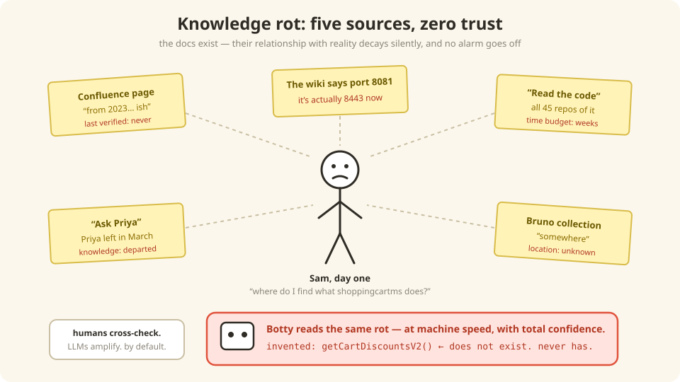

# 1 — Your knowledge is rotting (and your robot knows it)

*In which Sam has a terrible first day, Botty invents an API that doesn't exist, and we
discover that the problem isn't missing documentation — it's documentation you can't
trust.*

---

## Sam's first day

Sam joins the Commerce team. First task: "add a field to the shopping cart API." Simple,
right? Sam asks the obvious question — *"where do I find what shoppingcartms actually
does?"* — and gets five answers:

1. "There's a Confluence page… from 2023. Ish."
2. "Read the code. All 45 repos of it."
3. "Ask Priya. Oh wait, Priya left."
4. "There's a Bruno collection somewhere with example calls."
5. "The wiki says port 8081 but it's actually 8443 now, ignore that part."

Five sources. All partially right. All partially wrong. **Nobody knows which parts.**

That's not "we should document more." That's *knowledge rot*: the docs exist, but their
relationship with reality decays silently, and no alarm goes off.

## Then it got urgent

Here's the thing that turned a chronic annoyance into a crisis: **we started asking AI
agents to write our stories, plans, and code.**

Sam wastes an afternoon on a stale wiki page and gets annoyed. Botty reads the same page
and — with total confidence, in milliseconds, at scale — writes a story against an API
that was renamed eight months ago. Last Tuesday, Botty cheerfully invented
`getCartDiscountsV2`. It does not exist. It has never existed.

> **Your brain on stale docs:** humans cross-check, hesitate, ask a teammate. LLMs do
> none of that by default. An AI agent is a *massive amplifier* — of whatever you feed
> it. Feed it rot, get confident rot at machine speed.

## The big idea: treat knowledge like code

We already solved this exact problem once — for *software*. We don't email each other
zip files of source code and hope; we have a single source of truth, derived builds,
tests, and CI that blocks bad changes. So:

| Software engineering has… | So the knowledge base has… |
|---------------------------|----------------------------|
| One source of truth (git) | One declared input file (`seed.yaml`) + structured sources |
| Deterministic builds | A boring Python generator: same input, byte-identical output |
| Tests that block bad merges | Exams: does search still find the right page? ([Chapter 9](./09-evaluation.md)) |
| Code review + ownership | Every change is a PR; every fact has an owner |
| Dependency freshness bots | A nightly sniff-test for changed services ([Chapter 8](./08-freshness.md)) |

And the output format? **Markdown files.** Not a database, not a wiki product — plain
files with a little YAML on top. Humans read them on any git host. Robots read them
without choking on wiki markup. Google literally published a spec for exactly this
pattern — and that brings us Under the Hood.

---

## Under the Hood — this is a standards play, not an invention

Every load-bearing design choice in this framework maps to a named, citable industry
standard that is current as of 2026. When someone asks *"did we invent something
weird?"*, this table is the answer — **no, we standardized**:

| Design Choice | Industry Standard It Implements | Status |
|---|---|---|
| Markdown + YAML frontmatter bundle, stable URIs, progressive disclosure | **[Open Knowledge Format v0.2](https://github.com/GoogleCloudPlatform/knowledge-catalog)** — Google Cloud's vendor-neutral spec (June 2026) | Conformant (C1–C12 gate) |
| Three layers: raw sources → generated wiki → schema | **[Karpathy's LLM-Wiki pattern](https://cloud.google.com/blog/products/data-analytics/how-the-open-knowledge-format-can-improve-data-sharing)** (`raw/`, `wiki/`, schema file) — the pattern OKF formalized | Adopted |
| Structured tools over the KB via MCP (9 unified tools) | **[Model Context Protocol](https://blog.modelcontextprotocol.io/posts/2026-07-28-release-candidate/)** — donated to the Linux Foundation's Agentic AI Foundation (Dec 2025); adopted by OpenAI, Google, Microsoft, AWS, IBM | Adopted |
| `catalog-info.yaml` service descriptors, team-maintained | **[Backstage Software Catalog](https://backstage.io/docs/features/software-catalog/)** (CNCF) descriptor convention — metadata-next-to-code, centrally aggregated | Adopted |
| Serving markdown (not HTML/wiki markup) to agents | **[llms.txt](https://www.mintlify.com/blog/what-is-llms-txt)** movement (Cloudflare, Stripe, Anthropic, Mintlify) — up to ~10× token reduction vs HTML | Aligned |
| Golden-query retrieval gates (Recall@K, MRR) in CI | Standard RAG evaluation practice ([Ragas](https://blog.premai.io/rag-evaluation-metrics-frameworks-testing-2026/)/DeepEval ecosystem; golden datasets of 50–100 queries) | Adopted |
| Deterministic generation + sync gate, $0-LLM CI | Docs-as-code + OKF "deterministic-first" principle | Adopted |

The framework runs entirely on corporate-network-compatible Python libraries (`PyYAML`,
`numpy`, `rank-bm25`, `FastMCP`, `onnxruntime`, `tokenizers`). The dense embedding model
(`all-MiniLM-L6-v2` ONNX) is **committed in-repo** and runs on CPU — no HuggingFace, no
model downloads, no GPU. When ONNX dependencies are unavailable, retrieval falls back to
BM25-only with a startup notice.

## There are no Dumb Questions

**Q: Isn't Confluence enough? We already pay for it.**
A: Confluence is where knowledge goes to *be written once*. Nothing checks it against
the code, nothing expires it, and agents drown in its markup. We still *ingest* useful
wiki pages — Confluence becomes an *input*, not the source of truth.

**Q: Why is markdown suddenly a big deal? It's just text files.**
A: That's the point. Text files diff, review, version, and grep. Serving markdown to
agents instead of HTML cuts token cost ~10× — big companies (Cloudflare, Stripe,
Anthropic) already serve their docs to AI this way.

**Q: Couldn't we just tell developers to keep docs updated?**
A: We could also just tell everyone to write bug-free code. Process that depends on
human diligence loses to process that runs in CI. Every time.

## BULLET POINTS

- Knowledge rot is silent: docs don't *look* wrong, they just quietly stop being right.
- AI agents turn stale docs from an annoyance into confident, scaled-up wrongness.
- The fix is the software playbook applied to knowledge: one source of truth,
  deterministic builds, tests, CI, ownership.
- Markdown + YAML frontmatter is the output format because humans *and* robots read it
  natively — and it lives happily in git.
- Nothing here is bespoke: OKF, LLM-Wiki, MCP, Backstage, llms.txt — every pillar is a
  named industry standard with receipts.

**Next**: [2 — The three-layer cake](./02-three-layer-architecture.md) | **Home**: [Book cover](./README.md)
