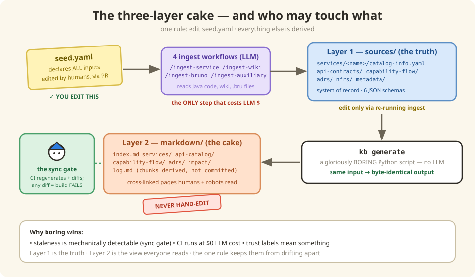
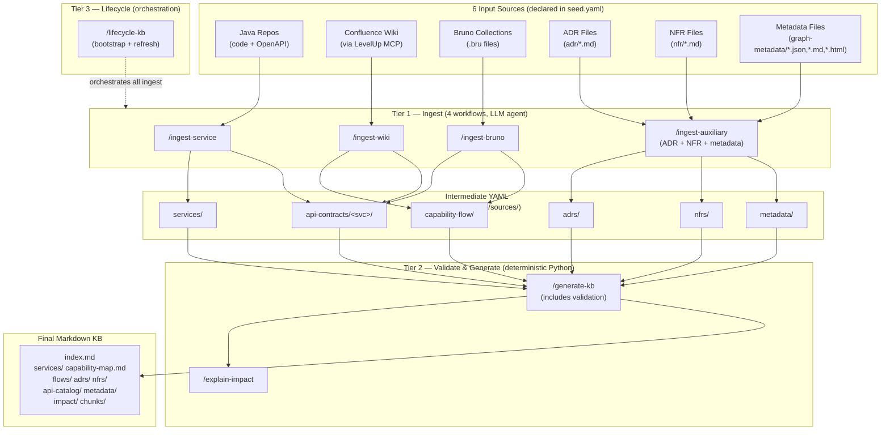

# 2 — The three-layer cake (architecture & data flow)

*In which we learn the ONE rule of the whole framework, meet a very boring Python
script (that's a compliment), and find out why nobody — nobody — edits Layer 2 by hand.*

---

## One rule to rule them all

Maya's first whiteboard session with Sam starts with a single sentence:

> **"You edit `seed.yaml`. Everything else is derived. That's the whole religion."**

The knowledge base is a cake with three layers, and knowing *which layer you're allowed
to touch* is 90% of understanding the system:



| Layer | What it is | Who writes it | Can YOU edit it? |
|-------|-----------|---------------|------------------|
| **The recipe** — `seed.yaml` | One file declaring every input: which service repos, which wiki pages, which API collections | Humans, via PR | **YES — this is THE file** |
| **Layer 1: ingredients** — `sources/` | Structured YAML extracted from real code: every API, every Kafka topic, every dependency | An LLM agent that *reads the actual Java code* (workflows like `/ingest-service`) | Only via re-running ingest |
| **Layer 2: the cake** — `markdown/` | The readable knowledge base: cross-linked pages for services, APIs, flows, decisions | A **deterministic Python script**. No LLM. No creativity. | **NEVER. Not once. Not even a typo.** |

(There's also a quiet third layer of *rules*: `KB-SCHEMA.md`, `templates/`, `scripts/`,
and the workflow definitions — the schema/config layer that governs how the other two
behave. You rarely touch it; it mostly touches you.)

## Why is the generator boring on purpose?

Because *boring is a superpower*. The generator (`kb generate`) is pure template
rendering: same `sources/` in, **byte-identical** `markdown/` out. Every time. On any
machine.

That one property buys us everything downstream:

- **The sync gate.** CI regenerates everything and diffs it against what's committed.
  Any difference = the build fails. It is *mechanically impossible* for a stale
  generated page to sneak onto `main`. (Think of it as the cake police.)
- **Trust labels that mean something.** A page generated deterministically from
  code-scanned YAML gets stamped `authoritative`. A human-written analysis gets
  `curated`. Something the LLM guessed gets `inferred` — and consumers treat it with
  gloves ([Chapter 3](./03-addresses-and-metadata.md)).
- **$0 CI.** The LLM only runs at *ingest time* (reading code → YAML). Validation,
  generation, auditing — all deterministic, all free.

> **Sharpen your pencil 🖉** — Which layer do you touch for each of these?
> 1. A new microservice joins the domain.
> 2. You spot a typo in `markdown/services/shoppingcartms.md`.
> 3. A useful new Confluence page should be included.
>
> *(Answers at the bottom. No peeking. Okay, peek.)*

## Fireside Chat: Layer 1 vs Layer 2

**Tonight: "Which of you is the real knowledge base?"**

**sources/ (Layer 1):** I am, obviously. I'm the *system of record*. Structured,
validated against six JSON schemas, extracted from actual code. Cut me and the whole
thing bleeds.

**markdown/ (Layer 2):** Adorable. Nobody *reads* you. Have you seen yourself? You're
YAML. When Sam wants to understand cart checkout, Sam reads *me* — cross-linked prose
with diagrams. When Botty retrieves context, it retrieves *my* pages.

**sources/:** And when you're wrong?

**markdown/:** I'm never wrong on my own — that's the beautiful part. I'm a pure
function of you. If I'm wrong, *you're* wrong, and the fix happens in you, then I get
regenerated. Which is exactly why nobody's allowed to hand-edit me: an edit to me is a
lie that the next regeneration erases.

**sources/:** …huh. So you're the *view*, and I'm the *truth*.

**markdown/:** And the one rule keeps us honest. Group hug? `seed.yaml`, get in here.

---

## Under the Hood — the data flow, end to end

Six input sources feed four ingest workflows (the only LLM steps), which produce
validated YAML, which a deterministic generator renders into the final bundle:



The LLM agent is the scanner during ingest — it reads Java source code, deep-crawls
Confluence via LevelUp MCP, parses Bruno `.bru` files, and extracts structured YAML.
The final markdown generation by `generate_multidim_kb.py` is **fully deterministic** —
no LLM involved, pure Python template rendering.

### seed.yaml — the single input

Full path: `{KB_ROOT}/templates/seed.yaml`. Nothing is auto-discovered; every source is
declared here:

```yaml
kb:
  domain: commerce
  apmId: apm0045079
  kbRoot: multi-dimensional-kb

services:                               # 45 entries
  - name: shoppingcartms
    repoPath: ../apm0045080-commercsox-shoppingcartms
    subdomain: cart-checkout

wiki:
  confluence:
    pages:
      - url: https://wiki.web.att.com/display/DRC/ShoppingCartMs+Design
        dimension: design               # api | capability-flow | design
        service: shoppingcartms
        depth: 3

bruno:
  repoPath: ../apm0045081-commerce-services-api-collections
  items:
    - dir: shoppingcartms
      service: shoppingcartms

adrs:
  basePath: adr
  pattern: "*.md"

nfrs:
  basePath: nfr
  pattern: "*.md"

metadata:
  basePath: graph-metadata
  patterns: ["*.json", "*.md", "*.html"]
```

| Want to Add... | What to Do |
|----------------|------------|
| New service | Add `- name: / repoPath: / subdomain:` under `services:` |
| New wiki page | Add `- url: / dimension: / service: / depth:` under `wiki.confluence.pages:` |
| New Bruno collection | Add `- dir: / service:` under `bruno.items:` |
| New ADR/NFR | Drop `.md` file in `adr/` or `nfr/` — auto-picked up |
| New metadata | Drop file in `graph-metadata/` — auto-picked up |

### The 6 JSON schemas (Layer 1's bouncers)

Located in `{KB_ROOT}/templates/schema/` — every YAML file in `sources/` must pass its
schema before generation runs:

| Schema | Validates | Key Fields |
|--------|-----------|-----------|
| `service-descriptor` | `catalog-info.yaml` | `inboundApis[]`, `outboundApis[]`, `datastores[]`, `topicsProduced[]` |
| `capability-flow` | `capability-flow/*.yaml` | `kind: CapabilityFlow`, `spec.steps[]`, `spec.participatingServices[]` |
| `api-contract` | `api-contracts/<svc>/*.yaml` | `operationId`, `method`, `path`, `scenarios[]` |
| `adr` | `adrs/*.yaml` | `id`, `title`, `status`, `context`, `decision` |
| `nfr` | `nfrs/*.yaml` | `service`, `latencyP99`, `throughput`, `availability` |
| `metadata` | `metadata/*.yaml` | `name`, `dimension`, `content` |

### Version planes — two, not four

One version for the machinery, one for the content:

| Plane | Where declared | Current | Bump when |
|---|---|---|---|
| **Framework** (`kb-framework`) | `pyproject.toml` → `version` (echoed in the `KB-SCHEMA.md` header) | 2.0.0 | Anything about the machinery changes: scripts, `kb` CLI, MCP server, JSON Schemas, templates, or the emitted OKF frontmatter contract (a frontmatter contract change is a breaking — major — framework bump) |
| **Domain bundle** | `templates/seed.yaml` → `kb.version` (rendered as `generated.by: commerce-kb-generator/<version>`) | 7.1.0 | Significant source-content changes; stamped into every generated page |

The OKF frontmatter contract keeps its own label (`OKF version: 0.2`) as documentation
of the emitted format, but it is versioned *through* the framework plane — changing the
contract requires a major framework bump, not a separate plane. (There used to be four
planes. Two of them were pack weight — see [Chapter 11](./11-less-is-more.md).)

## There are no Dumb Questions

**Q: What if the LLM mis-reads the code during ingest? Doesn't that poison Layer 1?**
A: Sharp question — that's the one non-deterministic step, and it gets special
treatment: where machine-readable specs (OpenAPI) exist we parse them *without* the
LLM, LLM-only claims get tagged `inferred`, and there's a spot-check routine
([Chapter 9](./09-evaluation.md)). Trust, but verify.

**Q: If markdown/ is derived, why commit it to git at all?**
A: So humans can review knowledge changes in PRs like code changes ("wait, since when
does cart call the pricing service twice?"), and so the sync gate has something to
diff. The *chunks* used for search, though, are derived at build time and not
committed — no noise, same guarantees.

**Q: Who runs the ingest — and how often?**
A: A nightly job re-ingests only services whose code actually changed.
[Chapter 8](./08-freshness.md) is entirely about this.

## BULLET POINTS

- **One rule**: edit `seed.yaml` (and fix `sources/` via ingest). *Never* hand-edit
  `markdown/`.
- The generator is deterministic — same input, byte-identical output — and that makes
  staleness *mechanically detectable* (the sync gate).
- LLMs read code at ingest time; everything after that is boring, free, and testable.
- Layer 1 is the truth. Layer 2 is the view everyone actually reads. The rule keeps
  them from drifting apart.
- Six declared input types, six JSON schemas, two version planes — every moving part is
  enumerable, and that's on purpose.

> **Sharpen your pencil — answers:** 1. `seed.yaml` (add the service entry, run
> `/ingest-service`). 2. Trick question! Find where it comes *from*: fix `sources/`
> (or the code/wiki it was ingested from), regenerate. 3. `seed.yaml` (add the wiki
> URL under `wiki.confluence.pages`).

**Next**: [3 — Every fact gets an address](./03-addresses-and-metadata.md) | **Back**: [1 — Your knowledge is rotting](./01-the-problem.md)
