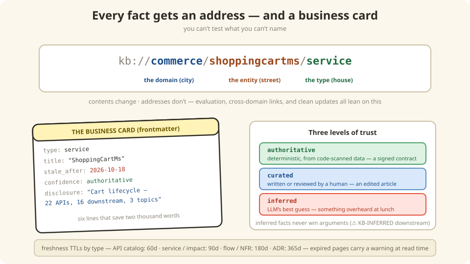

# 3 — Every fact gets an address (identity, metadata & trust)

*In which we staple a business card to every page, learn why "somewhere in the wiki" is
not an address, and discover that you can't test what you can't name.*

---

## The postal system for knowledge

Quick thought experiment. Someone asks: *"is the fact about cart repricing up to date?"*

In the old world, the answer is "…which fact? The one in Confluence? The one in the
README? The one in Priya's head?" **You can't check on a fact that has no address.**

So the knowledge base gives every single piece of knowledge a stable, boring, permanent
address — a URI:

```
kb://commerce/shoppingcartms/service                       ← the service's page
kb://commerce/shoppingcartms/api-catalog/addItemsToCart    ← one specific API
kb://commerce/wireless-postpaid-upgrade/capability-flow    ← one business flow
```



Read it like a postal address: **which domain** (city) / **which entity** (street) /
**what kind of thing** (house). And like postal addresses, they don't change when the
contents do — repaint the house all you like, the mail still arrives.

Why this obsession with addresses? Because *everything else in this book depends on it*:

- **Search evaluation** ([Chapter 9](./09-evaluation.md)): "did search return the right
  page?" only means something if pages have identities to be right *about*.
- **Cross-domain links** ([Chapter 10](./10-federation.md)): the Order KB can point at
  `kb://commerce/shoppingcartms/...` and it *resolves*.
- **Updates**: when a page regenerates, systems that indexed it update *in place*
  instead of creating a duplicate.

## The business card (frontmatter)

Every page starts with a small block of YAML — its business card. Before reading a
2,000-word page, you (or Botty) can read six lines and know whether to bother:

```yaml
---
type: service                  # what kind of thing am I?
title: "ShoppingCartMs"
description: "Cart lifecycle service"
stale_after: 2026-10-18        # my freshness expiry date (Chapter 8!)
confidence: authoritative      # how much should you trust me?
disclosure: "Cart lifecycle — 22 APIs, 16 downstream, Cassandra, 3 Kafka topics"
---
```

That `disclosure` line is the elevator pitch: **one sentence that lets a reader decide
"is this the page I need?" without opening it.** When Botty searches, it reads ten
disclosure lines and picks two pages to read fully — instead of stuffing ten full pages
into its brain. (Head First readers know this trick: it's a book's back cover.)

## Three levels of trust

Not all knowledge is equally trustworthy, and *pretending it is* is how wikis rot. So
every page wears its confidence on its sleeve:

| Label | Means | Like… | Trust Tier (MCP) |
|-------|-------|-------|------------------|
| `authoritative` | Generated deterministically from code-scanned data | A signed contract | `machine-confirmed` |
| `curated` | Written or reviewed by a human who meant it | An edited article | `human-reviewed` |
| `inferred` | The LLM's best guess, not confirmed by any primary source | Something you overheard at lunch | `unverified` |

Consumers take this seriously: anything `inferred` shows up downstream tagged
**⚠️ KB-INFERRED**, and it *never* overrides a design document. Overheard-at-lunch facts
don't get to win arguments.

---

## Under the Hood — the full frontmatter contract

The six-line business card above is the short version. The complete contract every
generated page carries:

```yaml
---
type: service                          # canonical taxonomy
title: "ShoppingCartMs"
description: "Cart lifecycle service"
tags: [cart-checkout]
status: stable                         # draft | stable | deprecated
generated:
  by: commerce-kb-generator/8.1.0
  at: 2026-07-20T14:30:00Z
stale_after: 2026-10-18                # generated.at + per-type TTL
sources:
  - id: catalog-info
    resource: sources/services/shoppingcartms/catalog-info.yaml
confidence: authoritative              # authoritative | curated | inferred
uri: commerce://shoppingcartms/service
disclosure: "Cart lifecycle — 22 APIs, 16 downstream, Cassandra, 3 Kafka topics"
---
```

### Required fields (OKF) and Commerce extensions

| Field | Type | Description |
|-------|------|-------------|
| `type` | string | Concept type (see taxonomy below) |
| `title` | string | Human-readable title |
| `description` | string | One-line description |
| `tags` | string[] | Subdomain / dimension tags |
| `status` | enum | `draft` \| `stable` \| `deprecated` |
| `generated.by` | string | `commerce-kb-generator/<version>` |
| `generated.at` | string | ISO-8601 timestamp |
| `stale_after` | string | `generated.at` + per-type TTL |
| `sources` | array | `{id, resource}` provenance entries |
| `confidence` *(ext)* | enum | `authoritative` \| `curated` \| `inferred` |
| `uri` *(ext)* | string | Stable chunk URI: `commerce://<entity>/<type>[/<section>]` |
| `disclosure` *(ext)* | string | One-line progressive-disclosure hint |

> **Federation note**: the single-domain scheme `commerce://…` migrates to
> `kb://<domain>/<entity>/<type>[/<section>]` so cross-domain links resolve uniformly —
> [Chapter 10](./10-federation.md#federated-uri-scheme) has the migration rules.

### Concept type taxonomy

| Type | Pages |
|------|-------|
| `service` | `services/<name>.md` |
| `api-catalog` / `api-operation` | `api-catalog/<svc>.md` + operation chunks |
| `capability-flow` | `capability-flow/<name>.md` |
| `impact-analysis` | `impact/<name>.md` |
| `architecture-decision` | `adrs/<id>.md` |
| `nfr` | `nfrs/<name>.md` |
| `capability-map` | `capability-map.md` |
| `index` | `index.md`, `<dir>/index.md` |

### Freshness TTLs (per type)

| Page Type | TTL |
|-----------|-----|
| Service / Impact | 90 days |
| API Catalog | 60 days |
| Capability Flow / NFR | 180 days |
| ADR | 365 days |

Pages past their `stale_after` date are flagged `stale` by the MCP server's
`kb_read_concept` — the warning travels with the answer ([Chapter 5](./05-mcp.md)).

### Progressive disclosure — navigation from general to specific

```
index.md (bundle root, okf_version: "0.2")
  → services/index.md (directory listing with title + description per entry)
    → services/shoppingcartms.md (full service deep-dive)
```

Via MCP: `kb_navigate('')` → `kb_navigate('services')` →
`kb_read_concept('services/shoppingcartms')`. Every chunk carries its `disclosure`
one-liner so agents can decide relevance without reading the body — like a search
snippet.

### What a fact looks like inside Layer 1

Two structures carry most of the knowledge. First, **CapabilityFlow** — business
capability context and step-by-step flow details in one YAML kind, grouped by
`metadata.capability` into `capability-map.md`:

```yaml
kind: CapabilityFlow
metadata:
  name: wireless-postpaid-upgrade
  capability: wireless                   # grouping key
spec:
  businessDomain: wireless
  realizedBy:
    - service: cpopofferms
      role: Offer discovery via PAPI
  participatingServices:
    - {service: shoppingcartms, role: "Cart lifecycle"}
  steps:
    - seq: 1
      name: device-list
      api: {method: POST, path: /msapi/.../product-offers, service: cpopofferms}
```

Second, the **catalog-info.yaml forward map** — each `inboundApis[]` entry carries
per-endpoint integration context:

```yaml
inboundApis:
  - operationId: addItemsToCart
    method: POST
    path: /shopping-cart/v1/carts/{cartId}/items
    outboundCalls:
      - ref: cpoppricingms-priceinfo-v2-cart
        targetService: cpoppricingms
        purpose: Reprice cart after adding items
    kafkaEventsPublished:
      - topicRef: shopping-cart-events
        eventType: ADD_ITEMS
    datastoreOperations:
      - store: cart
        operation: read-write
```

Cross-ref rules: `outboundCalls[].ref` → `outboundApis[]`, `topicRef` →
`topicsProduced[]`, `store` → `datastores[]` — all verified by schema validation.

## There are no Dumb Questions

**Q: Why URIs instead of just database IDs like `doc_8842`?**
A: `kb://commerce/shoppingcartms/service` is meaningful to humans, sortable, and
derivable from the content itself — the generator computes the same URI every time
without needing a database to remember anything. `doc_8842` requires a lookup table
and means nothing in a code review.

**Q: What happens when a service gets renamed?**
A: The URI changes (it's derived), and the old one is kept as an alias for a
deprecation window while links migrate. Renames are rare; broken links are checked in
CI, so nothing dangles silently.

**Q: Isn't the frontmatter just… metadata bureaucracy?**
A: It's the *opposite* of bureaucracy — it's what lets robots skip reading. Six lines
that save two thousand words is the best deal in the whole framework. (Also, this
exact markdown+frontmatter format is Google's published OKF spec — we standardized,
not invented.)

## BULLET POINTS

- Every fact gets a stable `kb://domain/entity/type` address. Contents change;
  addresses don't.
- Addresses are what make evaluation, cross-domain links, and clean updates possible —
  *you can't test what you can't name*.
- Frontmatter is the business card; `disclosure` is the one-line pitch that saves
  everyone (especially Botty) from reading whole pages to find out they're irrelevant.
- Trust is explicit: `authoritative` / `curated` / `inferred` — and inferred facts
  never win arguments.
- TTLs are per type (60–365 days) and enforced at read time — staleness warnings travel
  with the content.

**Next**: [4 — Finding stuff](./04-finding-things.md) | **Back**: [2 — The three-layer cake](./02-three-layer-architecture.md)
