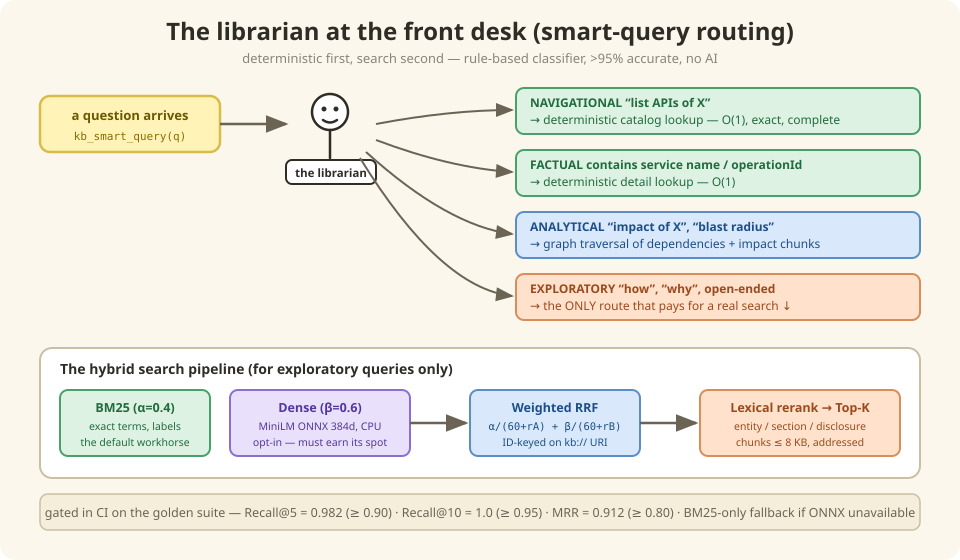

# 4 — Finding stuff (the librarian at the front desk)

*In which we meet a librarian with excellent judgment, learn why exact-match search is
secretly the hero, and watch two search engines argue by the fireside.*

---

## Not every question deserves a search engine

Watch what happens when two very different questions arrive at the knowledge base:

> **"List the APIs of shoppingcartms."**
> **"How does payment processing work across services?"**

A naive system throws both at a search index and hopes. Ours doesn't — because the
first question isn't a *search* at all. It has one exact, complete answer sitting in a
structured catalog. Searching for it would be like googling your own phone number.

So the front desk has a **librarian** (the smart-query router) who reads each question
and sends it down the right corridor:



| The question sounds like… | The librarian says… | What happens |
|---------------------------|---------------------|--------------|
| "List the APIs of X" / "show me X" | *"Card catalog, no searching needed"* | Direct lookup — instant, exact, complete |
| "What breaks if X changes?" | *"Impact section"* | Graph traversal of dependencies |
| "How does checkout pricing work?" | *"Okay, THAT one's a real search"* | Full-text search over the chunks |

The librarian is a rule-based classifier — no AI, deterministic, >95% accurate. Exact
questions get *exact* answers; only genuinely open-ended questions pay the cost (and
uncertainty) of search. This "deterministic first, search second" ordering is straight
from Google's OKF playbook.

## The underrated hero: keyword search

For the questions that *are* real searches, the workhorse is **BM25** — classic keyword
search, the stuff powering search engines since before deep learning was cool.

Why is old-school keyword search the default in an AI-era system? Look at our
vocabulary: `shoppingcartms`, `addItemsToCart`, `/carts/{cartId}/items`,
`shopping-cart-events`. These aren't English — they're *labels*. And when your needle
is labeled, you don't need a metal detector. You need someone who reads labels
extremely fast and never misses.

There's also a fancier option: **dense embeddings** — the "vibes matcher" that
understands `"how do we recalculate prices?"` should find the *repricing* page even
though no words overlap. Nice! But here's the twist worth internalizing:

> **The fancy option has to *earn* its place.** The dense tier ships switched off. It
> gets switched on only if the exam ([Chapter 9](./09-evaluation.md)) proves it finds
> things BM25 misses — by a measured margin. No vibes about the vibes matcher.

## Fireside Chat: BM25 vs. Dense Embeddings

**Tonight: "Which of you should Sam trust?"**

**BM25:** Let's keep this short. The user types `addItemsToCart`. I return
`addItemsToCart`. I have never once returned `removeItemsFromCart` because it "felt
similar."

**Dense:** And when Sam types *"how do we recalculate prices when the cart changes?"*
— zero of your precious keywords appear on the repricing page. I find it anyway,
because I read *meaning*, not spelling.

**BM25:** Fair! That's a real skill. Now tell the audience what you cost: a 90-megabyte
model, an embedding step for every chunk, and one more thing to explain when retrieval
misbehaves.

**Dense:** Quality costs. And you? You cost *misses* — silent ones — every time a
question is phrased differently from the page.

**BM25:** Which is why neither of us gets to win this argument with words. There's an
exam. Real questions, right-answer keys, recall numbers. If you beat me by enough,
you're in — hybrid mode, both of us, scores blended. If you don't…

**Dense:** …I wait on the bench. Ugh. Fine. But I want a rematch every time the eval
set grows.

**BM25:** Deal. That's literally the process.

---

## Under the Hood — routing, ranking & chunking

### Smart query routing

`kb_smart_query` classifies queries and routes to the optimal retrieval:

| Route | Pattern | Method |
|-------|---------|--------|
| **Analytical** | "impact of X", "blast radius" | Graph traversal + impact chunks |
| **Navigational** | "list APIs of X" | Deterministic catalog lookup (O(1)) |
| **Factual** | Contains service name / operationId | Deterministic detail lookup (O(1)) |
| **Exploratory** | "how", "why", open-ended | Hybrid BM25 + dense search |

Classifier accuracy: **>95%** on labeled test cases (`test_smart_query.py`) — with zero
dependencies and full determinism. (An ML classifier was evaluated and rejected: the
rule-based one already clears the bar.)

### The hybrid search pipeline

```
Query → tokenize → ┬─ BM25:  term relevance (α=0.4)              → Ranked List A
                    └─ Dense: MiniLM ONNX 384d cosine (β=0.6)
                              (skipped if unavailable — BM25-only)  → Ranked List B
                                                              ↓
                    Weighted RRF: α/(60+rankA) + β/(60+rankB) → Merged
                                                              ↓
                    Lexical Rerank: entity/section/disclosure  → Final Top-K
```

- **BM25** — `rank_bm25.BM25Okapi`, best for exact terms (service names, operationIds)
- **Dense** — `all-MiniLM-L6-v2` ONNX (committed in-repo, no downloads, CPU-only).
  Captures paraphrases with no keyword overlap. Embeds the full 1,291-chunk corpus in
  ~20s on CPU (cached in `.kb_index/`; queries embed in ~20ms).
- **BM25-only fallback** — when ONNX deps are unavailable, retrieval runs on the
  lexical tier alone and prints a clear notice at startup
- **RRF merging is ID-keyed** on the chunk URI (k=60) — keying on question text is a
  collision bug the stable URIs prevent

### Search modes

| Mode | Retrievers | Best For |
|------|-----------|----------|
| `hybrid` *(default)* | BM25 + dense → W-RRF (BM25-only if dense unavailable) | General queries |
| `bm25` | BM25 only | Exact keywords |
| `dense` | MiniLM only | Conceptual/paraphrase |

```bash
kb search "shopping cart submit" --top 5           # hybrid (default)
kb search "addItemsToCart" --mode bm25 --top 3     # exact keyword
kb search "order pricing" --mode dense --top 5     # semantic/paraphrase
kb context "payment processing" --tokens 4000      # ready-to-paste markdown with citations
```

All of this runs straight off the files — no server, offline. Botty's MCP tools
([Chapter 5](./05-mcp.md)) use the very same engine.

### RAG chunking rules

Chunks are a **build artifact**: derived in-memory from the committed `markdown/` pages
(embedded `<!-- chunk:... -->` markers) at index/startup time by
`kblib.chunker.derive_chunks()` — currently 1,291; nothing is committed. Each carries
HTML-comment metadata (`entity-type`, `entity`, `section`, `tokens`) and keeps its
stable URI.

- **8 KB ceiling** per chunk — API-catalog pages split per operation; other oversized
  pages split at heading boundaries (`AUD-22` guards against regressions)
- One concept per chunk (OKF principle): search returns the bite, not the buffet
- Debug on disk with `kb generate --show-chunks` (writes to `.kb_index/chunks/`)

### Current golden-suite numbers

| Metric | Target | Current |
|--------|--------|---------|
| Recall@5 | ≥ 0.90 | **0.982** |
| Recall@10 | ≥ 0.95 | **1.0** |
| MRR | ≥ 0.80 | **0.912** |

(That Recall@10 = 1.0 is *suspicious*, not glorious — [Chapter 9](./09-evaluation.md)
explains why a saturated exam gets rebuilt to be harder.)

## There are no Dumb Questions

**Q: What's a "chunk"? You keep saying chunks.**
A: Pages get sliced into bite-sized, self-contained pieces (one API operation, one
flow step-list) so search can return *exactly* the relevant part instead of a
40-screen page. Each chunk keeps its `kb://` address — sliced bread, still labeled.

**Q: Does search work without any servers running?**
A: Yes — `kb search "cart pricing"` and `kb context "topic"` run straight off the
files, no server, offline. The MCP server uses the same engine when it's up.

**Q: Why not just use one of those vector database products?**
A: At ~1,300 chunks the whole index loads in about a second, in-process. When the
corpus grows 40×, there's a written plan with a real database and *measured* switch
conditions ([Chapter 11](./11-less-is-more.md)). Buying infrastructure before the
problem exists is how frameworks get fat.

## BULLET POINTS

- The librarian (router) sends exact questions to exact lookups — **search is the
  fallback, not the default.**
- BM25 keyword search is the workhorse because our vocabulary is labels, and labels
  reward exact matching.
- Dense/semantic search exists and is genuinely useful for paraphrases — but it starts
  benched, and only measured recall wins it a starting spot.
- Chunks = self-contained bites (≤ 8 KB) with stable addresses; derived at build time,
  never committed.
- The whole pipeline is in-process, CPU-only, offline-capable — and gated by recall
  numbers in CI.

**Next**: [5 — Teaching robots to ask nicely](./05-mcp.md) | **Back**: [3 — Every fact gets an address](./03-addresses-and-metadata.md)
