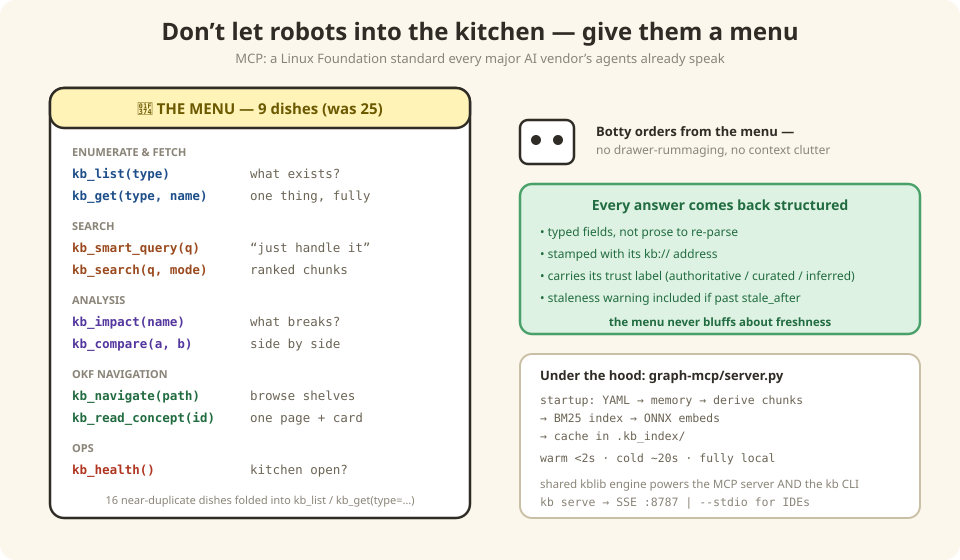

# 5 — Teaching robots to ask nicely (MCP)

*In which Botty stops rummaging through the kitchen, learns to order from a menu, and
we find out why nine dishes beat twenty-five.*

---

## The kitchen problem

Before MCP, when Botty needed to know something about `shoppingcartms`, it did what any
eager robot does: **walked into the kitchen and started opening drawers.** Read this
file, follow that link, grep for a promising-looking string, read four more files just
in case…

Result: Botty's brain (its *context window* — which is finite and expensive) fills up
with drawer contents. Whole pages, navigation menus, sections about the wrong service.
By the time Botty finds the answer, it's carrying so much clutter it starts confusing
the pricing service with the promo service.

The fix is the oldest one in hospitality: **don't let guests into the kitchen. Give
them a menu.**



## MCP: the menu protocol

**MCP (Model Context Protocol)** is a standard way for AI agents to call tools —
published as an open standard, governed by the Linux Foundation, and spoken by
basically every AI vendor (OpenAI, Google, Microsoft, the lot). That last part matters:
because it's a *standard* menu format, any waiter (Claude, Copilot, Gemini, your IDE's
agent) can read it. We didn't build a custom API that every tool would need custom
glue for — we printed a menu in the language every robot already reads. About a quarter
of the Fortune 500 already runs MCP servers; this is the industry's pick, not ours.

Every result comes back **structured** — typed fields, not prose to re-parse — stamped
with its `kb://` address and its trust label. When a page is past its expiry date,
`kb_read_concept` *says so*, right in the response. The menu never bluffs about
freshness.

## Why 9 dishes and not 25?

The first version of this menu had 25 items. Sounds generous — it was actually worse,
for the same reason a nine-page diner menu is worse:

- **Choice paralysis, robot edition.** Give a model 25 overlapping tools and it picks a
  near-duplicate, or dithers. Give it 9 distinct ones and it orders correctly.
- **Menus take up table space.** Every tool's name + description + schema is loaded
  into Botty's brain *on every session*. Twenty-five schemas of clutter, before the
  first question is even asked.
- **The description is the dish.** The single most important line of an MCP tool is its
  *description* — that's what the model reads to decide when to order it. Nine
  well-written descriptions beat twenty-five mumbled ones.

(Fifteen list/get lookalikes got folded into `kb_list`/`kb_get` with a `type`
parameter. Order the dumplings, specify the filling.)

---

## Under the Hood — the 9 tools, precisely

`graph-mcp/server.py` serves the KB through 9 unified MCP tools. Retrieval is layered,
deterministic, and fully local. The shared `kblib` package powers both the MCP server
and the `kb` CLI — same engine, two doors.

### Enumerate & Fetch (2)

| Tool | Use Case |
|------|----------|
| `kb_list(type, filter?)` | Enumerate: `services`, `flows`, `adrs`, `metadata`, `api-contracts` (filter=service), `apis` (filter=path pattern) |
| `kb_get(type, name)` | Fetch one: `service`, `flow`, `adr`, `metadata`, `nfr`, `api` (`service/operationId`), `architecture-layers`, `document` (`wiki`/`bruno`/`service-wiki` stores) |

### Search (2)

| Tool | Use Case |
|------|----------|
| `kb_smart_query(query)` | Intelligent router — classifies → routes to best tool ([Chapter 4](./04-finding-things.md)) |
| `kb_search(query, mode?)` | Hybrid BM25 + dense ranked search over derived chunks |

### Analysis (2)

| Tool | Use Case |
|------|----------|
| `kb_impact(name)` | Blast-radius analysis: upstream/downstream + impact page |
| `kb_compare(a, b)` | Side-by-side service comparison |

### OKF Navigation (2)

| Tool | Use Case |
|------|----------|
| `kb_navigate(path?)` | Walk hierarchical indexes (OKF progressive disclosure) |
| `kb_read_concept(id)` | Read one concept with parsed frontmatter + trust tier + staleness warning |

### Ops (1)

| Tool | Use Case |
|------|----------|
| `kb_health()` | Server health + index stats + active retrieval mode |

### Running the server

```bash
kb serve                           # SSE on http://localhost:8787
MCP_PORT=9000 kb serve             # custom port
python3 multi-dimensional-kb/graph-mcp/server.py --stdio   # stdio transport
```

At startup: loads all YAML into memory → derives RAG chunks from `markdown/` pages →
builds BM25 index → builds dense MiniLM ONNX embeddings (BM25-only fallback with a
startup notice if unavailable) → caches in `.kb_index/`. Startup: **<2s warm, ~20s
cold.**

### Resources & prompt templates

Beyond the 9 tools, the server publishes:

- **Resources**: `kb://services`, `kb://stats`, `kb://subdomains`
- **Prompt templates**: `kb_explore`, `kb_investigate_service`, `kb_compare`

## There are no Dumb Questions

**Q: Why not just a REST API? We build those all day.**
A: A REST API needs custom client code in every consumer. MCP needs *zero* — the
agent's runtime already speaks it, the same way your browser already speaks HTTP. We
publish one server; every AI tool in the company can call it tomorrow.

**Q: What if Botty orders the wrong dish — or the same dish five times?**
A: It happens! Tool calls are logged (every order goes on the receipt), and there's a
whole grading rubric for tool-use behavior waiting in [Chapter 9](./09-evaluation.md).
Also: if Botty asks `kb_get` for a type that doesn't exist, the error message lists
the valid types — Botty self-corrects on the next order.

**Q: Does Botty *have* to use the menu? What about the files directly?**
A: The files stay readable — humans browse them all the time. But agent workflows use
the menu (or the offline `kb` CLI): it's measured, structured, and doesn't fill
Botty's brain with drawer clutter. Rummaging is neither.

## BULLET POINTS

- MCP = a standard menu format for AI agents; every major vendor's robots can read it,
  so one server serves them all.
- Structured answers with addresses and trust labels beat "here's a wall of text,
  good luck."
- 9 tools > 25 tools: less schema clutter in the context window, better ordering
  decisions, one great description per dish.
- The menu is honest about freshness — expired pages come with a warning label.
- One shared engine (`kblib`) powers both the MCP server and the offline `kb` CLI;
  startup is <2s warm, and everything runs local.

**Next**: [6 — Running the kitchen](./06-daily-operations.md) | **Back**: [4 — Finding stuff](./04-finding-things.md)
