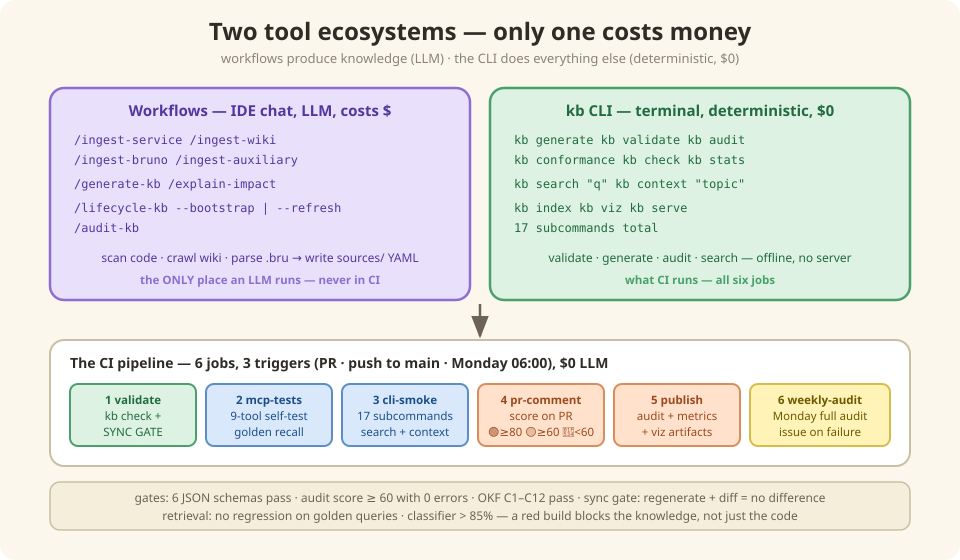

# 6 — Running the kitchen (setup, daily ops & CI)

*In which Sam finally gets to type something, we meet the two tool ecosystems and learn
which one costs money, and the cake police get a whole pipeline of their own.*

---

## A day in the life of the KB

Here's the rhythm of the system once it's running — and notice who does what:

- **Morning, Sam**: reads a service page, runs `kb search "cart pricing"` in a
  terminal. No server. No LLM. Free.
- **Afternoon, Maya**: a new service joined the domain. She adds three lines to
  `seed.yaml`, opens the IDE chat, and runs `/ingest-service newservicems`. The LLM
  reads the Java code and writes structured YAML. This is the *one* step that costs
  money.
- **All day, Botty**: orders from the 9-tool menu ([Chapter 5](./05-mcp.md)) while
  writing stories and plans.
- **Every PR, the cake police**: CI regenerates everything, diffs, audits, checks
  conformance, and runs the retrieval exam. All deterministic. **$0 in LLM cost.**
- **Nightly, nobody**: the freshness scan sniffs 45 repos for change and re-ingests
  only what moved ([Chapter 8](./08-freshness.md)).

The big idea of this chapter: **there are exactly two kinds of tools, and only one of
them ever costs money.**

| | Workflows (`/ingest-*`, `/generate-kb`, …) | CLI (`kb` commands) |
|-|-----------------------------------------------|---------------------|
| **Runs with** | LLM agent (Windsurf/Cascade/Devin) | Deterministic Python |
| **Invoked via** | `/command` in IDE chat | `kb command` in terminal |
| **Purpose** | Scan code, crawl wiki → produce YAML | Validate, generate, audit, search |
| **LLM cost** | Yes | $0 |
| **CI** | Not used | Used (all 6 jobs) |

**Important**: `/ingest-*` has no CLI equivalent (requires an LLM to read code).
`kb search` / `kb context` have no workflow equivalent (CLI-native).



---

## Under the Hood — install, bootstrap, operate

### Prerequisites & install

Requires **Python 3.10+**. Run from the repo root
(`apm0045079-commerce-AIFC-knowledge-base/`):

```bash
python3 -m venv .venv
source .venv/bin/activate
python3 -m pip install --upgrade pip setuptools
pip install -e "multi-dimensional-kb/[all]"    # kb CLI + RAG + MCP server
kb index                                        # warm RAG cache (~20s, cached thereafter)
```

> **Must be editable (`-e`).** A plain `pip install` (without `-e`) breaks path
> resolution — `kb search` silently returns empty results. If `kb index --json` shows
> `chunkCount: 0`, reinstall with `-e`.

| Install profile | Command |
|----------------|---------|
| Minimal — CLI only (BM25-only fallback) | `pip install -e "multi-dimensional-kb/"` |
| + Dense RAG (MiniLM ONNX, no downloads) | `pip install -e "multi-dimensional-kb/[embeddings]"` |
| + MCP server only | `pip install -e "multi-dimensional-kb/[mcp]"` |
| Everything (recommended) | `pip install -e "multi-dimensional-kb/[all]"` |

### First-time bootstrap

```bash
cat multi-dimensional-kb/templates/seed.yaml   # 1. review the declared inputs
/lifecycle-kb --bootstrap                      # 2. WORKFLOW (IDE chat) — all ingest + validate + generate
kb validate && kb audit && kb conformance      # 3. verify
kb stats
kb serve                                       # 4. optional: start MCP server
```

Bootstrap is **workflow-only** — it needs an LLM agent to scan source code and crawl
the wiki. After bootstrap, use `kb generate` (CLI) for subsequent regeneration.

### `kb` CLI reference

```bash
# Generation & Validation
kb generate [--dry-run]                 # regenerate markdown/ from sources/
kb validate [--quality-report]          # source YAML schema + cross-ref validation
kb audit [--scope=S] [--min-score=N]    # full KB health audit
kb conformance [--json]                 # OKF v0.2 C1-C12 conformance
kb check                                # schema + audit + conformance in one command
kb contracts                            # per-operation API contract YAMLs
kb aid-coverage [--fail-under=N]        # AID sample coverage report
kb viz [--out=PATH]                     # interactive dependency graph
kb stats                                # quick summary from audit-metrics.json

# Search & Context (no MCP server needed)
kb search "query" --top 5 [--type service] [--mode hybrid|bm25|dense] [--json]
kb context "topic" --tokens 4000        # ready-to-paste markdown with citations
kb index                                # rebuild .kb_index/ caches

# MCP Server
kb serve                                # start graph-mcp/server.py
```

### The 10 workflows, by tier

| Tier | Workflow | What It Does | CLI Equivalent |
|------|----------|--------------|----------------|
| **1 — Ingest** | `/ingest-service` | LLM scans a Java repo (pom.xml, *.java, config, OpenAPI) → `sources/services/<name>/` + `sources/api-contracts/<name>/` | *(none — needs LLM)* |
| | `/ingest-wiki` | Crawls Confluence pages (via LevelUp MCP) → `sources/wiki-crawled/` + `sources/api-contracts/<svc>/` | *(none)* |
| | `/ingest-bruno` | Parses Bruno `.bru` collections → `sources/capability-flow/` + `sources/bruno-parsed/` | *(none)* |
| | `/ingest-auxiliary` | ADR/NFR/metadata files → `sources/adrs/`, `sources/nfrs/`, `sources/metadata/` | *(none)* |
| **2 — Generate** | `/generate-kb` | Validates YAML → generates Markdown KB + chunks | `kb generate` |
| | `/explain-impact` | Traces deps → writes `impact/<name>.md` | *(none)* |
| **3 — Lifecycle** | `/lifecycle-kb --bootstrap` | One-time: ingests ALL → validates → generates | *(none)* |
| | `/lifecycle-kb --refresh` | Re-ingests changed sources (fingerprint skip) → regenerates | *(none)* |
| | `/audit-kb` | Health audit + LLM semantic analysis | `kb audit` (no LLM) |

### What `/ingest-service` actually extracts

| Dimension | Source | YAML Field |
|-----------|--------|-----------|
| Inbound APIs | `@RestController`, `@Path` | `inboundApis[]` |
| Request/response fields | `@NotNull`, `@Size` | `requestFields[]` |
| Outbound calls | `WebClient`, `RestTemplate`, `@FeignClient` | `outboundApis[]` |
| Forward call chain | Controller → Service → Adapter | `outboundCalls[]` |
| Kafka topics | `@KafkaListener`, `kafkaTemplate.send()` | `topicsProduced[]`, `topicsConsumed[]` |
| Datastores | `@Table`, `@Document`, `@Cacheable` | `datastores[]` |
| Architecture layers | `@Autowired` hierarchy | `architectureLayers` |
| Feature flags | `isFeatureEnabled()` | `featureFlag` |
| Error codes | `@ControllerAdvice` | `errorCodes[]` |
| Tech stack | `pom.xml` | `frameworks[]` |

### Common recipes

```bash
# Ingest one service (after adding it to seed.yaml)
/ingest-service shoppingcartms
/generate-kb --scope=shoppingcartms     # or: kb generate

# Ingest one wiki page
/ingest-wiki https://wiki.web.att.com/display/DRC/Cart+APIs \
  --dimension=api --service=shoppingcartms --depth=5

# Ingest an ADR
/ingest-auxiliary adr adr/ADR-005.md
kb generate

# Health check
kb audit --scope=shoppingcartms
```

| Refresh mode | Command | What Happens |
|------|---------|-------------|
| **Partial** | `/ingest-service X` → `/generate-kb --scope=X` | Re-scan one service |
| **Subdomain** | `/generate-kb --scope=subdomain:cart-checkout` | Regenerate a group |
| **Full refresh** | `/lifecycle-kb --refresh` | Re-ingest changed (fingerprint skip) |
| **Force refresh** | `/lifecycle-kb --refresh --force` | Re-ingest ALL sources |
| **Regenerate only** | `kb generate` | Re-run generator, no re-scanning |

### Directory layout

```
<kb-repo>/
├── multi-dimensional-kb/               ← {KB_ROOT}
│   ├── templates/seed.yaml             ← THE SINGLE INPUT
│   ├── sources/                        ← Layer 1: Intermediate YAML
│   │   ├── services/<name>/catalog-info.yaml
│   │   ├── api-contracts/<svc>/*.yaml
│   │   ├── capability-flow/ · adrs/ · nfrs/ · metadata/
│   │   └── .fingerprints.json
│   ├── markdown/                       ← Layer 2: Final OKF Bundle
│   │   ├── index.md · services/ · api-catalog/ · capability-flow/
│   │   ├── impact/ · adrs/ · nfrs/ · metadata/ · wiki-content/
│   │   └── log.md · CHANGELOG.md
│   ├── graph-mcp/server.py             ← MCP server (9 unified tools)
│   ├── kbcli/cli.py                    ← Unified kb CLI
│   ├── scripts/                        ← Python generation + validation
│   ├── all-MiniLM-L6-v2/              ← ONNX model (committed in-repo)
│   └── documentation/                  ← THIS BOOK
├── Commerce-Services-Summary.md        ← PRIMARY entry point (repo root)
└── .devin/workflows/multi-dimensional-kb/  ← 10 workflow definitions
```

### The CI pipeline — 6 jobs, 3 triggers, $0 LLM

Defined in `.github/workflows/kb-validation.yml`. Fully deterministic.

| Trigger | When | Jobs |
|---------|------|------|
| **pull_request** | PR touching `sources/`, `scripts/`, `graph-mcp/`, `markdown/`, etc. | validate, mcp-tests, cli-smoke, pr-comment |
| **push (main)** | Push to `main` | validate, mcp-tests, cli-smoke, publish |
| **schedule** | Monday 06:00 UTC | weekly-audit |

| Job | What it does |
|-----|--------------|
| **1: validate** | `kb check` — schema validation (6 JSON schemas) + health audit (AUD-01…25, score ≥ 60, 0 errors) + OKF conformance (C1–C12) → `check-report.md`. Then the **sync gate**: regenerates ALL markdown, diffs vs committed, **fails on any diff**. Plus viz build + AID coverage report |
| **2: mcp-tests** *(parallel)* | 9-tool self-test (`test_tools.py`) + 54 golden queries (`test_retrieval.py`, fails on regression) + classifier accuracy (`test_smart_query.py`, >85% required) |
| **3: cli-smoke** *(parallel)* | Verifies all 17 `kb` subcommands, runs `kb search` / `kb context` smoke tests |
| **4: pr-comment** | Posts audit score on the PR: 🟢 ≥ 80, 🟡 ≥ 60, 🔴 < 60 |
| **5: publish** *(main push)* | Uploads `audit-report.md`, `audit-metrics.json`, `viz.html` (30-day retention) |
| **6: weekly-audit** | Full audit every Monday — creates a GitHub issue on failure |

### Quality gate summary

| Gate | Tool | Pass Criteria |
|------|------|--------------|
| Unified check | `kb check` (schema + audit + OKF) | 0 violations, score ≥ 60, 0 errors, C1–C12 pass |
| Schema | `validate_catalog.py` (alias: `kb validate`) | 0 violations |
| Audit | `audit_kb.py` (alias: `kb audit`) | Score ≥ 60, 0 errors |
| OKF | `okf_conformance_check.py` (alias: `kb conformance`) | C1–C12 all pass |
| Sync | `generate + git diff` | No diff |
| Retrieval | `test_retrieval.py` | No regression |
| CLI | smoke tests | All subcommands work |

The OKF conformance checks (C1–C12) validate bundle structure: root `index.md` with
`okf_version`, frontmatter presence and required fields, ISO-8601 timestamps, valid
`status` values, cross-links resolving, per-directory indexes, index coverage, `log.md`
format, and provenance entries referencing real files. The audit adds D1–D10
machine-readable metrics (freshness distribution, cross-link density, orphan rate,
trust distribution, …) to `audit-metrics.json`.

### Maintenance rules

1. **Never hand-edit `markdown/`** — change `sources/` YAML, then regenerate
2. **Regenerate + audit after any source change** — score must stay ≥ 60 with 0 errors
3. **Keep provenance honest** — `sources` must reference real files
4. **Respect exclusions** — `@Internal`, admin, health endpoints stay out of API catalogs
5. **Compound knowledge** — durable analyses go in `markdown/analysis/` with
   `confidence: curated` (exempt from the sync gate); use `kb context "topic"` to gather
   chunks, then file the synthesized answer back so explorations compound instead of
   disappearing into chat

## There are no Dumb Questions

**Q: How do I add a new service?**
A: Add to `templates/seed.yaml` → `/ingest-service <name>` → `/generate-kb
--scope=<name>`. That's the whole ceremony.

**Q: How do I regenerate without re-scanning code?**
A: `kb generate` (CLI) — fast, no LLM. Re-scanning is only needed when the *code*
changed.

**Q: Why does CI cost $0 if the system uses LLMs?**
A: Because of where the LLM sits: at ingest time only. Everything CI does — validate,
generate, diff, audit, run the retrieval exam — is deterministic Python replaying
recorded knowledge, not re-reading code.

## BULLET POINTS

- Two ecosystems: **workflows** (LLM, IDE chat, costs money, produces YAML) and the
  **`kb` CLI** (deterministic, terminal, free, does everything else).
- Bootstrap once with `/lifecycle-kb --bootstrap`; after that, daily life is
  `/ingest-service` + `kb generate`.
- The 6-job CI pipeline enforces: schemas, audit ≥ 60, OKF conformance, the sync gate
  (no diff), retrieval recall, and CLI smoke — every PR, $0 LLM.
- An editable install (`-e`) is mandatory — a plain install silently breaks search.
- Durable analyses compound in `markdown/analysis/`; everything else regenerates.

**Next**: [7 — Botty gets a job](./07-consumers.md) | **Back**: [5 — Teaching robots to ask nicely](./05-mcp.md)
