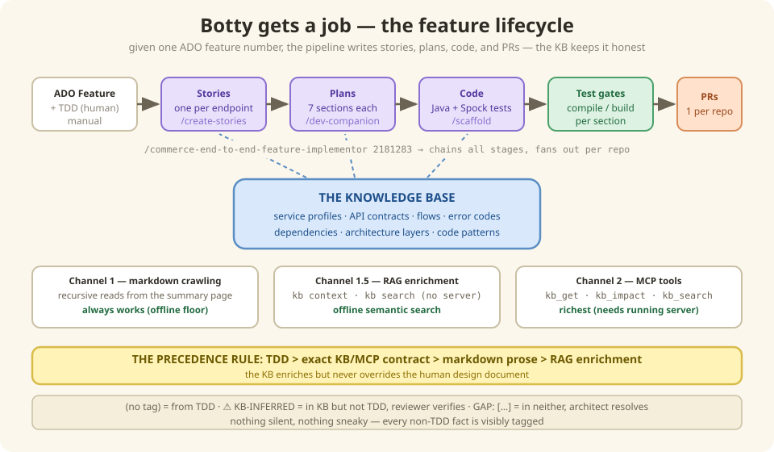

# 7 — Botty gets a job (consumer workflows)

*In which the knowledge base stops being a library and starts being a colleague — and we
learn the one precedence rule that keeps Botty from arguing with the architects.*

---

## What was all this FOR, again?

Eight chapters of layers, addresses, menus… why? Because of what happens *now*: the KB
goes to work. Given an ADO feature number, the automated pipeline writes the stories,
plans the implementation, scaffolds the code, and opens the PRs — and at every single
step, the thing keeping Botty honest is the knowledge base.

Here's the trick that makes it safe. Botty consults **three sources in strict order of
authority**:

1. **The TDD** (the human-written design document) — *always wins*.
2. **The KB's exact answers** (MCP contracts, deterministic lookups) — fills in
   schemas, error codes, dependencies the TDD doesn't spell out.
3. **RAG enrichment** (search results) — adds context, patterns, similar cases.

Anything the KB adds that the TDD didn't confirm is visibly tagged. Nothing silent,
nothing sneaky:

| Tag | Meaning |
|-----|---------|
| *(no tag)* | Value from TDD (source of truth) |
| `⚠️ KB-INFERRED` | Present in KB, not in TDD — for reviewer verification |
| `GAP: [description]` | Neither TDD nor KB has it — for architect resolution |

Remember the trust labels from [Chapter 3](./03-addresses-and-metadata.md)?
This is where they pay rent: *overheard-at-lunch facts don't get to win arguments with
design documents.*



---

## Under the Hood — the feature pipeline

The KB participates at **every automated stage**:

| Stage | Workflow | KB Role |
|-------|----------|---------|
| 1. Requirement | Manual (ADO Feature) | — |
| 2. Design | Manual (TDD/LLD) | *Future*: draft TDD generation ([Chapter 11](./11-less-is-more.md)) |
| 3. **Stories** | `/commerce-create-stories-from-feature` | Service profiles, API schemas, flows, error codes |
| 4. **Plans** | `/compare-commerce-dev-companion` | API details, dependencies, architecture layers |
| 5. **Code** | `/scaffold-commerce-dev-companion` | RAG context for code patterns |
| 6. Test | Build gates (Spock + WireMock) | Tests validate against KB contracts |
| 7. **PR** | `/commerce-end-to-end-feature-implementor` | Chains 3→4→5→7 automatically |

### Tri-channel KB access

Consumer workflows reach the KB through **three complementary channels**, gracefully
degrading if one is missing:

| Phase | Channel | Mechanism | Availability |
|-------|---------|-----------|-------------|
| **1** | Markdown Crawling | Recursive `read_file` from `Commerce-Services-Summary.md` | Always (offline) |
| **1.5** | RAG Enrichment | `kb context` / `kb search` over 1,291 chunks | Always (offline, no server) |
| **2** | MCP Tools | `kb_get(type='service')`, `kb_get(type='api')`, etc. | Requires running server |

**Precedence**: TDD > exact KB/MCP contract > markdown prose > RAG enrichment.
RAG results are tagged `⚠️ KB-INFERRED` — never override TDD or MCP data.

**Degradation**: All 3 → richest. Markdown + RAG → offline semantic search.
Markdown only → functional floor.

### Story generation — `/commerce-create-stories-from-feature`

```bash
/commerce-create-stories-from-feature 2181283
```

- **Phase 1 — Markdown (always, offline)**: start at `Commerce-Services-Summary.md` →
  follow links recursively through `markdown/services/`, `capability-flow/`, `adrs/`.
  Collects API schemas, Kafka topics, outbound deps, error codes.
- **Phase 1.5 — RAG enrichment** (when the `kb` CLI is installed):

| Query | Command |
|-------|---------|
| Service context | `kb context "{service} inbound APIs outbound integrations" --tokens 4000 --type service` |
| Scenario discovery | `kb search "{scenario} {service}" --top 10 --type api-catalog --json` |
| Cross-service patterns | `kb context "{downstream} integration pattern {caller}" --tokens 2000` |

- **Phase 2 — MCP (mandatory attempt, graceful fallback)**: `kb_get(type='service')`
  for the full profile, `kb_get(type='api')` for contracts with scenarios and schemas,
  `kb_impact` for upstream/downstream deps, `kb_search` for open-ended questions.

Output — one story per endpoint, plus a summary:

```
features/{FEATURE_ID}/stories/
  ├── STORY-001-initializeCart.md
  ├── STORY-002-addItemsToCart.md
  └── ...
features/{FEATURE_ID}/feature-execution-summary.md
```

### Execution plans — `/compare-commerce-dev-companion`

Takes stories + KB + service repo → a **7-section execution plan**:

```bash
/compare-commerce-dev-companion --story-file features/2181283/stories/STORY-001.md
```

| Section | Content |
|---------|---------|
| §1 Scope | What changes, impacted files |
| §2 Design | API contract, data model, sequence diagrams |
| §3 Implementation | Step-by-step coding instructions |
| §4 Configuration | application.yml, feature flags |
| §5 Testing | Spock + WireMock tests, test data |
| §6 PR | Commit message, PR description |
| §7 Risk | Risks, rollback plan, monitoring |

Brownfield changes include the **IXP feature flag** protocol and **brownfield
hard-stops**.

### Code scaffold — `/scaffold-commerce-dev-companion`

```bash
/scaffold-commerce-dev-companion --plan docs/JIRA-123/execution-plan.md
```

Takes the execution plan → production-grade Java code + Spock tests. Processes the plan
**section by section** with compile/build gates between each. Uses `kb_search` to find
similar patterns in other services.

### End-to-end — `/commerce-end-to-end-feature-implementor`

```bash
/commerce-end-to-end-feature-implementor 2181283
```

```
ADO Feature → Stories (Phase 1) → Plans (Phase 2, batch)
           → Code (Phase 3, batch) → PRs (Phase 4, 1 per repo)
```

Multi-service features fan out to **parallel child sessions** per repository.

### Golden-dataset evaluation — `/kb-evaluation-judge`

The proof that KB changes don't degrade downstream quality — and the seed of the whole
evaluation story in [Chapter 9](./09-evaluation.md):

1. Takes golden-dataset folders with known-good stories + scorecards
2. Regenerates stories from TDD + current KB
3. Scores against baseline via `/stories-evaluation-judge`
4. Produces an aggregate improve/degrade report

```
golden-dataset/
├── 1342585/     ← BSSE Order Amend
├── 1488986/     ← BSSE WLS CIM
├── 2108438/     ← Feature 2108438
└── 2174069/     ← Feature 2174069
```

### KB usage at each stage — summary

| Stage | KB Data Used | Key MCP Tools |
|-------|-------------|---------------|
| **Stories** | Service profiles, API schemas, flows, error codes + RAG chunks | `kb_get(type='service')`, `kb_get(type='api')` |
| **Plans** | Architecture layers, dependencies, implementations | `kb_impact`, `kb_search` |
| **Code** | Coding patterns, field schemas, test patterns | `kb_get(type='architecture-layers')`, `kb_search` |
| **Evaluation** | Same as Stories (regeneration) | Same as Stories |

## There are no Dumb Questions

**Q: Why three channels? Wouldn't MCP alone be cleaner?**
A: MCP needs a running server. Markdown crawling and `kb` CLI search work offline, on a
plane, in a locked-down CI runner. The three channels are a graceful-degradation
ladder, not redundancy — the workflow always *attempts* the richest channel available.

**Q: What if the KB and the TDD disagree?**
A: The TDD wins, full stop. But the disagreement isn't discarded — the KB value shows
up tagged `⚠️ KB-INFERRED`, which tells the reviewer "the code seems to say something
different, maybe check?" That's the KB doing its job: surfacing, not overriding.

**Q: Who reviews what Botty writes?**
A: Humans, same as any PR. The pipeline generates stories, plans, code, and PRs — but
every artifact lands in review, and the tags (`KB-INFERRED`, `GAP`) tell reviewers
exactly where to look hardest.

## BULLET POINTS

- The KB's product is *leverage*: stories, plans, code, and PRs generated with
  trustworthy context at every stage.
- One precedence rule keeps it safe: **TDD > MCP exact > markdown > RAG** — and
  everything non-TDD is visibly tagged.
- Three access channels degrade gracefully: markdown (always), RAG CLI (offline), MCP
  (richest).
- The golden-dataset judge regenerates real features against known-good baselines —
  KB changes must not degrade story quality.
- Multi-service features fan out to parallel sessions, one PR per repo.

**Next**: [8 — The milk carton principle](./08-freshness.md) | **Back**: [6 — Running the kitchen](./06-daily-operations.md)
