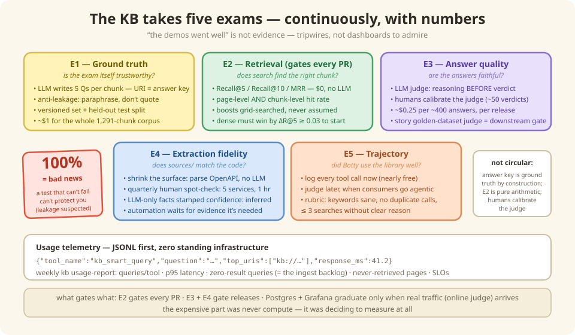

# 9 — Trust, but verify (the KB takes an exam)

*In which the knowledge base sits five different tests, we learn why a perfect score
is a red flag, and an AI judge is forced to show its work.*

---

## "It works great!" is not evidence

Sooner or later someone senior asks the only question that matters: **"How do you KNOW
the knowledge base is good?"**

"The demos went well" is not an answer. "Botty seems happier" is not an answer. The
answer is the same one software gave: **tests. Run continuously. With numbers.**

The KB sits five exams, each answering one specific question:



| Exam | Question It Answers | Cadence |
|------|---------------------|---------|
| E1 Ground truth | Is the eval set itself trustworthy? | Regenerated per significant content change, versioned |
| E2 Retrieval | Does search find the right chunk? | Every PR (CI gate) |
| E3 Answer quality | Are RAG/story answers faithful? | Per KB release (offline); online sampling later |
| E4 Extraction fidelity | Does sources/ YAML match the code? | Quarterly spot-check; automation deferred |
| E5 Trajectory | Do agents *use* the MCP tools well? | Logging now; judged when consumers are agentic |

## Exam 1: Writing the test (without cheating)

Before grading anything you need an answer key. Ours is built backwards, and the
backwards-ness is the clever part: take a page (whose address we know —
[Chapter 3](./03-addresses-and-metadata.md) paying off), and have an LLM write **five
questions this page answers**. Now you have question → known-correct-page pairs.
Hundreds of them, for about a dollar.

One rule makes or breaks the whole thing: the question-writer is told to **use as few
words from the page as possible.** Why? If the page says "cart repricing occurs on
item addition" and the question is *"when does cart repricing occur?"* — any dumb
string-matcher aces it. You're testing photocopying, not finding. Real users
paraphrase, so the exam must too.

> **A 100% score is bad news.** Our first golden suite scored Recall@10 = 1.0.
> Champagne? No — alarm bells. A test the system can't fail can't catch regressions,
> and suspiciously perfect scores usually mean the questions leaked words from the
> answers. We *rebuilt the exam to be harder on purpose.* When the new numbers come in
> lower, that's not the system getting worse — that's the thermometer getting honest.

## Exam 2: Did search bring the right book?

Now the mechanical part. For every exam question: did the right page come back in the
top 5? (**Recall@5**.) Was it near the top, or buried at rank 9 where nobody — human
or robot — actually looks? (**MRR**, which rewards rank 1 over rank 9.)

This runs **on every pull request**. Costs nothing (no LLM — just search + arithmetic
against the answer key). If a change to chunking or boosts drops recall, the build
fails *before* the change ships. It's a unit test suite where the unit is *findability*.

It's also the courtroom from [Chapter 4](./04-finding-things.md): this is the exam
where dense embeddings must beat BM25 *by a stated margin* to earn a starting spot.
Decisions by scoreboard, not by meeting.

## Exam 3: Was the answer any good? (the judge shows its work)

Retrieval can be perfect while the final answer is still mush. So a second LLM plays
**judge**: here's the original source, here's the question, here's the generated
answer — grade it.

Two safeguards keep the judge honest:

- **Reasons before verdicts.** The judge must write its reasoning *first*, then the
  grade. Forcing the "why" before the "what" measurably improves grading — the same
  reason your teacher demanded you show your work.
- **Someone judges the judge.** You can't hire a second AI judge to check the first —
  it has the same blind spots (who watches the watch-bot?). So periodically a *human*
  reviews a stack of the judge's verdicts, and the judge's instructions get tuned
  until human and judge agree. Calibration, not turtles all the way down.

And the best part: the team's golden-dataset story judge ([Chapter 7](./07-consumers.md))
— regenerate real feature stories with the current KB, compare against known-good
baselines — was already there before any of this. Exam 3 didn't have to be invented,
just surrounded with friends.

## Exams 4 & 5: the quick ones

**Exam 4 — Is the textbook itself right?** All the retrieval quality in the world is
useless if the *ingested facts* are wrong (remember: ingest is the one step where an
LLM reads code and could mis-read it). Defense one: wherever a machine-readable spec
(OpenAPI) exists, parse it deterministically — no LLM, nothing to mis-read. Defense
two: quarterly, a human spot-checks five random services against the actual code. If
the spot-checks start finding real errors, an automated nightly audit is designed and
waiting.

**Exam 5 — Did Botty use the library well?** Not *what* Botty answered — *how* it got
there. Did it search with sensible keywords? Did it call the same tool five times with
identical arguments (robot pacing-in-circles)? Right now Botty's tool calls follow
scripts, so there's nothing to grade — but every call is being *logged*, so the day
Botty starts choosing its own tools, the gradebook opens with data already in it.

---

## Under the Hood — the five layers, precisely

### E1 — Synthetic ground-truth generation

Grow the 54-query suite into a per-domain set of 500+:

1. For each chunk (stable `kb://` URI = the answer key), have the LLM generate **5
   questions a developer/architect would ask** that this chunk answers.
2. **Anti-leakage instruction**: *"use as few words as possible from the record"* —
   questions must paraphrase, not quote, or metrics inflate.
3. Structured output (`questions: list[str]`), batched with retry/backoff.
   Measured cost: **~$0.06 per 80 documents** — the full 1,291-chunk corpus is ~$1.
4. **Version the dataset** (`eval/golden-queries-v2.yaml`) and **hold out a test split**
   (tune boosts on validation, report on test). An eval set that changes silently
   between runs makes scores incomparable.
5. Keep ~50 *hand-written* queries from real consumer sessions — synthetic breadth +
   real-query realism.

### E2 — Retrieval metrics (the CI gate)

- **Recall@5 / Recall@10 / MRR** on the versioned set — expect headline numbers to
  *drop* when leakage is removed. That is the point: a gate at 0.98 on a saturated set
  catches nothing; a gate at (say) 0.85 on an honest set catches regressions.
- Score at **both granularities**: page (`kb://…/type`) hit rate *and* chunk
  (`…/section`) hit rate — chunk size is a hyperparameter tuned by exactly this pair
  of numbers (validates the 8 KB ceiling empirically instead of by decree).
- **Grid-search field boosts** against the eval set. Measured evidence says boosting
  the "obvious" field can monotonically *hurt* — tuned combinations beat intuition by
  points of hit rate. Boosts are tuned, not assumed.
- **E2 arbitrates the retrieval default**: BM25-only ships as default; the dense/ONNX
  tier is restored as default only if it wins on the exploratory slice by
  **ΔRecall@5 ≥ 0.03 or ΔMRR ≥ 0.05**. Whichever way it lands, the decision is recorded
  with its number — it stops being arguable.

### E3 — Answer quality (LLM-as-judge)

- **Offline (per KB release)**: A→Q→A′ pattern — original chunk (A), generated
  question (Q), RAG answer (A′); judge emits `{reasoning, score: good|bad}` with
  reasoning *before* the label. Measured cost ~$0.25 per ~400 answers.
- **Online (later, with real traffic)**: judge a **1-in-10 sample** of real queries,
  **asynchronously** (never in the answer path), verdicts
  `RELEVANT | PARTLY_RELEVANT | NON_RELEVANT`. Deliberately the *first* Phase 2
  component — it activates once real traffic exists ([Chapter 11](./11-less-is-more.md)).
- **Judge calibration**: periodically a human reviews ~50 judge verdicts side-by-side
  and the judge prompt is tuned until agreement is acceptable. Human feedback (thumbs)
  and judge verdicts share one table (`source` column) precisely so they can be
  compared on the same axis.
- The **story-regeneration golden-dataset judge** (`/kb-evaluation-judge`) stays as the
  downstream gate — E3 for the KB's real product (stories).

### E4 — Extraction fidelity

Attack the *surface* first, automate the *audit* only if evidence demands it:

1. **Shrink the surface — deterministic OpenAPI parsing.** Where a service has an
   OpenAPI spec, `/ingest-service` parses it *deterministically* for `inboundApis[]`
   (paths, methods, operationIds, schemas); the LLM only fills what specs can't express
   (outbound call chains, Kafka usage, feature flags). Every fact moved from
   LLM-extracted to parsed no longer needs auditing at all.
2. **Quarterly manual spot-check.** One engineer, five random services, one hour: diff
   the `sources/` YAML claims against mechanically checkable ground truth. Findings
   logged in `log.md`. Two quarters of findings produce the real error rate.
3. **Automation trigger.** Build the nightly sampling harness only if a spot-check
   finds a material error the `inferred` tagging did not contain, OpenAPI coverage
   stalls below ~50% of inbound APIs, or an incident is traced to a wrong KB fact.
4. **Confidence honesty**: facts only the LLM asserted are marked
   `confidence: inferred` — consumers already treat those as `⚠️ KB-INFERRED`
   ([Chapter 7](./07-consumers.md)), which bounds the blast radius of extraction errors
   while the quarterly cadence runs.

### E5 — Trajectory (log now, judge later)

Today's consumers are *scripted* workflows with fixed tool sequences; judging a
hardcoded sequence measures the script's author, not agent behavior. Trajectory logging
(the `tool_name` field in the usage JSONL) is nearly free and builds the dataset
judging will need.

When consumers become genuinely agentic, the rubric: **search queries contain the
important keywords; no duplicate calls with identical arguments; repeat searches are
refinements; ≤ 3 searches without clear reason; calls support the final answer** —
thresholds set from *observed* call distributions rather than guessed. Two independent
scores (answer, trajectory) diagnose failures: answer-bad + trajectory-good means
retrieval context was wasted; both-bad means the agent searched for the wrong thing.

### Usage telemetry — JSONL first, zero Docker

You can't tune what you can't see. Phase 1 telemetry runs **zero standing
infrastructure**: the MCP server and `kb` CLI append one JSON line per query/tool call
to local `usage/*.jsonl` files:

```json
{"domain":"commerce","channel":"mcp-tool","tool_name":"kb_smart_query",
 "question":"list APIs of shoppingcartms","top_uris":["kb://commerce/shoppingcartms/api-catalog"],
 "response_ms":41.2,"timestamp":"2026-08-01T10:14:03Z"}
```

A weekly CI job runs **`kb usage-report`**: queries per tool, p95 latency,
**zero-result queries** (the ranked content-gap backlog — the highest-value signal),
never-retrieved pages, and the freshness SLO numbers.

**Graduation to Postgres + Grafana is triggered, not default**: stand up the two
standard containers when the online judge starts, when someone wants numbers more often
than weekly, or when multiple server instances make file-append coordination annoying.
The JSONL fields deliberately match the target `conversations` schema, so graduating is
a loader script, not a redesign. User thumbs and judge verdicts share one `feedback`
table with a `source` column — so human-vs-judge agreement (E3 calibration) is a single
SQL query.

## There are no Dumb Questions

**Q: An LLM writing the exam AND an LLM taking it AND an LLM judging it — isn't this
circular?**
A: The circle is broken in three places: the answer *key* is ground truth by
construction (the question was generated *from* that page, so we know the right
answer); Exam 2 is pure arithmetic, no LLM anywhere; and the judge is calibrated
against humans. Machines do the volume; humans anchor the truth.

**Q: What do the numbers actually gate?**
A: Exam 2 gates every PR (retrieval regression = red build). Exams 3–4 gate releases
(scorecard must not degrade vs. baseline). The exams aren't dashboards to admire —
they're tripwires.

**Q: What does all this testing cost?**
A: The answer key: ~$1 per rebuild. Judging a full answer run: under a dollar. Exam 2:
$0 forever. The expensive part was never compute — it was deciding to measure at all.

## BULLET POINTS

- "How do you know it's good?" gets answered with continuously-run, numbered exams —
  not adjectives.
- Answer keys are generated *from* the pages (cheap, scalable), with an anti-cheating
  rule: paraphrase, don't quote.
- **Perfect scores are a smell.** A test that can't fail can't protect you.
- The judge writes reasons before verdicts, and humans calibrate the judge.
- Wrong-facts risk is squeezed at the source (deterministic spec parsing) and
  spot-checked by humans — automation waits for evidence it's needed.
- Telemetry starts as a JSONL file and a weekly report; dashboards arrive with real
  traffic, and zero-result queries become the ingest backlog.

**Next**: [10 — Good fences, good knowledge](./10-federation.md) | **Back**: [8 — The milk carton principle](./08-freshness.md)
