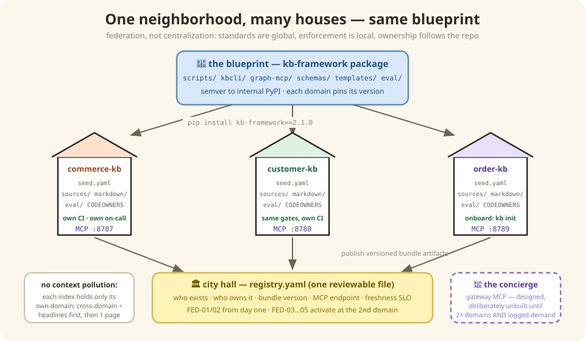

# 10 — Good fences make good knowledge (federation)

*In which Commerce gets neighbors, every house is built from the same blueprint, and a
very polite concierge refuses to haul furniture.*

---

## The Customer team wants one too

The Commerce KB works. Word gets out. The Customer domain wants one. Then Order. Then
Billing. And someone — there's always someone — proposes the obvious thing:

> *"Let's just put ALL the domains in ONE big knowledge base!"*

Tempting. Wrong. Here's why, and it's not a technology reason: **the Customer team
cannot own knowledge that lives in the Commerce team's repo.** Ownership follows
repository boundaries — CODEOWNERS, review rights, on-call rotations. One giant KB
means either one central team bottlenecking everyone's knowledge (they become the
bureau of documentation, everyone waits on them), or everyone editing everything
(and we're back to the wiki nobody trusts, at 10× scale).

Also — picture Botty working a Commerce story while ten domains of chunks about
customer profiles and billing cycles wash through its search results. That's **context
pollution**: the neighbor's furniture, in your living room, uninvited.

So we do what well-run cities do: **same building code, separate houses.**



## The neighborhood plan

| Piece | In city terms | In our terms |
|-------|---------------|--------------|
| **The blueprint** | One approved building design for every house | The framework, extracted into a shared package (`kb-framework`) — the generator, the CLI, the search engine, the schemas, the exam harness. Versioned; each domain pins the version it's on |
| **The houses** | Each family owns theirs, decorates inside | One repo per domain: its `seed.yaml`, its sources, its bundle, its exam answer keys. The Customer team merges Customer knowledge; nobody else can |
| **The city registry** | One page at city hall: who lives where | `registry.yaml` — a single small file listing every domain, its owner, its bundle version, its freshness promise. That's the *entire* central database |
| **The building inspector** | Same code enforced at every house, by inspections — not by a central approvals desk | The same CI gates ([Chapter 6](./06-daily-operations.md)'s cake police, [Chapter 9](./09-evaluation.md)'s exams), running in *each domain's own pipeline*. Standards are global; enforcement is local |
| **The concierge** | You call when you need something from *another* house | The gateway — a small MCP service for cross-domain questions. **Deliberately not built yet** (more below) |

New domain onboarding is *template instantiation*: `kb init --domain customer`, fill in
your `seed.yaml`, run the bootstrap. Same houses, different addresses — remember
[Chapter 3](./03-addresses-and-metadata.md)'s URIs? `kb://commerce/...`,
`kb://customer/...` — the domain is the city part of every address, so cross-domain
links *resolve* instead of dangling.

## The concierge who reads headlines first

When a Commerce story genuinely needs Customer knowledge ("what does the profile
service return?"), Botty doesn't get keys to the Customer house. It calls the
concierge, and the concierge has one golden rule:

> **Headlines first, furniture on request.** The gateway returns *disclosure lines* —
> those one-sentence business-card pitches from [Chapter 3](./03-addresses-and-metadata.md)
> — plus addresses. Botty reads ten headlines, picks the two pages it actually needs,
> and fetches just those.

That's the anti-pollution mechanism, twice over: structurally (each domain's index
contains only its own stuff) and behaviorally (cross-domain content arrives one
deliberate page at a time, never as a flood).

And the concierge? **Designed in full, hired later.** With one domain there's nothing
to route between; a gateway today would be a doorman for a one-house street. He gets
hired when two conditions are true: a second domain is live, *and* the usage logs show
real cross-domain questions.

## Fireside Chat: Monorepo vs. Federation

**Monorepo:** One repo, one search index, one CI. Simple! Everything findable in one
place. Why are we complicating this?

**Federation:** Answer one question: in your world, who reviews a change to Customer
knowledge?

**Monorepo:** Whoever's around? A central docs team? CODEOWNERS on subfolders can—

**Federation:** *Whoever's around* is how wikis died, and a central team is a
bottleneck with a burnout date. Ownership isn't a folder permission — it's a team
saying "our repo, our on-call, our name on it." And your one CI: when the Billing
folder fails its audit, whose build is red? *Everyone's.* Ten domains sharing one
pipeline is ten teams blocking each other.

**Monorepo:** But you've built ten of everything! Ten pipelines, ten indexes—

**Federation:** Ten *instances* of ONE thing. The blueprint is shared and versioned;
domains run copies. That's the difference between duplicating code and running a
program ten times. Your model shares the *building*; mine shares the *blueprint*.

**Monorepo:** …and cross-domain search?

**Federation:** The concierge — scoped, polite, headlines-first. Better than your plan,
where every search wades through everyone's everything, always.

**Monorepo:** I concede the houses. I'm keeping the shared laundry room.

**Federation:** That's the registry, and yes, it's one page.

---

## Under the Hood — the federation, precisely

The pattern is **federation, not centralization** — the same model used by the two
closest industry analogues: **Backstage** (each team keeps `catalog-info.yaml` next to
its code; a central catalog *aggregates* — it never *owns*) and **Data Mesh** (domains
own their data as products; federated governance defines global standards **enforced
computationally in each domain's own pipeline**, not by a central review board).

```
                        ┌────────────────────────────────┐
                        │   kb-framework  (shared repo)   │
                        │  scripts/ kbcli/ graph-mcp/     │
                        │  schemas/ templates/ eval/      │
                        │  → internal PyPI, semver        │
                        └───────┬───────┬───────┬────────┘
                          pins v2.1.0   │       │
              ┌─────────────────┐ ┌─────┴─────────┐ ┌──────────────────┐
              │ commerce-kb repo│ │customer-kb repo│ │  order-kb repo   │
              │ seed.yaml       │ │ seed.yaml      │ │  seed.yaml       │
              │ sources/  (L1)  │ │ sources/       │ │  sources/        │
              │ markdown/ (L2)  │ │ markdown/      │ │  markdown/       │
              │ eval/golden-*   │ │ eval/golden-*  │ │  eval/golden-*   │
              │ CODEOWNERS      │ │ CODEOWNERS     │ │  CODEOWNERS      │
              │ MCP :8787       │ │ MCP :8788      │ │  MCP :8789       │
              └────────┬────────┘ └───────┬────────┘ └────────┬─────────┘
                       │ publish bundle   │ publish           │ publish
                       ▼                  ▼                   ▼
              ┌──────────────────────────────────────────────────────────┐
              │        kb-registry  (thin central federation repo)        │
              │  registry.yaml  ·  cross-domain link check  ·  gateway    │
              │  bundle artifacts: commerce@7.1.0 customer@1.3.0 …        │
              └──────────────────────────────────────────────────────────┘
```

### The four repositories of the federation

| Repo | Contains | Owned By | Cadence |
|------|----------|----------|---------|
| **`kb-framework`** | `scripts/`, `kbcli/`, `graph-mcp/`, JSON schemas, `templates/`, eval harness, workflow definitions | Architecture council (platform team) | Semver releases to internal PyPI/Artifactory |
| **`<domain>-kb`** (one per domain) | `seed.yaml`, `sources/`, generated `markdown/` bundle, domain golden eval set, ADRs/NFRs | **The domain team** (CODEOWNERS) | Continuous — same 6-job CI, installed from the framework package |
| **`kb-registry`** | `registry.yaml`, federation CI, gateway MCP config. **Created only when the 2nd domain onboards** — until then `registry.yaml` lives in `kb-framework`; a dedicated repo for a one-row table is ceremony | Architecture council | Changes only when a domain onboards or bumps |
| Service repos (existing) | Code + (later) their own `catalog-info.yaml` | Service teams | Unchanged |

Every domain repo is a clone of the Commerce structure — same `seed.yaml` grammar, same
sources/markdown split, same CI. Only the *content* differs:

```
<domain>-kb/
├── seed.yaml                  ← domain's declared inputs (services, wiki, collections)
├── sources/                   ← Layer 1 — domain team edits (via ingest workflows)
├── markdown/                  ← Layer 2 — generated OKF bundle, never hand-edited
├── eval/
│   ├── golden-queries-vN.yaml ← versioned retrieval eval set (Chapter 9)
│   └── golden-dataset/        ← story-regeneration baselines
├── CODEOWNERS                 ← domain team owns sources/ + seed.yaml
└── .github/workflows/         ← the same 6 jobs, from kb-framework
```

### Where things live — the placement matrix

| Asset | Lives In | Why There |
|-------|----------|-----------|
| **Sources (Layer 1 YAML)** | The domain's `<domain>-kb` repo, under `sources/` | System of record must sit inside the ownership boundary — domain team reviews every change via PR (Backstage model) |
| **Service descriptors** *(later option)* | Each service repo (`catalog-info.yaml` next to code), harvested at ingest | Metadata-next-to-code survives team reorgs; the KB repo becomes an aggregator of truth, not a copy of it |
| **Markdown bundle (Layer 2)** | Pages committed in the domain repo **and** published as a versioned artifact by CI (`publish` job → tarball to Artifactory). Chunks are **not** committed — derived at build time and shipped only inside the published artifact | Committed pages = reviewable diffs + sync gate; published artifact = what *consumers* pull. Cross-domain consumers never clone another domain's repo |
| **Framework (Layer 3)** | `kb-framework` repo → internal package registry | One implementation, N consumers; semver protects domains from breaking changes |
| **Registry** | `kb-registry` repo (`registry.yaml`) | Single small file = single source of truth for "what domains exist"; cheap to review |
| **Golden eval sets** | `eval/` in each domain repo, versioned files | Eval data must version with the content it evaluates |
| **Cross-domain analyses** | `markdown/analysis/` in whichever domain initiated it, cross-linked via `kb://` URIs | Compound-knowledge pattern unchanged |
| **Usage telemetry** | Phase 1: JSONL beside each domain's server + weekly `kb usage-report`; graduates to one central Postgres (`domain` column) when the online judge or real dashboard demand arrives | Slim first; centralization is the graduation, because cross-domain comparison is its purpose |

### Federated URI scheme

`commerce://shoppingcartms/service` does not federate — the scheme name *is* the
domain, so links can't be resolved uniformly and every domain invents its own. Migrate
to:

```
kb://<domain>/<entity>/<type>[/<section>]

kb://commerce/shoppingcartms/service/inbound-apis
kb://customer/profilems/api-catalog/getCustomerProfile
kb://order/orderfulfilms/capability-flow/order-submit
```

| Rule | Detail |
|------|--------|
| Generator | `generate_multidim_kb.py` emits `kb://` URIs; `uri_aliases: [commerce://…]` in frontmatter during a 2-release deprecation window |
| Resolution | Same-domain: local bundle. Cross-domain: `registry.yaml` maps `<domain>` → bundle artifact + MCP endpoint |
| Cross-domain refs | Today's dangling `AUD-25` warnings (outbound calls to services outside the KB) become **resolvable links** once the target domain onboards — AUD-25 is promoted to a federation-level check in `kb-registry` CI |

### The registry — `registry.yaml`

The entire central state of the federation is one reviewable file:

```yaml
okf_version: "0.2"
framework_min_version: "2.0.0"

domains:
  - name: commerce
    apmId: apm0045079
    repo: apm0045079-commerce-AIFC-knowledge-base
    owner: commerce-architecture-team          # CODEOWNERS group
    bundle:
      artifact: artifactory://kb-bundles/commerce/   # published by CI `publish` job
      version: 7.1.0
    mcp:
      endpoint: http://kb-commerce.internal:8787
    freshness_slo:
      pages_within_ttl: 0.95                   # D2 metric target
      reingest_within_days: 7                  # change→refresh latency target
    status: active                             # active | onboarding | deprecated

  - name: customer
    status: onboarding
    ...
```

**Federation CI** (runs nightly + on registry PRs). Only FED-01/02 run from day one;
FED-03…05 activate when the 2nd domain onboards — with one domain there are no
cross-domain links to resolve, no version matrix to compare:

| Check | What It Validates | Active |
|-------|-------------------|--------|
| FED-01 | `registry.yaml` schema + referenced repos/artifacts exist | Day one |
| FED-02 | Every domain's published bundle passes OKF conformance (C1–C12) at its declared version | Day one |
| FED-03 | Cross-domain `kb://` links resolve across the current bundle set (AUD-25 promoted) | 2nd domain |
| FED-04 | Each domain's framework version ≥ `framework_min_version` | 2nd domain |
| FED-05 | Freshness SLO met per domain (reads D2 from each bundle's `audit-metrics.json`) — violation notifies that domain's owner, not a shared inbox | 2nd domain |

### MCP topology — scoped servers + one gateway

| Tier | What Runs | Context-Pollution Control |
|------|-----------|---------------------------|
| **Per-domain MCP** (exists today) | The consolidated 9-tool server, one per domain, indexing *only* that domain's bundle | Structural: the index simply contains nothing from other domains |
| **Federation gateway MCP** (designed, **deferred** — build when ≥2 domains are active *and* usage logs show cross-domain demand) | `kb_route` (classify query → domain(s) via registry + capability keywords), `kb_federated_search` (fan out to ≤2 domain servers, merge by weighted RRF, return **disclosure lines + URIs only**), `kb_read(uri)` (fetch one concept cross-domain) | Behavioral: disclosure-first — an agent sees one-line hints and *chooses* what to pull, instead of receiving 10 domains of chunks |

The gateway reuses the existing smart-query router with one extra, earlier
classification step: **which domain(s)?** — then delegates. It holds no index of its
own. Deterministic tools (`kb_get(type='service')`, …) stay domain-scoped; the gateway
only ever proxies them with an explicit `domain=` argument.

### Governance — data mesh, applied to knowledge

| Data Mesh Principle | In This Framework |
|---|---|
| **Domain ownership** | Each domain team owns its KB repo, seed.yaml, sources, and eval set — enforced by CODEOWNERS, exercised through their normal PR workflow |
| **Knowledge as a product** | Every bundle ships with SLOs (freshness), quality guarantees (audit score ≥ 60, 0 errors), documentation (this book), and a versioned, consumable artifact |
| **Self-serve platform** | `kb-framework` package + `kb init` scaffold: onboarding a domain requires no platform-team involvement beyond a registry PR |
| **Federated computational governance** | Global standards (frontmatter contract, JSON schemas, C1–C12, quality gates) are defined centrally **but enforced locally in each domain's own CI** — no central review bottleneck, no drift |

**The council**: one representative per domain + the platform team owns exactly three
things — the frontmatter contract (OKF plane), the framework package roadmap, and
`registry.yaml`. Everything else is domain-local. This is deliberately the *smallest*
central surface that keeps bundles interoperable.

### Rollout sequence

| Step | What | Exit Criteria |
|------|------|---------------|
| 1 | **Extract** `kb-framework` from the Commerce repo (scripts, kbcli, graph-mcp, schemas, templates, eval harness) → internal PyPI `v2.0.0`, applying the simplification cuts during extraction (the cheapest moment: code is being moved anyway) | Commerce repo installs the package and all CI jobs stay green; sync gate proves byte-identical pages; 9-tool self-test passes |
| 2 | **Migrate URIs** to `kb://commerce/…` with aliases | Golden retrieval suite unchanged; consumers updated |
| 3 | **Add `registry.yaml`** (inside `kb-framework` for now) with Commerce as the only entry + FED-01/02 CI | Federation CI green |
| 4 | **Onboard Customer domain** via `kb init` — the real test of the template. Promote `registry.yaml` to its own `kb-registry` repo; activate FED-03…05 | Customer bundle passes C1–C12 + audit ≥ 60 with *zero framework code changes* |
| 5 | **Onboard Order domain**; build the gateway MCP only once usage logs show cross-domain demand | Cross-domain story generation resolves `kb://` links across bundles |
| 6 | Iterate: remaining domains at their own pace, pinned framework versions | — |

Anything requiring central infrastructure beyond the registry (shared vector index,
orchestrator, online judges) is Phase 2 — designed in full in
[Chapter 11](./11-less-is-more.md).

## There are no Dumb Questions

**Q: Doesn't each domain rebuilding the framework waste effort?**
A: Nobody rebuilds anything — domains `pip install kb-framework==2.1.0`. Framework
fixes ship once and every domain upgrades on its own schedule. That's just… packages.

**Q: What stops domains drifting apart until their bundles are incompatible?**
A: The inspections. Every domain's CI runs the same conformance checks from the same
package version, and a registry-level check verifies cross-domain links still resolve.
Standards centralized, enforcement automated, no committee meetings.

**Q: Who owns knowledge that spans domains — like an end-to-end order flow?**
A: The domain that owns the *flow* writes the page; every service it references is a
`kb://` link into its home domain. Facts live at home; stories link across town.

## BULLET POINTS

- Scaling domains is an *ownership* problem before a technology problem — repos are
  the ownership boundary, so each domain gets its own house.
- Shared blueprint (versioned framework package) + separate houses (domain repos) +
  one-page registry = same standards, no central bottleneck.
- Context pollution is solved structurally (scoped indexes) and behaviorally (the
  concierge's headlines-first rule).
- The gateway is fully designed and deliberately unbuilt — it gets hired when a second
  domain exists *and* the logs prove cross-domain demand.
- Governance is data mesh applied to knowledge: central standards, local enforcement,
  and the smallest possible council surface (contract, package, registry).

**Next**: [11 — The art of leaving things out](./11-less-is-more.md) | **Back**: [9 — Trust, but verify](./09-evaluation.md)
