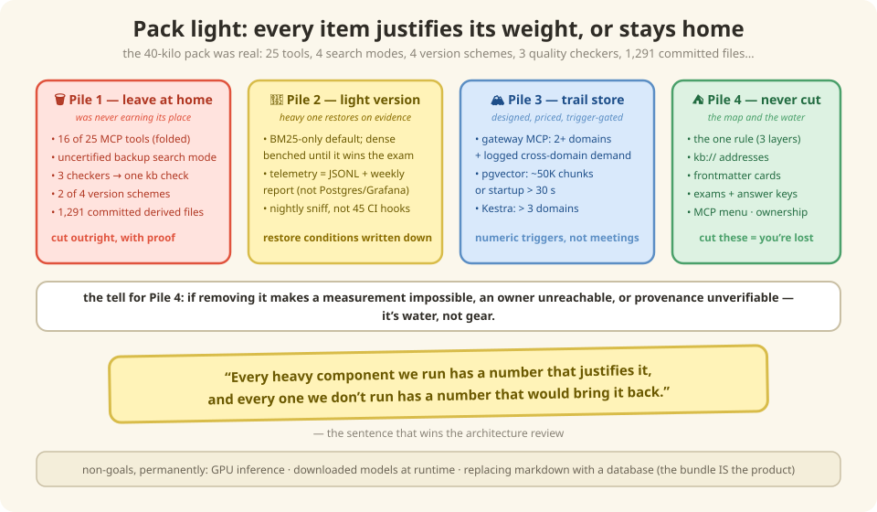

# 11 — The art of leaving things out (simplicity & the road ahead)

*In which we pack a backpack, discover that carrying less is an engineering skill, and
learn the one sentence that wins every architecture review.*

---

## The heaviest backpack on the trail

Every framework starts a hiking trip sooner or later, and there's always one hiker
bent under a 40-kilo pack: a tent for snow *and* a tent for rain, three stoves, a
satellite phone "just in case," a full toolbox. Every single item had a reason. The
pack is still killing them.

Our framework was heading there. At one point the inventory read: 25 MCP tools, four
search modes, three access channels, four version numbering schemes, three overlapping
quality checkers, 1,291 machine-generated files committed to git, and a plan to modify
CI in 45 repos owned by other teams. Each piece, individually, defensible. Together?
The 40-kilo pack.

So the framework got the hiker's treatment — every item held up to one question:
**"does the trail we're actually walking demand this?"** — and sorted into four piles:



## The four piles

**🗑 Pile 1 — Leave at home** (it was never earning its place)
The backup-backup search mode that no test had ever certified. Sixteen of the 25 menu
items (near-duplicates, folded into two generic dishes — [Chapter 5](./05-mcp.md)). The
three overlapping inspectors, merged into one `kb check` that runs every check. Two of
the four version schemes. The 1,291 committed derived files — regenerable at any time,
pure PR noise.

**🎒 Pile 2 — Pack the light version** (heavy one restores on evidence)
Keyword-only search by default; the 90 MB semantic model rides the bench until the
exam says it earns a starting spot ([Chapters 4](./04-finding-things.md) &
[9](./09-evaluation.md)). Usage tracking as a simple log file plus a weekly report —
the Postgres-and-dashboards rig arrives when someone actually demonstrates they'll
watch dashboards. The nightly sniff instead of wiring hooks into 45 other teams' CI
([Chapter 8](./08-freshness.md)).

**🏔 Pile 3 — Buy at the trail store** (designed, priced, waiting for a trigger)
The cross-domain concierge ([Chapter 10](./10-federation.md)): hired at 2+ domains
*plus* logged demand. The central vector database: adopted at ~50K chunks or slow
startups. The workflow orchestrator: at 3+ domains. Each has a *written, numeric*
trigger — so "should we build it yet?" is a dashboard glance, not a meeting.

**⛺ Pile 4 — Never leave behind** (the map and the water)
The one-rule three-layer discipline. The addresses. The business cards. The exams and
their answer keys. The menu protocol. Team ownership. Cut any of these and you're not
lighter — you're lost. The tell: **if removing something makes a measurement
impossible, an owner unreachable, or provenance unverifiable — it's water, not gear.**

## Why this is a chapter and not a footnote

Because the sorting *is* the framework's best defense. Watch the difference:

> **Architecture review, version A:**
> *"Why don't you have a vector database?"*
> "We didn't think we needed one."
> *(weak — you're guessing, and now everyone debates opinions)*

> **Architecture review, version B:**
> *"Why don't you have a vector database?"*
> "At 1,300 chunks, in-process search passes every retrieval gate. The vector DB is
> designed — pgvector, schema written — and adopts automatically at 50K chunks or a
> failed recall gate. Here's the dashboard number today."
> *(unanswerable — you measured, and the burden of proof just switched sides)*

That's the sentence that wins the review, and it deserves to be said in full:

> **"Every heavy component we run has a number that justifies it, and every one we
> don't run has a number that would bring it back."**

No component is a matter of taste. Nothing was cut by mood. The light pack isn't
minimalism for style points — it's the *measured* pack.

> **Sharpen your pencil 🖉** — Sort these into the four piles: (a) the stable `kb://`
> addresses, (b) a reranking model that might improve results a few percent, (c) the
> deprecated tool aliases kept "for compatibility," (d) the online answer-judge that
> needs production traffic.
>
> *(Answers at the bottom.)*

---

## Under the Hood — Phase 2, fully designed, trigger-gated

Pile 3 deserves its own reference: every deferred component is designed to be adopted
**component by component, each behind a measurable trigger** — explicitly not a
big-bang migration. Phase 1 keeps working untouched until a trigger fires, and every
component keeps the same contracts (OKF bundle, `kb://` URIs, MCP tools) so consumers
never change.

### Phase 1 vs Phase 2 at a glance

| Component | Phase 1 (today) | Phase 2 (target) | Upgrade Trigger |
|---|---|---|---|
| Dense index | **BM25-only default**; ONNX dense opt-in per domain, restored as default only on a measured E2 win | Central **pgvector** with HNSW, all domains | Corpus > ~50K chunks, or startup > 30 s, or cross-domain queries become routine |
| Keyword search | In-process BM25 (`rank_bm25`) per domain | Same (stays local!) — or OpenSearch BM25 if the central tier grows | Only if per-domain memory becomes a problem |
| Merge/rerank | Weighted RRF in-process | Same algorithm, fed by local BM25 + central dense lists | Follows the dense index |
| Query understanding | Rule-based classifier | + LLM query rewriting on zero-result retry (max 1 rewrite, logged, killed if the dashboard shows no lift) | Zero-result rate > ~10% |
| Ingest orchestration | Nightly detect-and-refresh in CI cron | **Kestra** flows (or ADO pipelines as constrained alternative) | > 3 domains, or flow count makes CI YAML unmanageable |
| Bundle distribution | Artifactory tarballs from CI publish | Same, plus registry-driven auto-pull into central index | With the central index |
| Answer evaluation | Offline judge per release | + **Online judge**, async, 1-in-10 sample | As soon as real traffic exists — **the first Phase 2 component** |
| Feedback | — | Thumbs UI in consumer workflows → `feedback` table | With online judge |
| Monitoring | JSONL + weekly `kb usage-report` | Postgres + Grafana, judge/cost panels; JSONL history backfilled by loader | Online judge starts, or real dashboard demand |
| Embedding model | Vendored MiniLM ONNX 384d (opt-in) | Same model in a build-time docker layer; optionally larger ONNX (bge-base 768d) if E2 justifies | Recall gap attributable to embedding quality |

All Phase 2 images are standard Docker Hub images that corporate registries commonly
mirror — no HuggingFace, no model downloads at runtime. The corporate constraint holds
in both phases.

### The central search tier (when it's earned)

**Why pgvector over a dedicated vector DB**: one standard container, plain SQL, exact
metadata filtering via `WHERE` (domain, type, confidence — no vector-DB filter DSL),
HNSW ANN when needed, and ops teams already run Postgres.

```sql
CREATE EXTENSION IF NOT EXISTS vector;

CREATE TABLE chunks (
    uri         TEXT PRIMARY KEY,       -- kb://commerce/shoppingcartms/service/inbound-apis
    domain      TEXT NOT NULL,
    type        TEXT NOT NULL,
    entity      TEXT NOT NULL,
    section     TEXT,
    disclosure  TEXT NOT NULL,          -- one-line hint (progressive disclosure)
    confidence  TEXT NOT NULL,          -- authoritative | curated | inferred
    stale_after DATE,
    bundle_ver  TEXT NOT NULL,          -- commerce@7.1.0 — provenance to the artifact
    body        TEXT NOT NULL,
    embedding   vector(384)             -- MiniLM ONNX, same model as Phase 1
);

CREATE INDEX ON chunks USING hnsw (embedding vector_cosine_ops);
CREATE INDEX ON chunks (domain, type);
```

The loader is deterministic, idempotent, and bundle-driven: download tarball → parse
chunk frontmatter → embed with the same vendored ONNX model → **upsert by `uri`** →
delete rows whose URI vanished → stamp `bundle_ver`. This is why stable URIs were a
Phase-1 requirement: the central index is a *derived cache keyed by URI*, rebuildable
from artifacts at any time. No LLM anywhere in this path.

Retrieval v2 keeps the shape you already know: gateway routes by domain → per-domain
BM25 (in-process, unchanged) + central pgvector dense (domain-filtered SQL) → the same
URI-keyed weighted RRF → the same lexical rerank → disclosure-first top-K. One
addition: on zero results, a single bounded LLM query rewrite, logged so its win-rate
is measurable.

### Migration triggers — the whole point, in one table

Adopt a component **only when its trigger fires**; the Phase 1 telemetry provides every
number:

| Trigger (measured) | Component to Adopt |
|---|---|
| Real traffic exists at all | Online judge + thumbs (do first — includes the Postgres/Grafana graduation from JSONL) |
| Cross-domain queries appear in the usage logs | Gateway MCP (thin version, no central index yet) |
| > 3 domains active in `registry.yaml` | Kestra orchestration |
| Corpus > ~50K chunks · or index startup > 30 s · or gateway fan-out latency unacceptable | Central pgvector tier |
| Zero-result rate > ~10% | LLM query rewriting |
| E2 recall gap persists after boost tuning | Larger vendored ONNX model (bge-base 768d) — still no runtime downloads |
| Central tier + BM25 memory pressure | OpenSearch consolidation (last resort) |

**Non-goals, permanently**: GPU inference (CPU ONNX embeds the corpus in seconds),
downloaded models at runtime (constraint holds in both phases), replacing markdown
bundles with a database (the bundle *is* the product; every index is a disposable
cache).

## There are no Dumb Questions

**Q: Isn't deferring things just procrastination with a spreadsheet?**
A: Procrastination is *unplanned* delay. Every deferred item here is fully designed —
schema, docker image, migration path — with a numeric trigger and a quarterly review
where "no trigger fired" gets logged as an explicit decision. That's the opposite of
drift: it's the cheapest state a component can be in. (Unbuilt things need no patching,
no on-call, no upgrades.)

**Q: What if a cut turns out wrong?**
A: Then a *number* says so, and the restore path is documented. The keyword-vs-semantic
decision, for instance, isn't final — it's re-matched every time the exam set grows.
Cuts here are reversible experiments, not amputations.

**Q: Who decides what's "the map and water" versus gear?**
A: The dependency test, not a person: everything in Pile 4 is what Piles 1–3 *lean on*
to be safe. You can only cut the semantic model *because* the exams exist to catch a
mistake. Cut the exams and every other decision degrades from "measured" to "vibes."

## BULLET POINTS

- Complexity accrues one defensible item at a time; it gets removed only by asking
  each item to justify its weight *against the actual trail*.
- Four piles: cut outright · slim-by-default with restore conditions · deferred behind
  numeric triggers · untouchable load-bearing core.
- Deferred ≠ rejected: designed + triggered + reviewed quarterly.
- Phase 2 (pgvector, gateway, Kestra, online judge, Grafana) is fully designed and
  arrives component-by-component, never big-bang — consumers never change because the
  contracts don't.
- The winning defense is symmetrical: numbers justify what runs, numbers would restore
  what doesn't.

> **Sharpen your pencil — answers:** (a) Pile 4 — every exam and every cross-domain
> link leans on addresses. (b) Pile 2/3 — bench it until the exam shows the gap it
> would close. (c) Pile 1 — compatibility shims for tools nobody calls are pure pack
> weight. (d) Pile 3 — literally cannot function before its trigger (traffic) exists.

**You made it!** That's the whole framework: rot → layers → addresses → search → menu →
operations → consumers → freshness → exams → neighborhood → light pack. Go re-read the
[one-page summary](./README.md#the-whole-framework-on-one-page) — we bet it reads
differently now.

**Back**: [10 — Good fences, good knowledge](./10-federation.md) | **Home**: [Book cover](./README.md)
