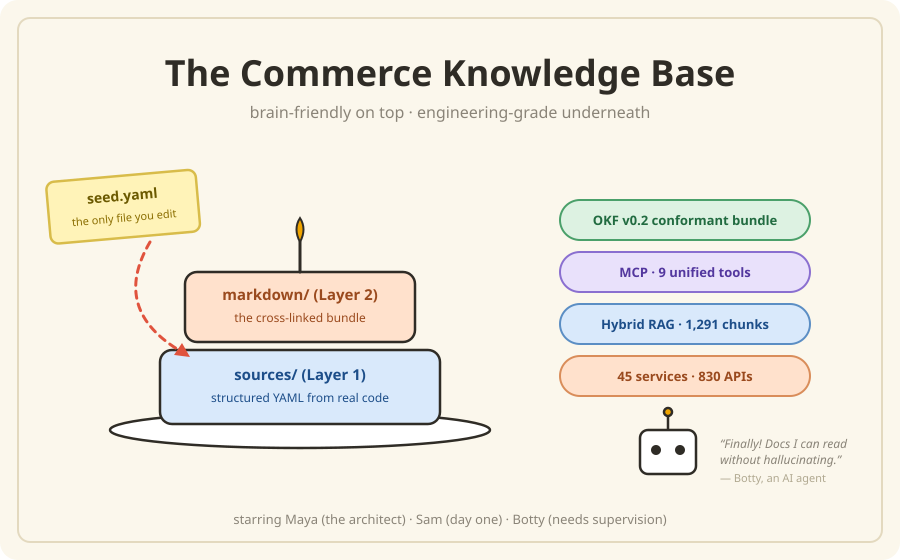

# The Commerce Knowledge Base — The Book



> *"Finally! Docs I can read without hallucinating."* — Botty, an AI agent

> **Version**: 2.0.0 (`kb-framework`) | **Domain**: Commerce (apm0045079) | **Stack**: Python 3.10+, PyYAML, FastMCP, numpy
>
> **Standards**: OKF v0.2 knowledge bundle + LLM-Wiki three-layer architecture + MCP

---

## What is this book?

The Commerce Knowledge Base transforms **45 scattered Java microservice repos**, Confluence
wiki pages, Bruno API collections, ADRs, NFRs, and curated metadata into a **unified,
cross-linked Markdown knowledge base** that both humans and AI agents can navigate.

This book explains it — *all* of it — in one place, written for two readers at once:

- **The reader who wants to understand.** Every chapter opens with the idea: a story, a
  metaphor, a picture. You'll know *why* each piece exists before you meet a single table.
  (Yes, this is an affectionate homage to the
  [Head First](https://en.wikipedia.org/wiki/Head_First_(book_series)) learning style —
  pictures with the words, conversation instead of lecture, the same idea repeated in
  sneaky different ways until it sticks.)
- **The reader who has to operate it.** Every chapter then goes *Under the Hood*: the
  commands, the schemas, the check IDs, the SLO numbers, the gates. The reference material
  is complete — nothing was left in a second document you have to go find.

Read the openings for a guided tour; read the Under-the-Hood sections when you're at a
keyboard. Same book, both altitudes.

## Meet the cast

- **Maya** — the architect who built the Commerce knowledge base. Patient. Owns a lot of
  yellow sticky notes.
- **Sam** — a developer whose first day is Chapter 1. Asks the questions you're too polite
  to ask.
- **Botty** — an AI agent that consumes the KB to write stories, plans, and code.
  Enthusiastic. Occasionally needs supervision.

## The system in numbers

| Dimension | Count |
|-----------|-------|
| Microservices | 45 across 11 subdomains |
| Inbound APIs | 830 endpoints |
| API Contracts | 686 with scenarios |
| Capability Flows | 127 (1 primary + 115 Bruno + 11 curated groupings) |
| ADRs | 5 architecture decisions |
| NFR Profiles | 45 |
| RAG Chunks | 1,291 derived at index time (BM25 + dense MiniLM-ONNX 384d, BM25-only fallback) |
| MCP Tools | 9 unified query tools |

## The whole framework on one page

```
you edit ONE file          robots scan the code           a boring python script
   seed.yaml       ──▶   sources/  (structured YAML) ──▶  markdown/  (the bundle)
                                                              │
                              every page has an address (kb://…), a business card
                              (frontmatter), and an expiry date (stale_after)
                                                              │
              ┌───────────────────────────────┬───────────────┴────────┐
        humans read it                 kb search / kb context     Botty calls 9 MCP tools
        (it's just markdown)           (works offline)            (structured answers)
                                                              │
        nightly: sniff the repos for change → re-ingest only what changed → gates → ship
        always:  exams in CI prove search still finds the right page
```

**One rule**: edit `seed.yaml` → run workflows → everything else is derived.

## The chapters

| # | Chapter | The one-liner | Under the hood |
|---|---------|---------------|----------------|
| 1 | [Your knowledge is rotting](./01-the-problem.md) | Five wikis, 45 repos, and a confused robot — why "knowledge as code" | The industry standards the design implements, with citations |
| 2 | [The three-layer cake](./02-three-layer-architecture.md) | seed.yaml → sources → markdown, and the ONE rule | Data flow, seed.yaml anatomy, 6 JSON schemas, version planes |
| 3 | [Every fact gets an address](./03-addresses-and-metadata.md) | URIs, business cards, and three levels of trust | Frontmatter contract, concept taxonomy, TTLs, CapabilityFlow kind |
| 4 | [Finding stuff](./04-finding-things.md) | The librarian at the front desk; keyword search is underrated | Smart-query routing, hybrid BM25+dense pipeline, chunking rules |
| 5 | [Teaching robots to ask nicely](./05-mcp.md) | MCP: a 9-item menu instead of letting the robot into the kitchen | All 9 tools, server internals, resources & prompt templates |
| 6 | [Running the kitchen](./06-daily-operations.md) | A day in the life of the KB — setup to nightly ship | Install, CLI reference, workflows, recipes, the 6-job CI pipeline |
| 7 | [Botty gets a job](./07-consumers.md) | The KB writes stories, plans, and code (with supervision) | Feature pipeline, tri-channel access, precedence rules, golden datasets |
| 8 | [The milk carton principle](./08-freshness.md) | Dates tell you when milk is old, not when it's bad | Detect–refresh–backstop model, freshness SLOs, the rejected event trigger |
| 9 | [Trust, but verify](./09-evaluation.md) | The KB takes five exams; a 100% score is bad news | E1–E5 evaluation stack, telemetry, judge calibration, costs |
| 10 | [Good fences, good knowledge](./10-federation.md) | One neighborhood, many houses: Customer, Order, and beyond | Federation repos, registry.yaml, FED checks, gateway MCP, governance |
| 11 | [The art of leaving things out](./11-less-is-more.md) | Pack light; add gear only when the trail demands it | Phase 1 vs Phase 2, migration triggers, the leadership defense |

## Quick start (if you'd rather type than read)

```bash
# 1. One-time setup (from repo root)
python3 -m venv .venv && source .venv/bin/activate
pip install -e "multi-dimensional-kb/[all]"
kb index                                     # warm RAG cache (~20s)

# 2. Verify
kb stats
kb search "shopping cart API" --top 5
kb serve                                     # starts MCP on http://localhost:8787

# 3. Bootstrap the full KB (first time only — runs in IDE chat)
/lifecycle-kb --bootstrap

# 4. Daily: ingest one changed service (IDE chat), then regenerate
/ingest-service shoppingcartms
/generate-kb --scope=shoppingcartms
```

Full setup details live in [Chapter 6](./06-daily-operations.md).

## Key files

| File | Purpose |
|------|---------|
| `templates/seed.yaml` | **THE entry point** — declares all KB sources |
| `scripts/generate_multidim_kb.py` | Deterministic markdown generation (3100+ lines) |
| `scripts/validate_catalog.py` | Schema validation + cross-ref integrity |
| `scripts/audit_kb.py` | Full KB health audit (AUD-01…25 + D1–D10) |
| `scripts/okf_conformance_check.py` | OKF v0.2 conformance (C1–C12) |
| `graph-mcp/server.py` | MCP server (9 unified tools, hybrid search) |
| `kbcli/cli.py` | Unified `kb` CLI entry point |
| `.devin/workflows/multi-dimensional-kb/` | 10 workflow definitions |
| `.github/workflows/kb-validation.yml` | CI pipeline (6 jobs) |

---

*Head First is an O'Reilly series — go buy their books, they're wonderful.*

**Owner**: Commerce Architecture Team | **Repository**: `apm0045079-commerce-AIFC-knowledge-base`

**Start**: [Chapter 1 — Your knowledge is rotting](./01-the-problem.md)
