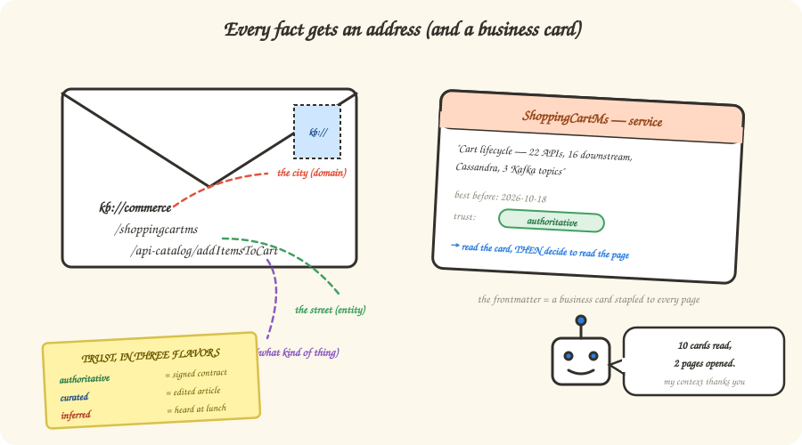

# 3 — Every fact gets an address

*In which we staple a business card to every page, learn why "somewhere in the wiki" is
not an address, and discover that you can't test what you can't name.*

---

## The postal system for knowledge

Quick thought experiment. Someone asks: *"is the fact about cart repricing up to date?"*

In the old world, the answer is "…which fact? The one in Confluence? The one in the
README? The one in Priya's head?" **You can't check on a fact that has no address.**

So the knowledge base gives every single piece of knowledge a stable, boring, permanent
address — a URI:

```
kb://commerce/shoppingcartms/service            ← the service's page
kb://commerce/shoppingcartms/api-catalog/addItemsToCart   ← one specific API
kb://commerce/wireless-postpaid-upgrade/capability-flow   ← one business flow
```



Read it like a postal address: **which domain** (city) / **which entity** (street) /
**what kind of thing** (house). And like postal addresses, they don't change when the
contents do — repaint the house all you like, the mail still arrives.

Why this obsession with addresses? Because *everything else in this book depends on it*:

- **Search evaluation** (Chapter 7): "did search return the right page?" only means
  something if pages have identities to be right *about*.
- **Cross-domain links** (Chapter 8): the Order KB can point at
  `kb://commerce/shoppingcartms/...` and it *resolves*.
- **Updates**: when a page regenerates, systems that indexed it update *in place*
  instead of creating a duplicate.

## The business card (frontmatter)

Every page starts with a small block of YAML — its business card. Before reading a
2,000-word page, you (or Botty) can read six lines and know whether to bother:

```yaml
---
type: service                  # what kind of thing am I?
title: "ShoppingCartMs"
description: "Cart lifecycle service"
stale_after: 2026-10-18        # my freshness expiry date (Chapter 6!)
confidence: authoritative      # how much should you trust me?
disclosure: "Cart lifecycle — 22 APIs, 16 downstream, Cassandra, 3 Kafka topics"
---
```

That `disclosure` line is the elevator pitch: **one sentence that lets a reader decide
"is this the page I need?" without opening it.** When Botty searches, it reads ten
disclosure lines and picks two pages to read fully — instead of stuffing ten full pages
into its brain. (Head First readers know this trick: it's a book's back cover.)

## Three levels of trust

Not all knowledge is equally trustworthy, and *pretending it is* is how wikis rot. So
every page wears its confidence on its sleeve:

| Label | Means | Like… |
|-------|-------|-------|
| `authoritative` | Generated deterministically from code-scanned data | A signed contract |
| `curated` | Written or reviewed by a human who meant it | An edited article |
| `inferred` | The LLM's best guess, not confirmed by any primary source | Something you overheard at lunch |

Consumers take this seriously: anything `inferred` shows up downstream tagged
**⚠️ KB-INFERRED**, and it *never* overrides a design document. Overheard-at-lunch facts
don't get to win arguments.

## There are no Dumb Questions

**Q: Why URIs instead of just database IDs like `doc_8842`?**
A: `kb://commerce/shoppingcartms/service` is meaningful to humans, sortable, and
derivable from the content itself — the generator computes the same URI every time
without needing a database to remember anything. `doc_8842` requires a lookup table
and means nothing in a code review.

**Q: What happens when a service gets renamed?**
A: The URI changes (it's derived), and the old one is kept as an alias for a
deprecation window while links migrate. Renames are rare; broken links are checked in
CI, so nothing dangles silently.

**Q: Isn't the frontmatter just… metadata bureaucracy?**
A: It's the *opposite* of bureaucracy — it's what lets robots skip reading. Six lines
that save two thousand words is the best deal in the whole framework. (Also, this
exact markdown+frontmatter format is Google's published OKF spec — we standardized,
not invented.)

## BULLET POINTS

- Every fact gets a stable `kb://domain/entity/type` address. Contents change;
  addresses don't.
- Addresses are what make evaluation, cross-domain links, and clean updates possible —
  *you can't test what you can't name*.
- Frontmatter is the business card; `disclosure` is the one-line pitch that saves
  everyone (especially Botty) from reading whole pages to find out they're irrelevant.
- Trust is explicit: `authoritative` / `curated` / `inferred` — and inferred facts
  never win arguments.

**Want the full spec?** [Chapter 01 — Architecture, Patterns 2–5](../01-architecture.md#okf-v02-patterns-adopted)

**Next**: [4 — Finding stuff](./04-search.md) | **Back**: [2 — The three-layer cake](./02-three-layers.md)
