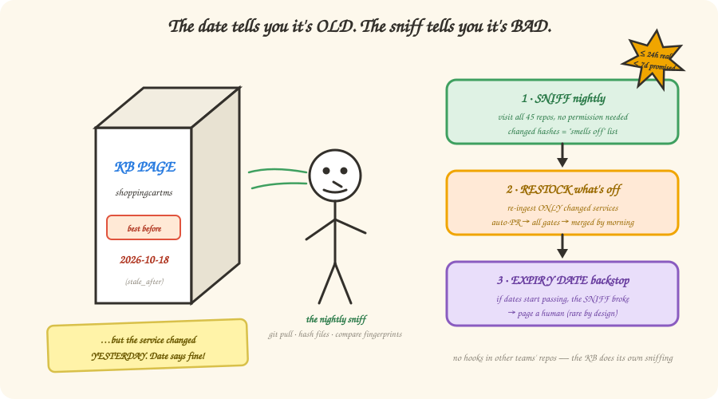

# 6 — The milk carton principle (keeping it fresh)

*In which we learn why expiry dates are the last line of defense, not the first, and
how to keep knowledge fresh without asking 45 other teams to change anything.*

---

## The lie on the milk carton

Every page in the KB has an expiry date (`stale_after` — you saw it on the business
card in Chapter 3). Feels safe, right? Expired page → warning label → done?

Here's the problem, and it's the same one in your fridge: **the date tells you when
milk is *old*, not when it's *bad*.** A service can change the day after we ingest it —
and its KB page stays "fresh" by the label for another 89 days while being wrong the
entire time. Confidently, quietly wrong. That's the worst failure mode a knowledge
base has.

Dates measure **age**. What we care about is **change**. So the freshness system leads
with its nose:

## Sniff, restock, expiry-check

Three moves, from sharpest to bluntest:

| Move | What happens | When |
|------|--------------|------|
| **1. SNIFF** (detect) | Every night, the KB quietly visits all 45 service repos — `git pull`, hash the important files, compare against last time's fingerprints. Changed files = the "smells off" list. | Nightly, minutes, ~$0 |
| **2. RESTOCK** (refresh) | Only the changed services get re-ingested (that's the LLM re-reading their code), producing an auto-PR that must pass *every* gate from Chapter 2 before merging. | Same night |
| **3. EXPIRY CHECK** (backstop) | The `stale_after` dates + a weekly audit. If this ever fires, it doesn't mean "the milk went bad" — it means *the sniffing broke* and someone gets paged. | Weekly, safety net |

The result: a change lands in the KB within ~24 hours, against a promised
service-level objective of 7 days. That 7× headroom is deliberate slack, not laziness.

## The dog that didn't bark (on purpose)

Here's the design decision worth savoring. The *obvious* architecture is event-driven:
put a little notifier in each of the 45 service repos' CI — "hey KB, I changed!" —
and get told about changes in minutes instead of hours.

We designed it. Then we **deliberately didn't build it.** Why?

- It means changing CI in **45 repositories owned by other teams** — 45 PRs, 45
  approvals, and permanent "please don't break our hook" maintenance. Then again for
  every new domain.
- And what does all that friction buy? Faster *detection*. But detection was never the
  bottleneck — *re-ingestion runs nightly either way*. Knowing at 3:07 PM instead of
  2:00 AM changes nothing about when the KB actually updates.

The nightly sniff needs **zero cooperation from anyone**. The KB team owns the whole
freshness pipeline end to end. If the SLO ever tightens to same-day, the event system
is designed, documented, and waiting — behind a measured trigger. (This "don't build
it yet" discipline gets a whole chapter — Chapter 9.)

> **Sharpen your pencil 🖉** — `shoppingcartms` merges a new API endpoint Monday at
> 3 PM. Walk the timeline: when does the KB know? When is the KB updated? When would
> the expiry date have caught it?
>
> *(Answer at the bottom.)*

## There are no Dumb Questions

**Q: What if nothing changed? Does the LLM re-read everything nightly? Sounds pricey.**
A: Nope — that's the point of the fingerprints. Unchanged service = identical hashes =
skipped entirely. The LLM bill scales with *change*, not with fleet size.

**Q: What if the nightly sniff job itself silently dies?**
A: That's precisely what the expiry-date backstop is for. Pages start crossing their
`stale_after` dates, the weekly audit's freshness score drops, and the owning team is
notified. The backstop doesn't catch stale milk — it catches a broken nose.

**Q: Who fixes it when the refresh PR fails the gates?**
A: The same as any failing PR — it sits unmerged, visible, with the gate report saying
exactly what's wrong. Bad knowledge doesn't merge *silently*; that's the whole design.

## BULLET POINTS

- Expiry dates measure **age**; freshness needs to track **change**. Lead with the
  sniff, keep the date as backstop.
- Nightly: sniff all repos (cheap, no cooperation needed) → re-ingest only what
  changed (LLM cost scales with change) → gates → ship.
- The event-driven upgrade exists on paper with a trigger — building it today would
  buy nothing but 45 repos of friction.
- Freshness has *numbers*: ≤ 24 h typical, ≤ 7 days promised, and the backstop pages a
  human when the machinery itself breaks.

> **Sharpen your pencil — answer:** Monday 3 PM: merge (KB knows nothing, and that's
> fine). Tuesday ~2 AM: sniff spots changed hashes → re-ingest → auto-PR → gates →
> merged and republished by morning. The expiry date? Would have flagged the page
> around *October*. That gap — October vs. Tuesday — is this whole chapter.

**Want the full spec?** [Chapter 06 — Freshness, CI/CD & Evaluation](../06-freshness-and-evaluation.md#the-freshness-model--detect-refresh-backstop) ·
[S2.3 — why no event trigger](../simplification/02-tier-2-slim-by-default.md#s23--drop-the-t1-event-trigger-nightly-fingerprint-scan-instead)

**Next**: [7 — Trust, but verify](./07-evaluation.md) | **Back**: [5 — Teaching robots to ask nicely](./05-mcp.md)
