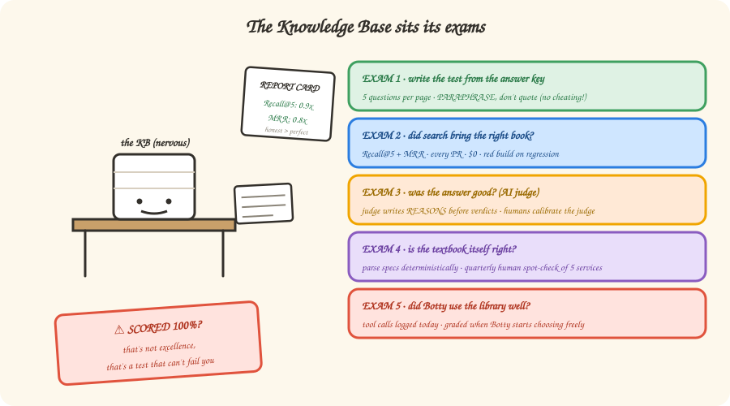

# 7 — Trust, but verify (the KB takes an exam)

*In which the knowledge base sits five different tests, we learn why a perfect score
is a red flag, and an AI judge is forced to show its work.*

---

## "It works great!" is not evidence

Sooner or later someone senior asks the only question that matters: **"How do you KNOW
the knowledge base is good?"**

"The demos went well" is not an answer. "Botty seems happier" is not an answer. The
answer is the same one software gave: **tests. Run continuously. With numbers.**

The KB sits five exams, each answering one specific question:

## Exam 1: Writing the test (without cheating)

Before grading anything you need an answer key. Ours is built backwards, and the
backwards-ness is the clever part: take a page (whose address we know — Chapter 3
paying off), and have an LLM write **five questions this page answers**. Now you have
question → known-correct-page pairs. Hundreds of them, for about a dollar.

One rule makes or breaks the whole thing: the question-writer is told to **use as few
words from the page as possible.** Why? If the page says "cart repricing occurs on
item addition" and the question is *"when does cart repricing occur?"* — any dumb
string-matcher aces it. You're testing photocopying, not finding. Real users
paraphrase, so the exam must too.

> **A 100% score is bad news.** Our first golden suite scored Recall@10 = 1.0.
> Champagne? No — alarm bells. A test the system can't fail can't catch regressions,
> and suspiciously perfect scores usually mean the questions leaked words from the
> answers. We *rebuilt the exam to be harder on purpose.* When the new numbers come in
> lower, that's not the system getting worse — that's the thermometer getting honest.

## Exam 2: Did search bring the right book?

Now the mechanical part. For every exam question: did the right page come back in the
top 5? (**Recall@5**.) Was it near the top, or buried at rank 9 where nobody — human
or robot — actually looks? (**MRR**, which rewards rank 1 over rank 9.)

This runs **on every pull request**. Costs nothing (no LLM — just search + arithmetic
against the answer key). If a change to chunking or boosts drops recall, the build
fails *before* the change ships. It's a unit test suite where the unit is *findability*.

It's also the courtroom from Chapter 4: this is the exam where dense embeddings must
beat BM25 *by a stated margin* to earn a starting spot. Decisions by scoreboard, not
by meeting.

## Exam 3: Was the answer any good? (the judge shows its work)

Retrieval can be perfect while the final answer is still mush. So a second LLM plays
**judge**: here's the original source, here's the question, here's the generated
answer — grade it.

Two safeguards keep the judge honest:

- **Reasons before verdicts.** The judge must write its reasoning *first*, then the
  grade. Forcing the "why" before the "what" measurably improves grading — the same
  reason your teacher demanded you show your work.
- **Someone judges the judge.** You can't hire a second AI judge to check the first —
  it has the same blind spots (who watches the watch-bot?). So periodically a *human*
  reviews a stack of the judge's verdicts, and the judge's instructions get tuned
  until human and judge agree. Calibration, not turtles all the way down.

And the best part: the team's golden-dataset story judge — regenerate real feature
stories with the current KB, compare against known-good baselines — was already there
before any of this. Exam 3 didn't have to be invented, just surrounded with friends.

## Exams 4 & 5: the quick ones

**Exam 4 — Is the textbook itself right?** All the retrieval quality in the world is
useless if the *ingested facts* are wrong (remember: ingest is the one step where an
LLM reads code and could mis-read it). Defense one: wherever a machine-readable spec
(OpenAPI) exists, parse it deterministically — no LLM, nothing to mis-read. Defense
two: quarterly, a human spot-checks five random services against the actual code. If
the spot-checks start finding real errors, an automated nightly audit is designed and
waiting.

**Exam 5 — Did Botty use the library well?** Not *what* Botty answered — *how* it got
there. Did it search with sensible keywords? Did it call the same tool five times with
identical arguments (robot pacing-in-circles)? Right now Botty's tool calls follow
scripts, so there's nothing to grade — but every call is being *logged*, so the day
Botty starts choosing its own tools, the gradebook opens with data already in it.

## There are no Dumb Questions

**Q: An LLM writing the exam AND an LLM taking it AND an LLM judging it — isn't this
circular?**
A: The circle is broken in three places: the answer *key* is ground truth by
construction (the question was generated *from* that page, so we know the right
answer); Exam 2 is pure arithmetic, no LLM anywhere; and the judge is calibrated
against humans. Machines do the volume; humans anchor the truth.

**Q: What do the numbers actually gate?**
A: Exam 2 gates every PR (retrieval regression = red build). Exams 3–4 gate releases
(scorecard must not degrade vs. baseline). The exams aren't dashboards to admire —
they're tripwires.

**Q: What does all this testing cost?**
A: The answer key: ~$1 per rebuild. Judging a full answer run: under a dollar. Exam 2:
$0 forever. The expensive part was never compute — it was deciding to measure at all.

## BULLET POINTS

- "How do you know it's good?" gets answered with continuously-run, numbered exams —
  not adjectives.
- Answer keys are generated *from* the pages (cheap, scalable), with an anti-cheating
  rule: paraphrase, don't quote.
- **Perfect scores are a smell.** A test that can't fail can't protect you.
- The judge writes reasons before verdicts, and humans calibrate the judge.
- Wrong-facts risk is squeezed at the source (deterministic spec parsing) and
  spot-checked by humans — automation waits for evidence it's needed.

**Want the full spec?** [Chapter 06 — the five-layer evaluation stack](../06-freshness-and-evaluation.md#the-evaluation-stack--five-layers-of-proof)

**Next**: [8 — Good fences, good knowledge](./08-federation.md) | **Back**: [6 — The milk carton principle](./06-freshness.md)
