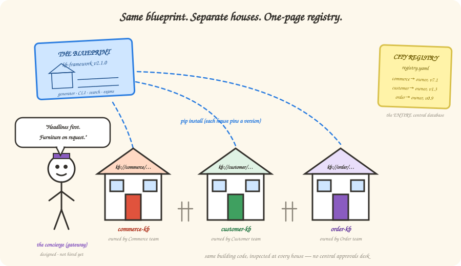

# 8 — Good fences make good knowledge (federation)

*In which Commerce gets neighbors, every house is built from the same blueprint, and a
very polite concierge refuses to haul furniture.*

---

## The Customer team wants one too

The Commerce KB works. Word gets out. The Customer domain wants one. Then Order. Then
Billing. And someone — there's always someone — proposes the obvious thing:

> *"Let's just put ALL the domains in ONE big knowledge base!"*

Tempting. Wrong. Here's why, and it's not a technology reason: **the Customer team
cannot own knowledge that lives in the Commerce team's repo.** Ownership follows
repository boundaries — CODEOWNERS, review rights, on-call rotations. One giant KB
means either one central team bottlenecking everyone's knowledge (they become the
bureau of documentation, everyone waits on them), or everyone editing everything
(and we're back to the wiki nobody trusts, at 10× scale).

Also — picture Botty working a Commerce story while ten domains of chunks about
customer profiles and billing cycles wash through its search results. That's **context
pollution**: the neighbor's furniture, in your living room, uninvited.

So we do what well-run cities do: **same building code, separate houses.**

## The neighborhood plan

| Piece | In city terms | In our terms |
|-------|---------------|--------------|
| **The blueprint** | One approved building design for every house | The framework, extracted into a shared package (`kb-framework`) — the generator, the CLI, the search engine, the schemas, the exam harness. Versioned; each domain pins the version it's on |
| **The houses** | Each family owns theirs, decorates inside | One repo per domain: its `seed.yaml`, its sources, its bundle, its exam answer keys. The Customer team merges Customer knowledge; nobody else can |
| **The city registry** | One page at city hall: who lives where | `registry.yaml` — a single small file listing every domain, its owner, its bundle version, its freshness promise. That's the *entire* central database |
| **The building inspector** | Same code enforced at every house, by inspections — not by a central approvals desk | The same CI gates (Chapter 2's cake police, Chapter 7's exams), running in *each domain's own pipeline*. Standards are global; enforcement is local |
| **The concierge** | You call when you need something from *another* house | The gateway — a small MCP service for cross-domain questions. **Deliberately not built yet** (more below) |

New domain onboarding is *template instantiation*: `kb init --domain customer`, fill in
your `seed.yaml`, run the bootstrap. Same houses, different addresses — remember
Chapter 3's URIs? `kb://commerce/...`, `kb://customer/...` — the domain is the city
part of every address, so cross-domain links *resolve* instead of dangling.

## The concierge who reads headlines first

When a Commerce story genuinely needs Customer knowledge ("what does the profile
service return?"), Botty doesn't get keys to the Customer house. It calls the
concierge, and the concierge has one golden rule:

> **Headlines first, furniture on request.** The gateway returns *disclosure lines* —
> those one-sentence business-card pitches from Chapter 3 — plus addresses. Botty reads
> ten headlines, picks the two pages it actually needs, and fetches just those.

That's the anti-pollution mechanism, twice over: structurally (each domain's index
contains only its own stuff) and behaviorally (cross-domain content arrives one
deliberate page at a time, never as a flood).

And the concierge? **Designed in full, hired later.** With one domain there's nothing
to route between; a gateway today would be a doorman for a one-house street. He gets
hired when two conditions are true: a second domain is live, *and* the usage logs show
real cross-domain questions. (Chapter 9 will make a whole philosophy out of this.)

## Fireside Chat: Monorepo vs. Federation

**Monorepo:** One repo, one search index, one CI. Simple! Everything findable in one
place. Why are we complicating this?

**Federation:** Answer one question: in your world, who reviews a change to Customer
knowledge?

**Monorepo:** Whoever's around? A central docs team? CODEOWNERS on subfolders can—

**Federation:** *Whoever's around* is how wikis died, and a central team is a
bottleneck with a burnout date. Ownership isn't a folder permission — it's a team
saying "our repo, our on-call, our name on it." And your one CI: when the Billing
folder fails its audit, whose build is red? *Everyone's.* Ten domains sharing one
pipeline is ten teams blocking each other.

**Monorepo:** But you've built ten of everything! Ten pipelines, ten indexes—

**Federation:** Ten *instances* of ONE thing. The blueprint is shared and versioned;
domains run copies. That's the difference between duplicating code and running a
program ten times. Your model shares the *building*; mine shares the *blueprint*.

**Monorepo:** …and cross-domain search?

**Federation:** The concierge — scoped, polite, headlines-first. Better than your plan,
where every search wades through everyone's everything, always.

**Monorepo:** I concede the houses. I'm keeping the shared laundry room.

**Federation:** That's the registry, and yes, it's one page.

## There are no Dumb Questions

**Q: Doesn't each domain rebuilding the framework waste effort?**
A: Nobody rebuilds anything — domains `pip install kb-framework==2.1.0`. Framework
fixes ship once and every domain upgrades on its own schedule. That's just… packages.

**Q: What stops domains drifting apart until their bundles are incompatible?**
A: The inspections. Every domain's CI runs the same conformance checks from the same
package version, and a registry-level check verifies cross-domain links still resolve.
Standards centralized, enforcement automated, no committee meetings.

**Q: Who owns knowledge that spans domains — like an end-to-end order flow?**
A: The domain that owns the *flow* writes the page; every service it references is a
`kb://` link into its home domain. Facts live at home; stories link across town.

## BULLET POINTS

- Scaling domains is an *ownership* problem before a technology problem — repos are
  the ownership boundary, so each domain gets its own house.
- Shared blueprint (versioned framework package) + separate houses (domain repos) +
  one-page registry = same standards, no central bottleneck.
- Context pollution is solved structurally (scoped indexes) and behaviorally (the
  concierge's headlines-first rule).
- The gateway is fully designed and deliberately unbuilt — it gets hired when a second
  domain exists *and* the logs prove cross-domain demand.

**Want the full spec?** [Chapter 05 — Scaling & Federation](../05-scaling-and-federation.md)

**Next**: [9 — The art of leaving things out](./09-less-is-more.md) | **Back**: [7 — Trust, but verify](./07-evaluation.md)
