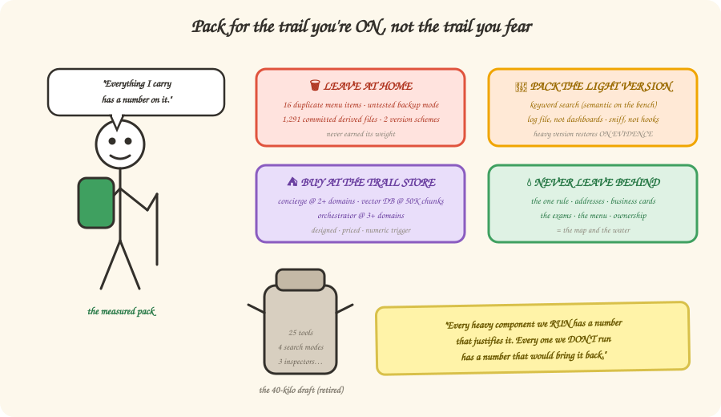

# 9 — The art of leaving things out

*In which we pack a backpack, discover that carrying less is an engineering skill, and
learn the one sentence that wins every architecture review.*

---

## The heaviest backpack on the trail

Every framework starts a hiking trip sooner or later, and there's always one hiker
bent under a 40-kilo pack: a tent for snow *and* a tent for rain, three stoves, a
satellite phone "just in case," a full toolbox. Every single item had a reason. The
pack is still killing them.

Our framework was heading there. At one point the inventory read: 25 MCP tools, four
search modes, three access channels, four version numbering schemes, three overlapping
quality checkers, 1,291 machine-generated files committed to git, and a plan to modify
CI in 45 repos owned by other teams. Each piece, individually, defensible. Together?
The 40-kilo pack.

So the framework got the hiker's treatment — every item held up to one question:
**"does the trail we're actually walking demand this?"** — and sorted into four piles:

## The four piles

**🗑 Pile 1 — Leave at home** (it was never earning its place)
The backup-backup search mode that no test had ever certified. Sixteen of the 25 menu
items (near-duplicates, folded into two generic dishes — Chapter 5). The three
overlapping inspectors, merged into one that runs every check. Two of the four version
schemes. The 1,291 committed derived files — regenerable at any time, pure PR noise.

**🎒 Pile 2 — Pack the light version** (heavy one restores on evidence)
Keyword-only search by default; the 90 MB semantic model rides the bench until the
exam says it earns a starting spot (Chapters 4 & 7). Usage tracking as a simple log
file plus a weekly report — the Postgres-and-dashboards rig arrives when someone
actually demonstrates they'll watch dashboards. The nightly sniff instead of wiring
hooks into 45 other teams' CI (Chapter 6).

**🏔 Pile 3 — Buy at the trail store** (designed, priced, waiting for a trigger)
The cross-domain concierge (Chapter 8): hired at 2+ domains *plus* logged demand. The
central vector database: adopted at ~50K chunks or slow startups. The workflow
orchestrator: at 3+ domains. Each has a *written, numeric* trigger — so "should we
build it yet?" is a dashboard glance, not a meeting.

**⛺ Pile 4 — Never leave behind** (the map and the water)
The one-rule three-layer discipline. The addresses. The business cards. The exams and
their answer keys. The menu protocol. Team ownership. Cut any of these and you're not
lighter — you're lost. The tell: **if removing something makes a measurement
impossible, an owner unreachable, or provenance unverifiable — it's water, not gear.**

## Why this is a chapter and not a footnote

Because the sorting *is* the framework's best defense. Watch the difference:

> **Architecture review, version A:**
> *"Why don't you have a vector database?"*
> "We didn't think we needed one."
> *(weak — you're guessing, and now everyone debates opinions)*

> **Architecture review, version B:**
> *"Why don't you have a vector database?"*
> "At 1,300 chunks, in-process search passes every retrieval gate. The vector DB is
> designed — pgvector, schema written — and adopts automatically at 50K chunks or a
> failed recall gate. Here's the dashboard number today."
> *(unanswerable — you measured, and the burden of proof just switched sides)*

That's the sentence that wins the review, and it deserves to be said in full:

> **"Every heavy component we run has a number that justifies it, and every one we
> don't run has a number that would bring it back."**

No component is a matter of taste. Nothing was cut by mood. The light pack isn't
minimalism for style points — it's the *measured* pack.

> **Sharpen your pencil 🖉** — Sort these into the four piles: (a) the stable `kb://`
> addresses, (b) a reranking model that might improve results a few percent, (c) the
> deprecated tool aliases kept "for compatibility," (d) the online answer-judge that
> needs production traffic.
>
> *(Answers at the bottom.)*

## There are no Dumb Questions

**Q: Isn't deferring things just procrastination with a spreadsheet?**
A: Procrastination is *unplanned* delay. Every deferred item here is fully designed —
schema, docker image, migration path — with a numeric trigger and a quarterly review
where "no trigger fired" gets logged as an explicit decision. That's the opposite of
drift: it's the cheapest state a component can be in. (Unbuilt things need no patching,
no on-call, no upgrades.)

**Q: What if a cut turns out wrong?**
A: Then a *number* says so, and the restore path is documented. The keyword-vs-semantic
decision, for instance, isn't final — it's re-matched every time the exam set grows.
Cuts here are reversible experiments, not amputations.

**Q: Who decides what's "the map and water" versus gear?**
A: The dependency test, not a person: everything in Pile 4 is what Piles 1–3 *lean on*
to be safe. You can only cut the semantic model *because* the exams exist to catch a
mistake. Cut the exams and every other decision degrades from "measured" to "vibes."

## BULLET POINTS

- Complexity accrues one defensible item at a time; it gets removed only by asking
  each item to justify its weight *against the actual trail*.
- Four piles: cut outright · slim-by-default with restore conditions · deferred behind
  numeric triggers · untouchable load-bearing core.
- Deferred ≠ rejected: designed + triggered + reviewed quarterly.
- The winning defense is symmetrical: numbers justify what runs, numbers would restore
  what doesn't.

> **Sharpen your pencil — answers:** (a) Pile 4 — every exam and every cross-domain
> link leans on addresses. (b) Pile 2/3 — bench it until the exam shows the gap it
> would close. (c) Pile 1 — compatibility shims for tools nobody calls are pure pack
> weight. (d) Pile 3 — literally cannot function before its trigger (traffic) exists.

**Want the full spec?** The whole [simplification folder](../simplification/README.md) —
tier by tier, with proofs · [Chapter 07 — Phase 2 triggers](../07-phase-2-target-architecture.md#migration-triggers--when-to-actually-do-this)

**You made it!** That's the whole framework: rot → layers → addresses → search → menu →
freshness → exams → neighborhood → light pack. Go re-read the
[one-page summary](./README.md#the-whole-framework-on-one-page) — we bet it reads
differently now.

**Back**: [8 — Good fences, good knowledge](./08-federation.md) | **Home**: [Book cover](./README.md)
