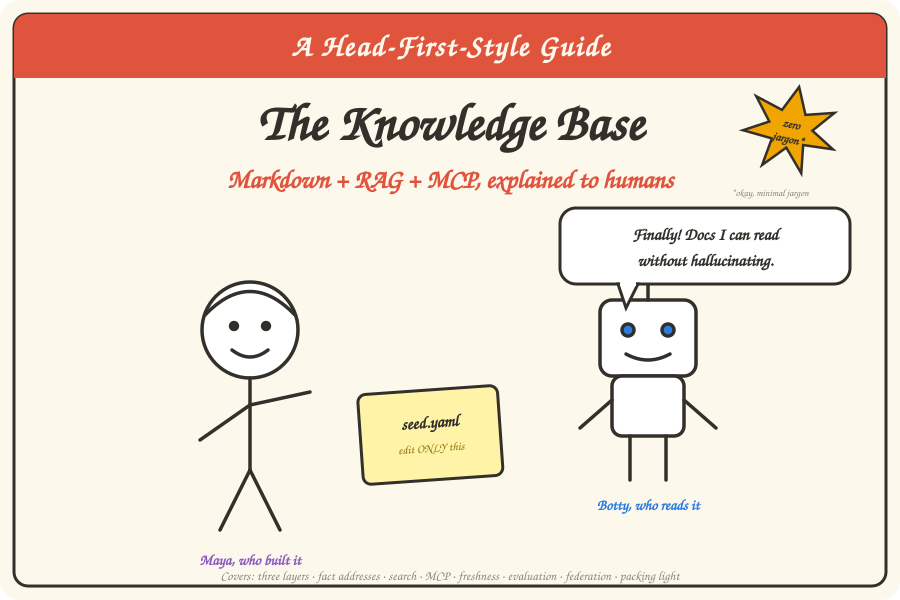

# The Knowledge Base — A Head-First-Style Guide



> *"Finally! Docs I can read without hallucinating."* — Botty, an AI agent

---

## How to use this book (yes, this part matters)

**We wrote this for your brain, not for a compliance checklist.**

Your brain craves novelty. It ignores boring things and remembers surprising ones — that's
why you can't recall yesterday's stand-up but you'll never forget the time the demo caught
fire. So this book does what the
[Head First series](https://en.wikipedia.org/wiki/Head_First_(book_series)) figured out
long ago: pictures with the words, conversation instead of lecture, questions that make
you *think*, and the same idea repeated in sneaky different ways until it sticks.

**This is the friendly companion, not the replacement.** Every chapter ends with a
*"want the full spec?"* link into the [engineering chapters](../README.md) — the serious
docs with the numbers, the check IDs, and the citations. Read this book to *understand*
the framework; read those to *operate* it.

## Who is this book for?

| You are… | Read it because… |
|----------|------------------|
| A developer who just joined the team | You'll understand the whole system before lunch |
| An architect from another domain (Customer? Order?) | You're about to get your own one of these |
| A leader who keeps hearing "markdown plus RAG plus MCP" | Chapters 1, 7, and 9 are your elevator pitches |
| Botty (an AI agent) | Honestly, you already read it. Twice. |

## Meet the cast

- **Maya** — the architect who built the Commerce knowledge base. Patient. Owns a lot of
  yellow sticky notes.
- **Sam** — a developer whose first day is Chapter 1. Asks the questions you're too
  polite to ask.
- **Botty** — an AI agent that consumes the KB to write stories, plans, and code.
  Enthusiastic. Occasionally needs supervision.

## The chapters

| # | Chapter | The one-liner |
|---|---------|---------------|
| 1 | [Your knowledge is rotting](./01-the-problem.md) | Why five wikis, 45 repos, and a confused robot are a crisis — and what "knowledge as code" means |
| 2 | [The three-layer cake](./02-three-layers.md) | seed.yaml → sources → markdown, and the one rule that keeps it all sane |
| 3 | [Every fact gets an address](./03-addresses.md) | URIs, frontmatter, and why you can't test what you can't name |
| 4 | [Finding stuff](./04-search.md) | The librarian at the front desk, and why keyword search is underrated |
| 5 | [Teaching robots to ask nicely](./05-mcp.md) | MCP: a 9-item menu instead of letting the robot into the kitchen |
| 6 | [The milk carton principle](./06-freshness.md) | Detect, refresh, backstop — freshness without bothering 45 other teams |
| 7 | [Trust, but verify](./07-evaluation.md) | The KB takes an exam. Warning: a 100% score is bad news |
| 8 | [Good fences, good knowledge](./08-federation.md) | One neighborhood, many houses: scaling to Customer, Order, and beyond |
| 9 | [The art of leaving things out](./09-less-is-more.md) | Pack light, add gear only when the trail demands it |

## The whole framework on one page

```
you edit ONE file          robots scan the code           a boring python script
   seed.yaml       ──▶   sources/  (structured YAML) ──▶  markdown/  (the bundle)
                                                              │
                              every page has an address (kb://…), a business card
                              (frontmatter), and an expiry date (stale_after)
                                                              │
              ┌───────────────────────────────┬───────────────┴────────┐
        humans read it                 kb search / kb context     Botty calls 9 MCP tools
        (it's just markdown)           (works offline)            (structured answers)
                                                              │
        nightly: sniff the repos for change → re-ingest only what changed → gates → ship
        always:  exams in CI prove search still finds the right page
```

That's it. Everything else in this book is *why* each piece looks the way it does.

---

*This folder is an affectionate homage to the
[Head First](https://en.wikipedia.org/wiki/Head_First_(book_series)) learning style
(visual, conversational, brain-friendly). Head First is an O'Reilly series — go buy their
books, they're wonderful.*

**Start**: [Chapter 1 — Your knowledge is rotting](./01-the-problem.md)
